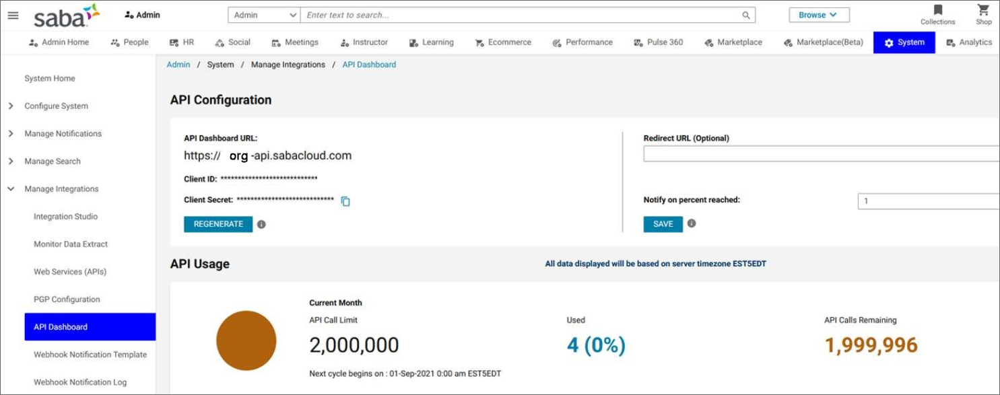

# Configure Saba as a content source for Microsoft Viva Learning

>[!NOTE]
>This feature is not supported in preview.

This article shows you how to configure Saba as a third-party learning content source for Microsoft Viva Learning. You must be a Saba System Admin or Super User to perform these steps.

>[!NOTE]
>Content accessible through Viva Learning is subject to terms other than the Microsoft Product Terms. Saba content and any associated services are subject to Saba’s privacy and service terms.

## Client’s Host URL

1. Identify your primary Saba Cloud URL (for example "org".sabacloud.com). If your API dashboard URL is org-api.sabacloud.com, your Host URL will be org.sabacloud.com.

2. Identify your API Dashboard URL by going to **Saba Cloud** > **Admin** > **System Admin** > **Manage Integrations** > **API Dashboard**. Find the API Dashboard URL, then remove "https://" and "-api" to get your Host URL.

## Client ID and Client Secret

1. On the same screen where you got the host URL, copy the Client ID and Client Secret if they've already been generated.

2. If the Client Secret isn't there yet, select the **GENERATE** button to generate it.

    

## Last steps

You'll need to complete the configuration in your Microsoft 365 admin center.

1. Log in to your [Microsoft 365 admin center](https://admin.microsoft.com).
2. Navigate to **Settings**, then **Org settings**. Select Viva Learning and enable Saba Cloud from the panel.
3. Fill in the details that you got from your Saba portal.
    >[!NOTE]
    >Display name is the name of the carousel under which Saba learning content will appear for users in your organization in Viva Learning. If you don't enter a new name, it will display the default name "Saba Cloud".

    

4. Select **Save** to activate Saba Cloud content in Microsoft Viva Learning. It may take up to 24 hours for the content to display in Viva Learning.

> [!Note]
> For Saba Cloud integration, you need to have a sabacloud.com domain in your Host URL. If you have a different domain name, you'll need to raise a support ticket to allow your domain name.

## Data residency

Tenant metadata is stored centrally in our data stores and not stored in geo-specific data stores.

## Roles and permissions

Currently, all the users within an organization will be able to discover all the tenant-specific courses. However, they'll only be able to use the courses that they have access to. User-specific content discovery (based on roles and permissions) is planned to be rolled out in the future.
