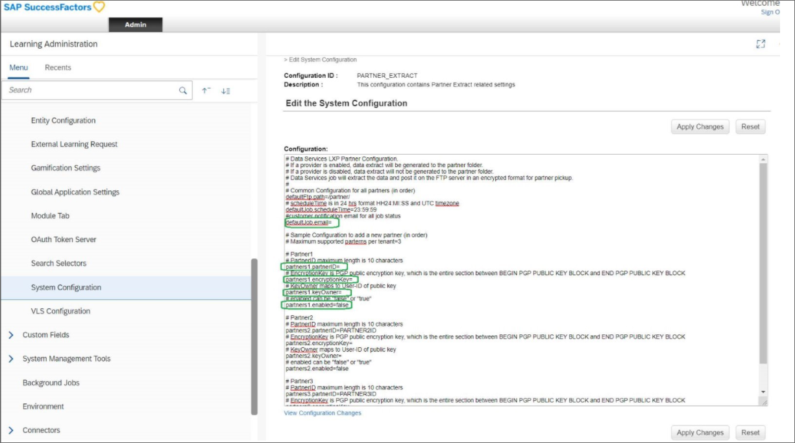
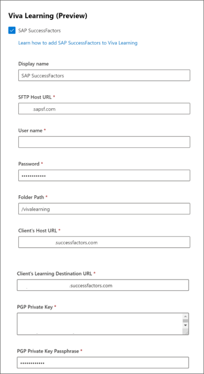
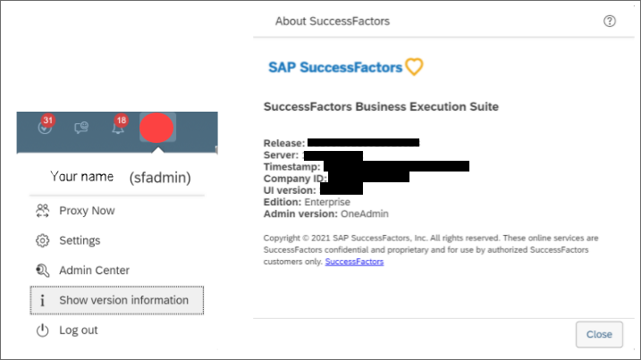

# Configure SAP SuccessFactors as a learning source for Microsoft Viva Learning

This article shows you how to configure SAP SuccessFactors as a third-party content source for Microsoft Viva Learning. First, you'll need to edit the system configuration in the SuccessFactors Portal, then you'll need to complete the configuration in the Microsoft 365 admin center.

>[!NOTE]
>Content accessible through Viva Learning is subject to terms other than the Microsoft Product Terms. SAP SuccessFactors content and any associated services are subject to the SAP SuccessFactors privacy and service terms.

## Configure the SuccessFactors portal

>[!Note]
> The admin who enables this feature must have access to the SuccessFactors Learning administrator application.

1. Obtain the required workflows to edit the PARTNER_EXTRACT configuration, which you can get to by going to **System Administration** > **Configuration** > **System Configuration** > **PARTNER_EXTRACT**.

2. Use the PGP tool to generate the PGP key (Public key, Private Key, Private Key Passphrase) of your preferred size. While generating the PGP key, you can select RSA algorithm, which is recommended. GNUPG tool is one of the PGP keys generation tools that you can use.

3. Fill in the following parameters in the PARTNER_EXTRACT configuration. To edit the partner extract configuration in SuccessFactors, you'll need **Edit System Configuration** workflow permission in SuccessFactors.

```
#customer notification email for all job status
defaultJob.email=

#Partner1
#PartnerID maximum length is 10 characters. This can be your LMS tenant ID. 
partners1.partnerID=

#EncryptionKey is the PGP public encryption key, which is the entire section between BEGIN PGP PUBLIC KEY BLOCK and END PGP PUBLIC KEY BLOCK 
partners1.encryptionKey=

#KeyOwner maps to the User-ID of public key 
partners1.keyOwner=

#enabled can be "false" or "true". Set it to "true" to enable the partner extract. 
partners1.enabled=
```



Once you've completed these steps in the SuccessFactors portal, you'll need to complete the setup in your Microsoft 365 Admin Center.

## Configure the Microsoft 365 admin center

1. Navigate to your [Microsoft 365 admin center](https://admin.microsoft.com).

2. Navigate to **Settings** > **Org settings**. Search for *Viva Learning* and enable SAP SuccessFactors from the options.

3. Fill in the configuration details.

### Configuration details



**Display Name**: Enter your desired display name for the SAP SuccessFactors carousel.

**SFTP Host URL**: Navigate to **LMS Admin Application** > **System Administration** > **Configuration** > **System Configuration** > **CONNECTORS**. Get the value of the `connector.ftp.server` property.

**User Name**: Follow the same steps you followed for the SFTP Host URL. Get the value of the `connector.ftp.userID` property.

**Password**: Enter your password. Check with your LMS application owner for help with retrieving your password.

**Folder Path**: Navigate to **LMS Admin Application** > **System Administration** > **Configuration** > **System Configuration** > **PARTNER_EXTRACT**. Get the value of the `defaultFtp.path` property.

**Client’s Host URL**: This is the BizX domain URL. You can get this from your BizX login URL. For example, if your BizX login URL is “organization.successfactors.com/sf/start/#/login” then the host URL is “organization.successfactors.com”.

**Client’s Learning Destination URL**: You can get this from the learning domain module URL. For example, if the learning domain URL is “organization.scdemo.successfactors.com/learning/...” then the Learning Destination URL is “organization.scdemo.successfactors.com”.

**PGP Private Key**: PGP private key for decryption, which is the entire section between BEGIN PGP PRIVATE KEY BLOCK and END PGP PRIVATE KEY BLOCK. You'll need to copy the key exactly as it's been generated; don't remove new line characters.

**PGP Private Key Passphrase**: You'll need to get this value from your IT admin or the team that provides your PGP key.

**Company ID**: Sign in to your SuccessFactors portal. Select your profile icon, then select **Show Version Settings**. You can view your company ID here.



>[!Note]
> SuccessFactors courses will start appearing in Viva Learning within 7 days of successful setup.

>[!Note]
> All users within an organization will be able to discover all the tenant-specific courses, but they'll only be able to access and consume courses that they have access to. User specific content discovery is planned for future releases.

## Data residency

Tenant metadata is stored centrally in our data stores and not stored in geo-specific data stores.
