# Coming soon: Configure SharePoint as a learning content source for Microsoft Viva Learning (Preview)

> [!NOTE]
> The information in this article relates to a preview product that may be substantially modified before it's commercially released. 

You can configure SharePoint as a learning content source to make your organization's own content available in Viva Learning (Preview).

## Overview

The knowledge admin (or global administrator) provides a site URL to where the Learning Service can create an empty centralized location—the Learning App Content Repository—in the form of a structured SharePoint list. This list can be used by your organization to house links to cross-company SharePoint folders that contain learning content. Admins are responsible for collecting and curating a list of URLs for folders. These folders should only include content that can be made available in Viva Learning (Preview).

Viva Learning (Preview) supports the following document types:

- Word, PowerPoint, Excel, PDF
- Audio (.m4a)
- Video (.mov, .mp4, .avi)

For more information, see [SharePoint limits](/office365/servicedescriptions/sharepoint-online-service-description/sharepoint-online-limits?redirectSourcePath=%252farticle%252fSharePoint-Online-limits-8f34ff47-b749-408b-abc0-b605e1f6d498). 

## Permissions

Document library folder URLs can be collected from any SharePoint site in the organization. Viva Learning (Preview) follows all existing content permissions. Therefore, only content for which a user has permission to access is searchable and visible within Viva Learning (Preview). Any content within these folders will be searchable, but only content to which the individual employee has permissions can be used.

Content deletion from your organization’s repository is not currently supported.

To remove unintentionally surfaced content, follow these steps:

1.	To restrict access to the document library, select the **Show actions** option, and then select **Manage access**.
	 
     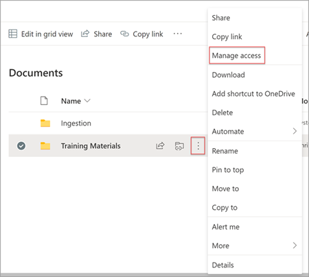

2.	Delete the original document within the document library.

For more information, see [Sharing and permissions in the SharePoint modern experience](/sharepoint/modern-experience-sharing-permissions). 

## Learning Service

The Learning Service uses the provided folder URLs to get metadata from all content stored in those folders. Within 24 hours of supplying the folder URL in the centralized repository, employees can search for and use your organization’s content within Viva Learning (Preview). All changes to content, including updated metadata and permissions, will also be applied in the Learning Service within 24 hours.

## Configure SharePoint as a source

You must be a Microsoft 365 global administrator, SharePoint administrator, or knowledge admin to perform these tasks.

To configure SharePoint as a learning content sources in for Viva Learning (Preview), follow these steps:

1.	In the left navigation of the Microsoft 365 admin center, go to **Settings** > **Org settings**.
 
2.	On the **Org settings** page, on the **Services** tab, select **Viva Learning (Preview)**.

     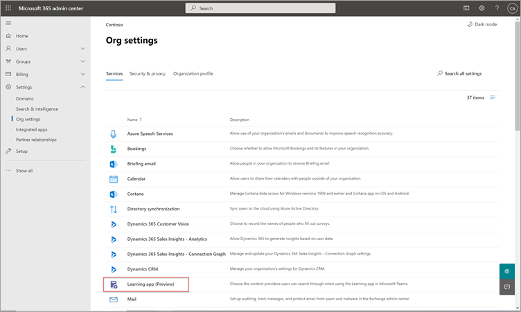

3.	On the **Viva Learning (Preview)** panel, under SharePoint, provides the site URL to the SharePoint site where you want Viva Learning (Preview) to create a centralized repository.

     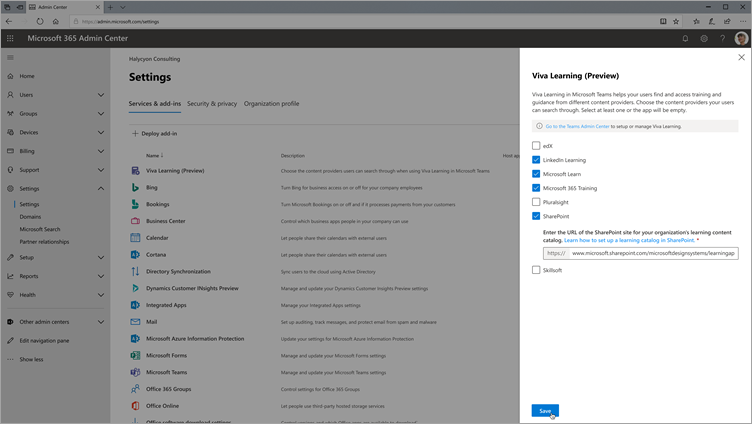

4.	A SharePoint list is created automatically within the provided SharePoint site.

     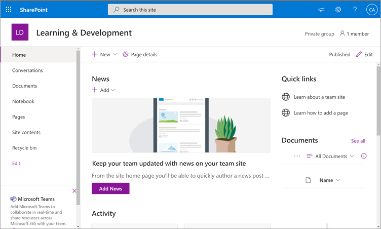

     In the left navigation of the SharePoint site, select **Site contents** > **Learning App Content Repository**. 

     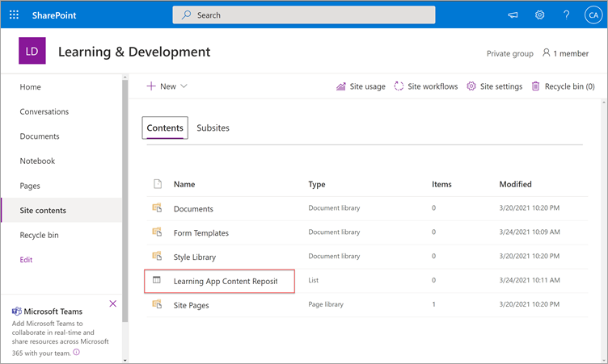 

5. On the **Learning App Content Repository** page, populate the SharePoint list with URLs to the learning content folders.

   1. Select **New** to view the **New item** panel. 

       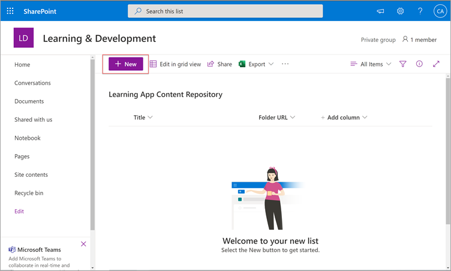
 
   2. On the **New item** panel, in the **Title** field, add a directory name of your choice. In the **Folder URL** field, add the URL to the learning content folder. Select **Save**.

       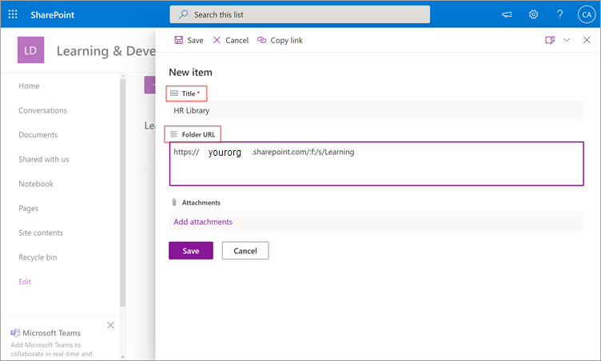

   3. The **Learning App Content Repository** page is updated with the new learning content.

       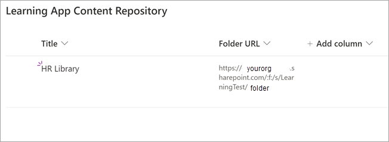

> [!NOTE]
> To allow for broader access to the Learning App Content Repository, a link to the list soon will be available in the Viva Learning (Preview) interface where users can request access and ultimately help populate the list. Site owners and global administrators will be required to grant access to the list. Access is specific to the list only and does not apply to the site where the list is stored. For more information, see [Provide your own organization's content](#provide-your-own-organizations-content) later in this article.

### Folder URL document library curation

Default metadata (such as modified date, created by, document name, content type, and organization name) is automatically pulled into Viva Learning (Preview) by the Microsoft Graph API.
 
To improve overall discovery and search relevance of the content, we recommend adding a **Description** column.

To add a **Description** column to the document library page, follow these steps:

1.	On the **Documents** page, select **Add column**.

2. Select the **Show actions** option, and then select **Single line of text**.

     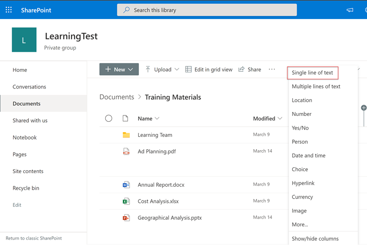

3. On the **Create a column** panel, in the **Name** field, add a descriptive name for the column. Select **Save**.

     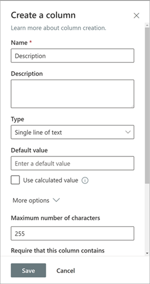
 
4. On the **Documents** page, in the **Description** column, add custom descriptions for each item. If no description is supplied, Viva Learning (Preview) will provide a default message that highlights the content as being from your own SharePoint library. 

     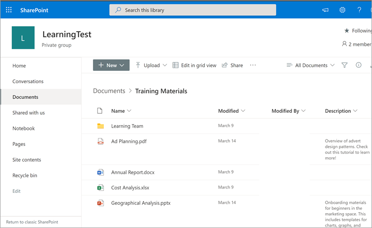
 
### Provide your own organization's content

Knowledge admins can access their organization’s Learning App Content Repository in SharePoint, where they can provide references to cross-organization document libraries. Content within these libraries will be then surfaced as learning content in Viva Learning (Preview).

1. In Viva Learning (Preview), select **More options** (**...**), and then select **Settings**.

     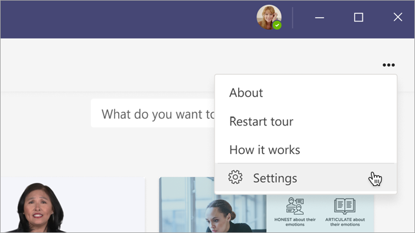
	 
2. Under **Settings**, select **Permissions**.

     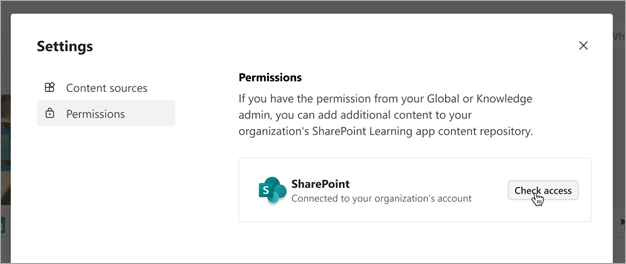

3. Select **Check access** to connect to your organization’s centralized library.
	 
