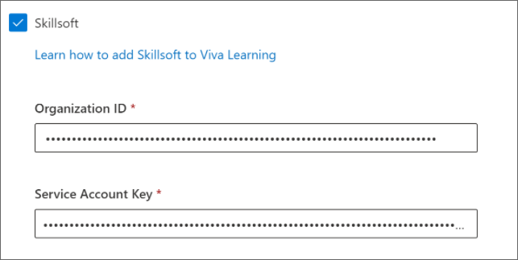

# Configure Skillsoft as a learning content source for Microsoft Viva Learning

>[!NOTE]
>Content accessible through Viva Learning is subject to terms other than the Microsoft Product Terms. Skillsoft content and any associated services are subject to Skillsoft’s privacy and service terms.

This article will show you how to configure Skillsoft as a learning content resource for Microsoft Viva Learning.

## First steps

You'll need to reach out to your Skillsoft account team to enable Viva Learning integration. Your account team will also provide you with the Organization ID and Service Account Key, which you'll need later on.

## Microsoft 365 admin center

1. Navigate to your [Microsoft 365 admin center](https://admin.microsoft.com) and sign in.
2. Navigate to **Settings** > **Org settings**. Then search for Viva Learning and enable Skillsoft from the options.
3. Fill in the configuration details you got from your Skillsoft account team.
    
4. Select **Save** to save the configuration details and complete the setup process.
