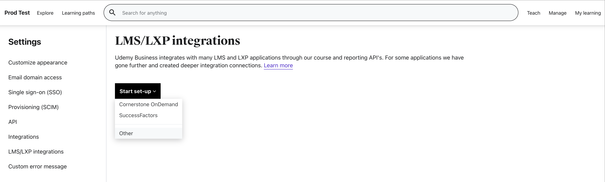
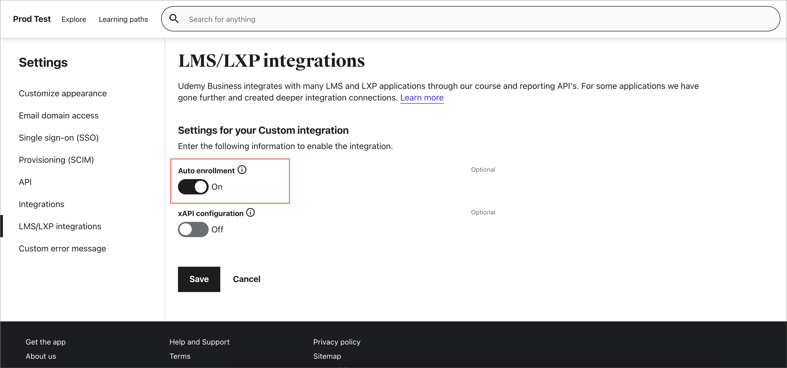
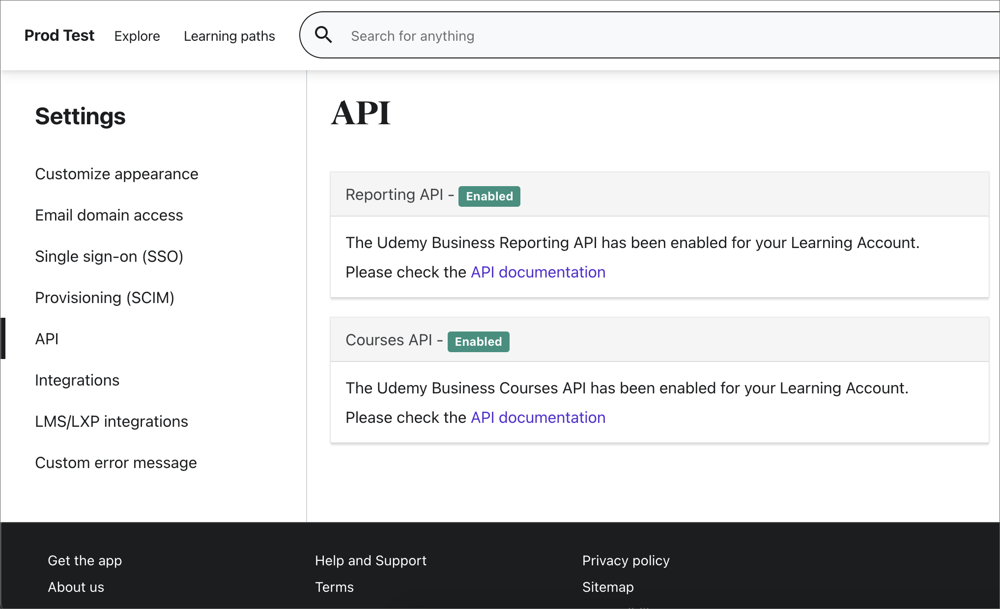
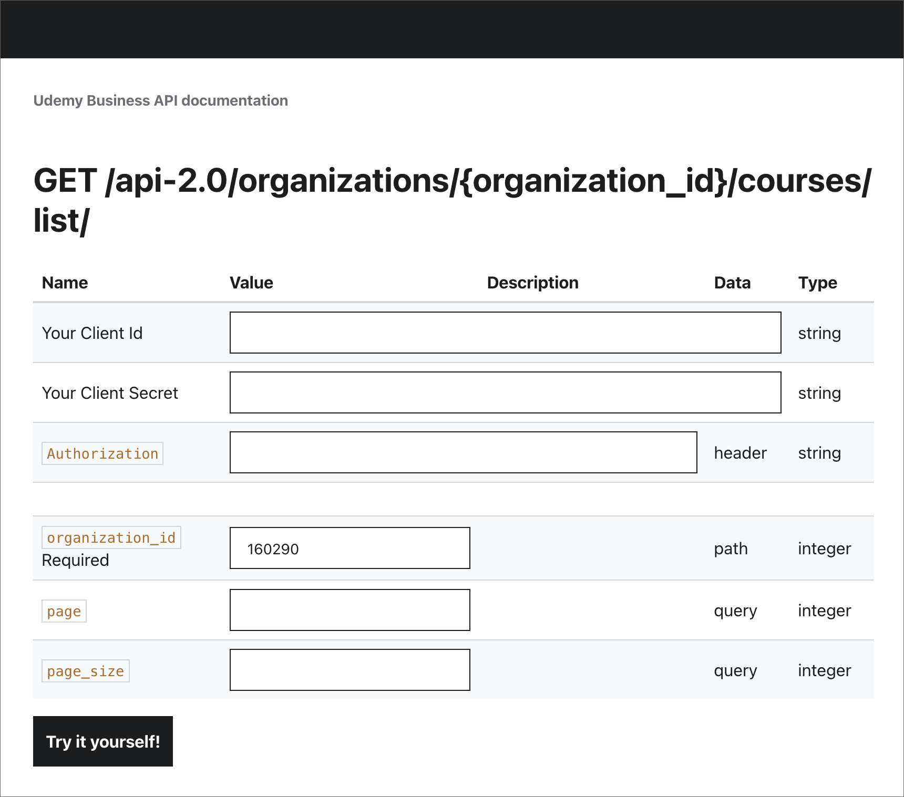

# Configure Udemy as a content source for Microsoft Viva Learning

This article shows you how to configure Udemy as a third-party learning content source for Microsoft Viva Learning.

>[!NOTE]
>Content accessible through Viva Learning is subject to terms other than the Microsoft Product Terms. Udemy content and any associated services are subject to Udemy’s privacy and service terms.

Follow these steps to enable the APIs in your Udemy Business environment and generate client credentials for your LMS/LXP application to access them.

1. Navigate to **Manage**, then **Settings**, then **API**. Check the status of your APIs. If they are disabled, you can contact support to have them enabled or follow the steps below to enable them.

    <!---->

2. If the APIs are disabled, navigate to **LMS/LXP integrations**, then **Start Set-up**, then **Other**.

    <!---->

3. In the following screen, type in the name of your custom LMS/LXP or third-party application. Then, turn on or off the auto-enrollment option and select **Save**. The auto enrollment option allows users that launch a course through their LMS/LXP to automatically be enrolled in Udemy.

    <!---->

4. Once you've saved, your Client ID and Client Secret will be generated and you can copy them from the screen. You can now access the APIs using the provided client credentials.

    <!---->

5. To access the API endpoints, you need to have your ACCOUNT_ID and endpoint URL. You can access this information and also try out the APIs by navigating to **Manage**, then **Settings**, then **API**. Once you’ve enabled the APIs, you should see the status of the APIs as "Enabled". Select the API documentation link.

    <!---->

6. Get the API endpoint URL and ACCOUNT_ID from the overview page. Navigate to the supported methods to try out an API call. You're now all set to make calls to the Udemy Business APIs.

    <!---->

    <!---->

## Configure the Microsoft 365 admin center

After you've received the required configuration details from Udemy portal by using the previous steps, the tenant admin needs to configure Udemy as a learning source in the Microsoft 365 admin center by using the following steps.

1. Navigate to the [Microsoft 365 admin center](https://admin.microsoft.com).

2. Navigate to **Settings**, then **Org settings**. Search for Viva Learning and enable Udemy from the options.

3. Fill in the following required configuration details:

    - **Client’s Host URL**: This is API endpoint URL gathered from Udemy portal in step 6.
    - **Organization ID**: This is the ACCOUNT_ID gathered from Udemy portal in step 6.
    - **Client ID**: This is the Client ID gathered from Udemy portal in step 4.
    - **Client Secret**: This is the Client Secret gathered from Udemy portal in step 4.

      <!---->

4. Select **Save** to activate Udemy content in Microsoft Viva Learning. It may take up to 24 hours for the content to be available in Viva Learning.
