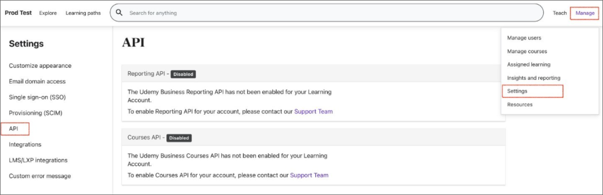
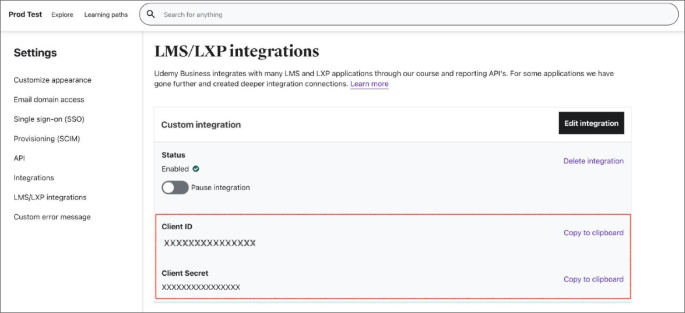
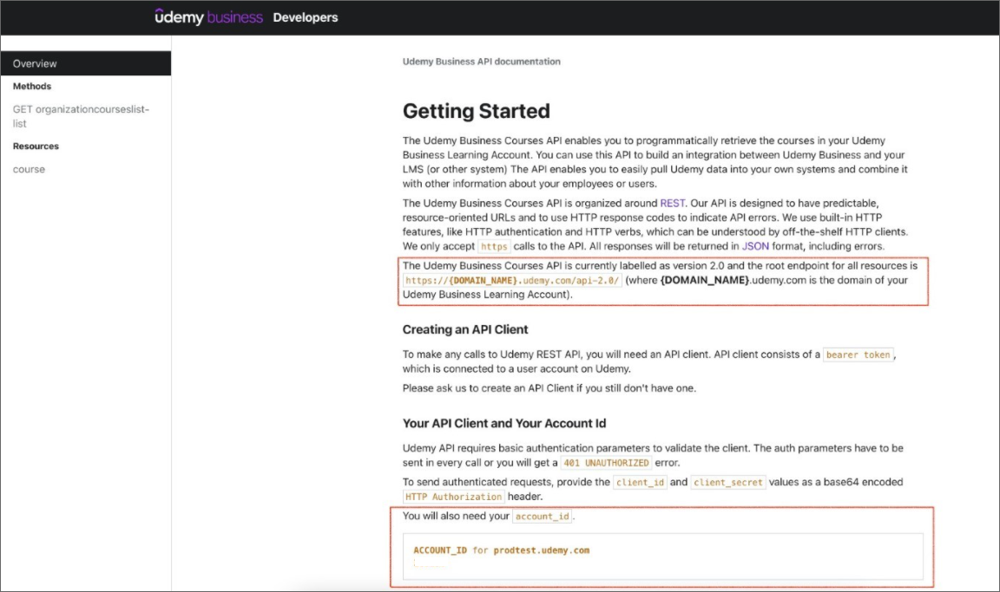
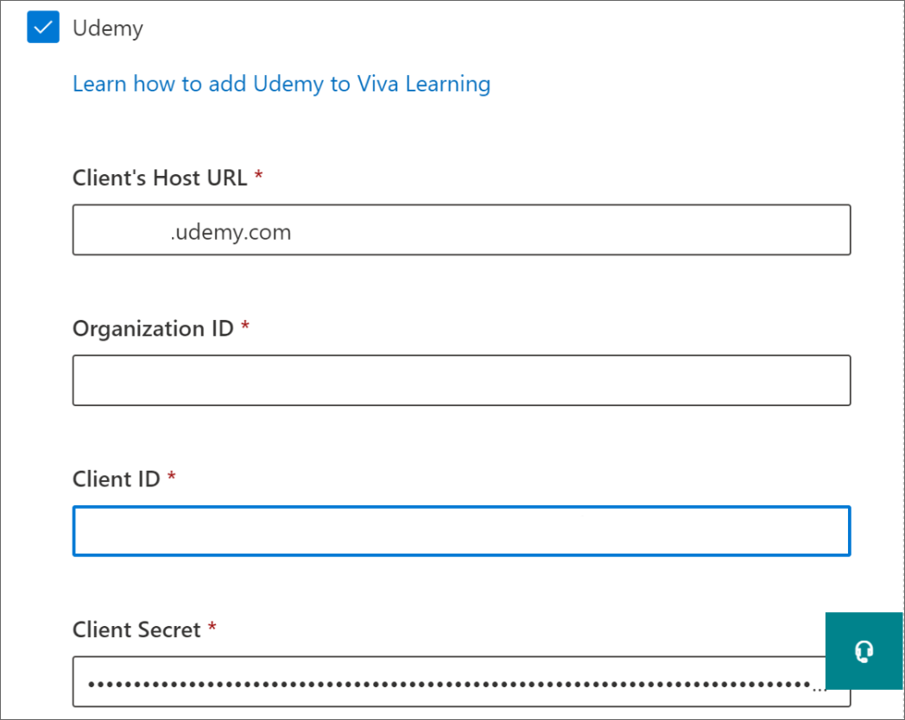

# Configure Udemy as a learning content source for Microsoft Viva Learning (Preview)

Follow these steps to enable the APIs in your Udemy Business environment and generate client credentials for your LMS/LXP application to access them.

1. Navigate to **Manage**, then **Settings**, then **API**. Check the status of your APIs. If they are disabled, you can contact support to have them enabled or follow the steps below to enable them.
    
2. If the APIs are disabled, navigate to **LMS/LXP integrations**, then **Start Set-up**, then **Other**.
    
3. In the following screen, type in the name of your custom LMS/LXP or 3rd party application. Then, turn ON/OFF auto-enrollment option and select **Save**. The auto enrollment option allows users that
launch a course through their LMS/LXP to automatically be enrolled in Udemy.<!--daisy ask if this needs to be on-->
    
4. Once you've saved, your client ID and client secret will be generated and you can copy them from the screen. You can now access the APIs using the provided client credentials.
    
5. To access the API endpoints, you need to have your ACCOUNT_ID and endpoint URL. You can access this information and also try out the APIs by navigating to **Manage**, then **Settings**, then **API**. Once you’ve enabled the APIs, you should see the status of the APIs as "Enabled". Select the API documentation link.
    
6. Get the API endpoint URL and ACCOUNT_ID from the overview page. Navigate to the supported methods to try out an API call. You're now all set to make calls to the Udemy Business APIs.
    
    

## Configure Udemy in the M365 Admin center

After you have received the required configuration details from Udemy portal through above steps, the tenant admin needs to configure Udemy as a learning source in M365 admin portal by following the steps below.

1. Navigate to the [Microsoft 365 admin center](https://admin.microsoft.com).
2. Navigate to **Settings**, then **Org settings**. Search for Viva Learning (Preview) and enable Udemy from the options.
3. Fill in required configuration details below.
    1. **Client’s Host URL** This is API endpoint URL gathered from Udemy portal in step 6.
    2. **Organization ID** This is the ACCOUNT_ID gathered from Udemy portal in step 6.
    3. **Client ID** This is the Client ID gathered from Udemy portal in step 4.
    4. **Client secret** This is the Client secret gathered from Udemy portal in step 4.
    
