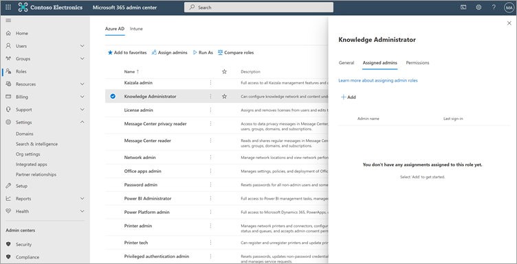
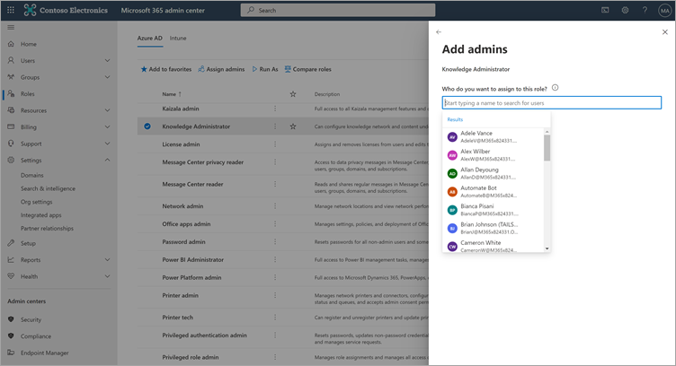
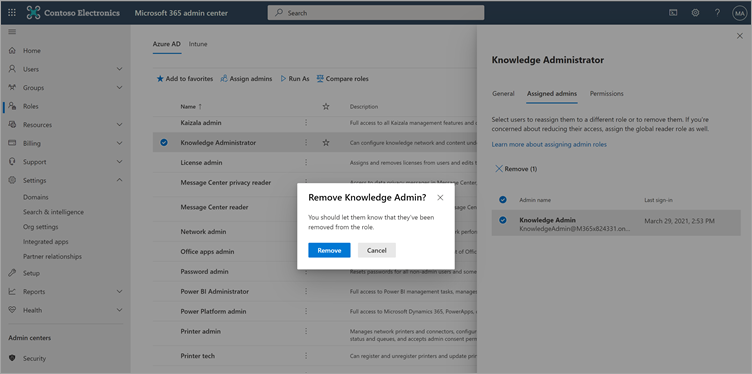

# Configure learning content sources for Microsoft Viva Learning (Preview) in the Microsoft 365 admin center

> [!NOTE]
> The information in this article relates to a preview product that may be substantially modified before it's commercially released. 

The administrators for the Microsoft 365 admin center—either by themselves or by assigning the knowledge admin role to selected individuals in your organization—can manage settings related to Viva Learning (Preview) and can configure the learning content sources.

The administrator selects which other learning content sources (for example, SharePoint or supported third-party content provider sources) will be available to users of Viva Learning (Preview). The admin then configures those sources to make sure the content is available for search and discovery and can be browsed by the employees who use Viva Learning (Preview).

> [!NOTE]
>  Users sign in to non-Microsoft and LinkedIn Learning Pro learnings in a browser or embedded viewer. This configured learning is subject to the separate license, privacy and service terms between your organization and the third party, and not the Viva Learning (Preview) terms. Before selecting this type of learning, verify you have an agreement in place for your organization and users.

## Assign the knowledge admin role (Optional)

You must be a Microsoft 365 global administrator to perform these tasks.

> [!TIP]
> The knowledge admin should be moderately technical and have existing SharePoint admin credentials, preferably someone who is well-versed in the education, learning, training, or employee experience part of the organization.

### Add a knowledge admin

To add a knowledge admin for Viva Learning (Preview), follow these steps:

1.	In the left navigation of the Microsoft 365 admin center, go to **Roles**.

2.	On the **Roles** page, on the **Azure AD** tab, select **Knowledge Administrator**.
 
3.	On the **Knowledge Administrator** panel, select **Assigned admins**, and then select **Add**.

     

3.	On the **Add admins** panel, select the person you choose for the role, and then select **Add**.

     

### Remove a knowledge admin

To remove a knowledge admin for Viva Learning (Preview), follow these steps:

1.	In the left navigation of the Microsoft 365 admin center, go to **Roles**.

2.	On the **Roles** page, on the **Azure AD** tab, and then select **Knowledge Administrator**.
 
3.	On the **Knowledge Administrator** panel, on the **Assigned Admins** tab, select **Remove**, and then select the person you want to remove from the role. To confirm, select **Remove**.

     

## Configure settings for the learning content sources

You must be a Microsoft 365 global administrator or knowledge admin to perform these tasks.

To configure settings for learning content sources in Viva Learning, follow these steps:

1.	In the left navigation of the Microsoft 365 admin center, go to **Settings** > **Org settings**.

2.	On the **Org settings** page, on the **Services** tab, select **Viva Learning (Preview)**.

     

3.	On the **Viva Learning (Preview)** panel, select the learning content sources you want to configure for the organization, and then select **Save**.

     

Among all the learning sources that exist, some will be enabled by default. These learning sources include:

- LinkedIn Learning (free content)
- Microsoft Learn
- Microsoft 365 Training

> [!NOTE]
> LinkedIn free content is provided to users under the LinkedIn privacy policies and user agreement. LinkedIn will receive the user’s IP address, any cookies previously set by LinkedIn, and will set a new cookie to track use of free content. Users are not required to sign in with LinkedIn to receive free content.  
For LinkedIn premium content, your organization needs a subscription for your team to access that content. Users will need to sign into LinkedIn to access that learning, which is provided under the terms of your organization’s and user terms with LinkedIn.   
For non-Microsoft content (except free LinkedIn content), ensure your organization has a subscription for your users to access that content using a work account before connecting it to Viva Learning (Preview). Users’ personal subscriptions to non-Microsoft learning providers will not be integrated with Viva Learning (Preview). Users sign in to non-Microsoft and LinkedIn Learning Pro learnings in a browser or embedded viewer. If users navigate to content where they do not have an organizational subscription, they may see a provider page where they could sign up for an individual subscription. All non-Microsoft learning is provided under the non-Microsoft provider’s terms and not as part of Viva Learning. 

To enable or disable a learning content source, select the check box next to the source. If a source is enabled, a check mark will be visible.

## Third-party content providers 

The set of available connected learning providers might change at any time. More providers will join as the program grows. Available providers might also choose to discontinue their connection with Viva Learning (Preview).

### Skillsoft as a content source  

For Viva Learning (Preview), users who have Skillsoft enabled and choose to view Skillsoft content will land on a Percipio page that asks them to input your organization's Percipio site name. After users input your organization's site name, they will be directed to page to sign in to your organization's Percipio site. Users will sign in by using their existing credentials and see the content they originally selected. Users will be asked to input the Percipio site name only once, until their browser cache is cleared. To streamline this experience for your users, we recommend including your Percipio site name in internal communications you send about Viva Learning (Preview).

This is intended to be a temporary experience for preview, and we are working with Skillsoft to enable tenant-specific integration for general availability, which will bypass the step that requires users to provide your organization's Percipio site name. 

### Details on Microsoft substrate  

For data that you copy to Viva Learning (Preview) from a non-Microsoft service (learning provider or learning management system), you are not able to directly extract, correct, or delete that data in Viva Learning (Preview). We refresh the data you import from non-Microsoft providers promptly to reflect changes and deletions in the non-Microsoft source data.

You need to work with the supplier of the non-Microsoft service to access, correct, delete or extract data under the license, service, or privacy terms of the non-Microsoft service. The changes made there will be reflected in the data processed for your use in Viva Learning (Preview) upon completion of the data update cycles of the non-Microsoft service and Viva Learning (Preview). If you turn off the connection between Viva Learning (Preview) and a non-Microsoft service, all data you had previously imported from that service will be deleted. 

## Next step

[Configure SharePoint as a learning content source for Microsoft Viva Learning (Preview)](configure-sharepoint-content-source.md)