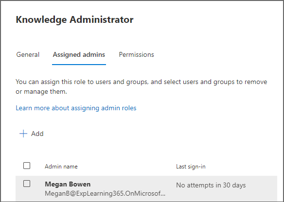

# Manage content sources for Microsoft Viva Learning in the Microsoft 365 admin center

The administrators for the Microsoft 365 admin center—either by themselves or by assigning the knowledge admin role to selected individuals in your organization—can manage settings related to Viva Learning and can configure the learning content sources.

The administrator selects which other learning content sources (for example, SharePoint or supported third-party content provider sources) will be available to users of Viva Learning. The admin then configures those sources to make sure the content is available for search and discovery and can be browsed by the employees who use Viva Learning. Content from Microsoft Learn, Microsoft 365 Training, and select content from LinkedIn Learning is available for free and enabled by default.

>[!NOTE]
>Content accessible through Viva Learning is subject to terms other than the Microsoft Product Terms. Content and any associated services are subject to the content provider's privacy and service terms.

> [!NOTE]
> For non-Microsoft content (except free LinkedIn content), ensure your organization has a subscription for your users to access that content using a work account before connecting it to Viva Learning. Users’ personal subscriptions to non-Microsoft learning providers will not be integrated with Viva Learning. Users sign in to non-Microsoft and LinkedIn Learning Pro learnings in a browser or embedded viewer. This configured learning is subject to the separate license, privacy and service terms between your organization and the third party, and not the Viva Learning terms. Before selecting this type of learning, verify you have an agreement in place for your organization and users. If users navigate to content where they do not have an organizational subscription, they may see a provider page where they could sign up for an individual subscription. All non-Microsoft learning is provided under the non-Microsoft provider’s terms and not as part of Viva Learning.

## Assign the knowledge admin role (Optional)

You must be a Microsoft 365 global administrator to perform these tasks.

> [!TIP]
> The knowledge admin should be moderately technical and have existing SharePoint admin credentials, preferably someone who is well-versed in the education, learning, training, or employee experience part of the organization.

### Add a knowledge admin

To add a knowledge admin for Viva Learning, follow these steps:

1. In the left navigation of the Microsoft 365 admin center, go to **Roles** and select **Role assignments**.

    

2. On the **Role Assignments** page, on the **Azure AD** tab, select **Knowledge Administrator**.

    

3. On the **Knowledge Administrator** panel, select **Assigned admins**, and then select **Add**.

    

4. On the **Add admins** panel, select the person you choose for the role, and then select **Add**.

### Remove a knowledge admin

To remove a knowledge admin for Viva Learning, follow these steps:

1. In the left navigation of the Microsoft 365 admin center, go to **Roles**, and select **Role assignments**.

    

2. On the **Role assignments** page, go to the **Azure AD** tab, and then select **Knowledge Administrator**.

    

3. On the **Knowledge Administrator** panel, on the **Assigned Admins** tab, select **Remove**, and then select the person you want to remove from the role. To confirm, select **Remove**.

    

## Configure settings for the learning content sources

You must be a Microsoft 365 global administrator or knowledge admin to perform these tasks.

To configure settings for learning content sources in Viva Learning, follow these steps:

1. In the left navigation of the Microsoft 365 admin center, go to **Settings** > **Org settings**.

2. On the **Org settings** page, on the **Services** tab, select **Viva Learning**.

    

3. On the **Viva Learning** panel, select the learning content sources you want to configure for the organization, and then select **Save**. You can view the date of the last successful sync with your selected sources from the same panel.

    > [!NOTE]
    > You'll need a Premium license to connect external content sources, with the exception of the select free courses from LinkedIn Learning. [Learn more about licensing](https://www.microsoft.com/microsoft-viva/learning).

    

4. To enable or disable a learning content source, select the check box next to the source. If a source is enabled, a check mark will be visible.

Some learning content sources will be enabled by default. These learning sources include:

- LinkedIn Learning select free content
- Microsoft Learn
- Microsoft 365 Training

> [!NOTE]
> For data that you copy to Viva Learning from a non-Microsoft service (learning provider or learning management system), you are not able to directly extract, correct, or delete that data in Viva Learning. We refresh the data you import from non-Microsoft providers promptly to reflect changes and deletions in the non-Microsoft source data.
You need to work with the supplier of the non-Microsoft service to access, correct, delete or extract data under the license, service, or privacy terms of the non-Microsoft service. The changes made there will be reflected in the data processed for your use in Viva Learning upon completion of the data update cycles of the non-Microsoft service and Viva Learning. If you turn off the connection between Viva Learning and a non-Microsoft service, all data you had previously imported from that service will be deleted.

## Next step

[Add SharePoint as a content source for Microsoft Viva Learning](configure-sharepoint-content-source.md)
