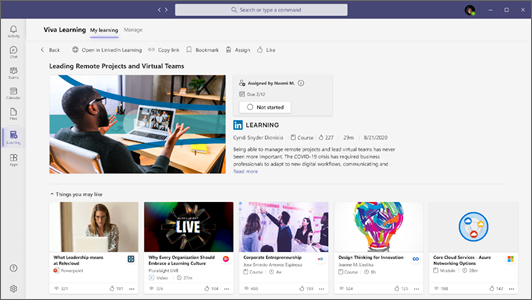

# Overview of Microsoft Viva Learning (Preview) 

> [!NOTE]
> The information in this article relates to a preview product that may be substantially modified before it's commercially released. 

Viva Learning (Preview) is a centralized learning hub in Microsoft Teams that lets you seamlessly integrate learning and building skills into your day. In Viva Learning (Preview), your team can discover, share, assign, and learn from content libraries provided by both your organization and partners. They can do all of this without leaving Microsoft Teams.

   
 
Employees are more likely to report being satisfied and remain at an organization longer when given opportunities to learn and grow. Viva Learning (Preview) makes it easy to create these opportunities for your organization without the need to step away from the communication tools you already use.

## Learn while working

### Everyone

Viva Learning (Preview) makes it easy to incorporate learning into your day. When you open Viva Learning (Preview) in Microsoft Teams, you’ll see a personalized view of learning content from both your organization and partners such as LinkedIn Learning. As you continue to search for and complete more training, your recommended content will update to reflect your interests.

- Easily find learning opportunities provided by your organization.
- Browse courses from LinkedIn Learning, Microsoft Learn, Microsoft 365 Training, Skillsoft, Coursera, edX, Pluralsight, and other third-party learning partners.
- Search for specific learning content that appeals to you or supports your career goals.
- Share relevant, interesting, and important learning content with your team members or groups in a Microsoft Teams chat or channel.
- Organize your custom selections of learning content in Microsoft Teams channels and tabs.
- Like and save courses you’re interested in.
- Play LinkedIn Learning courses in the embedded player without leaving Microsoft Teams.

### Managers

Keep your team engaged and up to date with necessary skills without the need to coordinate learning across platforms. You can assign learning content to individuals or groups, share content with your team, and track the completion status of learning you’ve assigned.

## Admin roles

Admins set permissions and allow learning content sources for Viva Learning (Preview). To set up Viva Learning (Preview), you'll need permissions as:

- Microsoft Teams admin
- Microsoft 365 global administrator or SharePoint administrator
- Knowledge admin

### Knowledge admin

The knowledge admin is a new Azure Active Directory (Azure AD) role in the Microsoft 365 admin center that can be assigned to anyone in the organization. This role manages the organization’s learning content sources through the Microsoft 365 admin center. For more information, see [Azure AD built-in roles](/azure/active-directory/roles/permissions-reference#knowledge-administrator).

The knowledge admin should be moderately technical and have existing SharePoint administrator credentials. The knowledge admin should be well versed in the education, learning, training, or employee experience part of the organization.

## Get started

When you’re ready to set up and configure Viva Learning (Preview) in your Microsoft 365 environment:

- Use the Microsoft Teams admin center to [manage Viva Learning (Preview) across your organization](set-up-teams-admin-center.md).
- Use the Microsoft 365 admin center to [configure learning sources available to specific groups](content-sources-365-admin-center.md).
- Use the SharePoint admin center to [manage and store your own learning content](configure-sharepoint-content-source.md).

