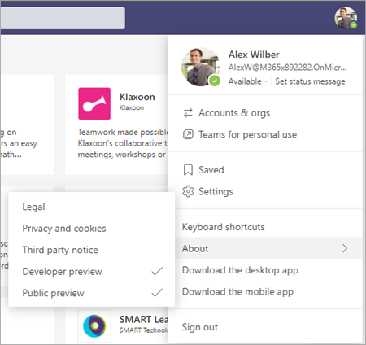
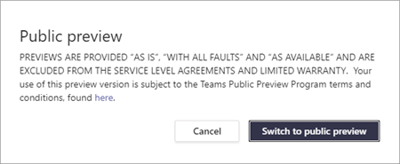
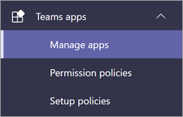
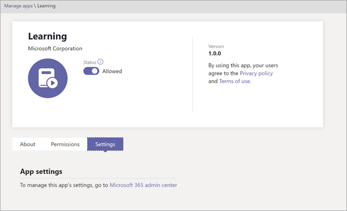
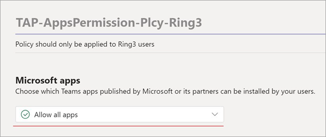

# Set up Microsoft Viva Learning (Preview) in the Teams admin center

> [!NOTE]
> The information in this article relates to a preview product that may be substantially modified before it's commercially released. 

The Teams administrator needs to perform certain steps to enable Viva Learning (Preview) for their users in the tenant. These steps vary based on how the tenant is enabled:  [*Public Preview*](set-up-teams-admin-center.md#public-preview-tenants) or [*Private Preview* (or Beta)](set-up-teams-admin-center.md#private-preview-tenants).

## Public Preview tenants

### Administrator steps for Public Preview tenants

Because the Viva Learning (Preview) is not yet generally available, certain steps are required to enable the features and set permissions for specific users or groups. 

1. Enable Public Preview features for Viva Learning (Preview) users.

    a. Modify Teams update policy to enable Public Preview features. See [Microsoft Teams Public Preview](https://docs.microsoft.com/MicrosoftTeams/public-preview-doc-updates).

    b. Enable the update policy for users or groups who will perform Viva Learning (Preview) testing. See [Assign policies to users and groups](https://docs.microsoft.com/microsoftteams/assign-policies-users-and-groups).

2. Modify the app permission policy for Viva Learning (Preview) users.

    a. Unless it's currently part of the global policy, allow all Microsoft apps in the app permission policy. See [Manage app permission policies in Microsoft Teams](https://docs.microsoft.com/microsoftteams/teams-app-permission-policies). 

    b. Enable the app permission policy for users or groups who will perform Viva Learning (Preview) testing. See [Assign policies to users and groups](https://docs.microsoft.com/microsoftteams/assign-policies-users-and-groups).

3.	Notify users who will test Viva Learning (Preview) to [switch their build client to Public Preview for Teams](set-up-teams-admin-center.md#user-steps-for-public-preview-tenants).

> [!IMPORTANT]
> For Public Preview tenants, Viva Learning (Preview) will not be displayed in **Managed apps** in the Teams admin center until final product release. However, enabled Public Preview users can find Viva Learning (Preview) in the Teams app store and use it, once the correct policies and permissions have been set up.

### User steps for Public Preview tenants

Users who have been enabled for Public Preview testing (by enabling policies [previously described](set-up-teams-admin-center.md#administrator-steps-for-public-review-tenants)) need to [switch to Public Preview](https://docs.microsoft.com/microsoftteams/public-preview-doc-updates#enable-public-preview) in their Teams client.

1. Users must select their profile image > **About** > **Public Preview**.
   
    
    
2. Users must accept the **Public Preview** terms and conditions.

    
 
3. Users can now find Viva Learning (Preview) in the Teams app store and start using it.

## Private Preview tenants

### Administrator steps for Private Preview (or Beta) tenants

For Private Preview tenants, there are no additional policies that need to be enabled. However, Viva Learning (Preview) must be made available for users in your organization.

1. In the left navigation of the Teams admin center, go to **Teams apps** > **Manage apps**.

   

2. On the **Manage apps** page, in the search box, type *Viva Learning*, and then select **Viva Learning (Preview)**.

   

3. On the **Viva Learning (Preview)** page, under **Status**, select **Allowed** to turn on Viva Learning (Preview).

   

<!---
The Teams admin installs Viva Learning (Preview) and applies permission policies through the Teams admin center.

1. For Viva Learning (Preview), you must first set the Update policy in Teams. For more information, see [Microsoft Teams Public Preview](/MicrosoftTeams/public-preview-doc-updates).

    1. Sign in to the Teams admin center.

    2. Select **Teams** > **Update policies**.

    3. Select **Add**. 

    4. Name the update policy, add a policy, and turn on **Show preview features**.

2. The admin must notify users of the policy update so that they move their build into the Public Preview for Teams. 

    1. Users must select their profile image > **About** > **Public Preview**.
   
        
    
    2. Users must accept the **Public preview** terms and conditions.

        
 
3. For organizations that have restrictive policies and need to enable Viva Learning (Preview), follow the process in the next section.

## Manage settings for Viva Learning (Preview)

You must be an administrator in the Teams admin center to perform these tasks.

To make Viva Learning (Preview) available for users in your organization, follow these steps:

1. In the left navigation of the Teams admin center, go to **Teams apps** > **Manage apps**.

   

2. On the **Manage apps** page, in the search box, type *Viva learning*, and then select **Viva Learning (Preview)**.

   

3. On the **Viva Learning (Preview)** page:

   1. Under **Status**, select **Allowed** to turn on Viva Learning (Preview).

   2. On the **Settings** tab, under **App settings**, go to the Microsoft 365 admin center to [configure learning content sources](content-sources-365-admin-center.md).

   

4. After **Manage app** settings, go to **Permission policies** and **Setup policies** to grant permission to employees who should have access to Viva Learning (Preview) as part of your organization's participation in the preview.

> [!NOTE]
>  If your organization is in Ring 4.0 as part of Teams TAP100 program, you might need to enable approved users in Ring 3.0 to access Viva Learning (Preview).   As part of the preview, Viva Learning (Preview) is released in Ring 3.0. If your organization is in Ring 4.0, you won’t see Viva Learning (Preview) on the **Manage apps** page. To test the app, you need to create a custom apps permission policy, set it to **Allow all apps**, and assign it to Ring 3.0 approved users.      

--->

## Next step

[Configure learning content sources for Viva Learning (Preview) in the Microsoft 365 admin center](content-sources-365-admin-center.md)
