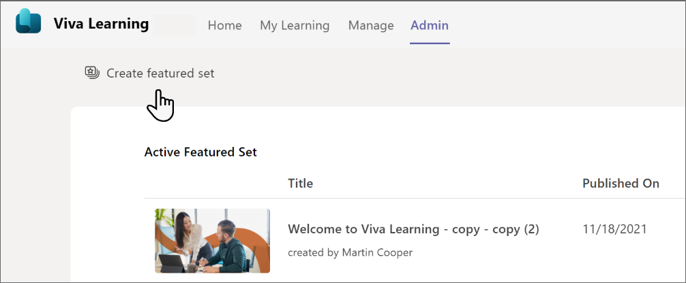

# Manage content in the admin tab

You can manage some of your Viva Learning content from within the app in Teams. You can choose which content to feature for your organization from the Admin tab. To see the Admin tab you'll need to:

- Have a premium license for Viva Learning
- Be assigned either an Admin, Knowledge admin, or Knowledge Manager role. [Learn how to assign roles](/exchange/permissions/role-group-members)

To create a set of featured content that will show up for your users, select the **Create featured set** in the top left corner.

## How content shows up in the My Learning page

The My Learning page helps users take control of their learning journey. Users will be able to track assignments, recommendations, bookmarks, recent history, and completed courses on this page.

-**Recommended to you**: Recommendations from your peers will show up here.

-**Bookmarks**: Content bookmarked by the user will be shown here.

-**Recently viewed**: The user's 20 most recently viewed items will be shown under this tab. The most recently viewed item is shown first.

-**Completed**: Courses completed by the user will show under this tab.
