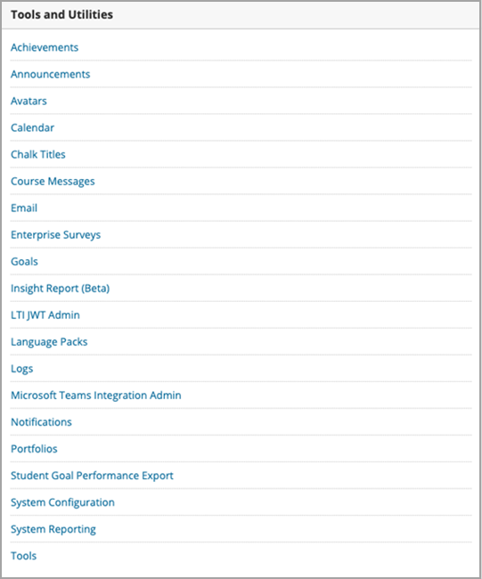

# Use Microsoft Teams classes with Blackboard

> [!IMPORTANT]
> Some information relates to prereleased product which may be substantially modified before it's commercially released. Microsoft makes no warranties, express or implied, with respect to the information provided here.

Microsoft Teams classes is a Learning Tools Interoperability (LTI) app that helps educators and students easily navigate between their Learning Management System (LMS) and Teams. Users can access their class teams associated with their course directly from within their LMS.

## Approve the app in the Microsoft Azure tenant

The following tasks are completed by the Microsoft Office 365 admin and the Blackboard Learn Ultra admin.

Before managing the integration within Blackboard Learn Ultra, the Microsoft Office 365 admin must approve the Blackboard **MSFT Teams for Learn Ultra Azure** app for the institution’s Microsoft Azure tenant.

1. Find your Microsoft Tenant ID. See [how to find the tenant](/azure/active-directory/fundamentals/active-directory-how-to-find-tenant).

2. Redirect the Microsoft Identity Platform Admin Consent Endpoint according to the following example:

   `https://login.microsoftonline.com/{tenant}/adminconsent?client\_id=2d94989f-457a-47c1-a637-e75acdb11568`

   > [!NOTE]
   > Replace {tenant} with your organization’s Microsoft tenant ID.

## Register the integration apps

As a Blackboard Learn Ultra admin, you'll need to register 2 LTI 1.3 integration apps within your Test environment:

- The Blackboard Learn Class Teams integration to support the roster sync

- The Microsoft Teams class team LTI app

1. Make a note of the following LTI Client IDs for both Apps:

    - Blackboard - f1561daa-1b21-4693-ba90-6c55f1a0eb41

    - Microsoft - 027328b7-c2e3-4c9e-aaa1-07802dae6c89

2. Access the Admin Panel, and under **Integrations**, locate the LTI Tool Providers.

   

3. Select **Register LTI1.3/Advantage Tool**.

4. Enter the first of the Client IDs provided (either Blackboard or Microsoft), and select **Submit**.

   

5. Review the pre-populated settings and ensure that the tool status is marked as approved.

6. Scroll to the bottom, and then select **Submit**.

7. Repeat the previous steps to register the second of the LTI apps within your environment.

## Set up the REST Application and Cross Origin Resource Sharing

The Blackboard Learn Ultra admin will also need to configure the REST Application and the Cross Origin Resource Sharing configuration.

Complete the following to set up the REST Application

1. Access the Learn Administration Tools, and then select **REST API Integrations** from the **Integrations** section.

2. Select **Create integrations** and enter the same Application/Client ID that you entered for the Blackboard Learn Class Teams Integration LTI tool.

3. Enter the Learn User (this could be your own learn admin username), or select **Browse** to locate.

4. Select **Yes** for **End User Access**.

5. Select **Yes** for **Authorized to Act as User**

6. Select **Submit** once complete.

## Set up Cross-Origin Resource Sharing

1. Access the Learn Administration Tools, and select **Cross-Origin Resource Sharing** from the **Integrations** section.

2. Select **Create Configuration**.

3. Enter `https://bb-ms-teams-ultra-ext.api.blackboard.com` in the origin.

4. Add the word **Authorization** in the **Allowed Headers**.

5. Set **Available** to **Yes**.

6. Select **Submit** once complete.

## Enable Class Teams in Blackboard Learn

Once you've enabled the LTI tools, your next step will be to set up the Microsoft Class Teams integration from your own Microsoft Office 365 tenant. You can do this by following these steps as the Blackboard Learn Ultra admin.

1. In **Learn Admin** > **Tools and Utilities**, select **Microsoft Teams Integration Admin**.

   

2. Select the checkbox for **Enable Microsoft Teams**.

3. Enter your tenant ID as referenced in the section under Microsoft O365 Admin

 > [!NOTE]
 > You won't be able to save the settings until the app has been approved by the O365 admin. See [Approve the app in Microsoft Azure tenant](#approve-the-app-in-the-microsoft-azure-tenant).

4. When the global O365 admin has approved the Blackboard Teams application in your Microsoft Tenant, select **Submit**.
