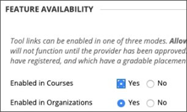
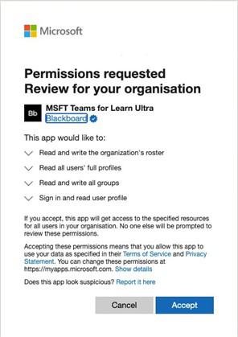

# Use Microsoft Teams classes with Blackboard Learn Ultra

Teamwork is at the core of every modern organization. By fostering collaboration, it’s a defining characteristic of every successful institution. You can enhance all the capabilities and features of Blackboard Learn Ultra by pairing them up with Microsoft Teams classes.

Your classes might include real-time conversations, video meetings, or asynchronous interactions. You can add file sharing and cocreation experiences for your students, all in one place. Microsoft Teams classes with Learn Ultra redefine the dynamics of teaching and what effective learning means.

> [!IMPORTANT]
> Ensure that you have successfully set up the Institution Email field in your [Student Information System (SIS)](https://help.blackboard.com/Learn/Administrator/SaaS/Integrations/Student_Information_System/SIS_Planning)
>
>The Microsoft Teams classes integration relies on the institution email field in your SIS to map to the correct Microsoft Azure Active Directory’s (AAD) [User Principle Name (UPN)](/azure/active-directory/hybrid/howto-troubleshoot-upn-changes). If no institution email has been provisioned, this will default to the existing email. It’s recommended that this field be set for every user to ensure their data is synchronized correctly and that there is no conflict of email data between AAD and Blackboard Learn Ultra.
>
> If you haven’t set this field appropriately in your SIS mapping, the integration will continue to work, but users might not appear in the Teams classes created, and errors could occur.

## Supporting Institutional Data Mapping – Institution Email SIS Field

As part of the evolution with Cloud provider integrations, Blackboard Learn Ultra has created a new **Institution Email** field, in both the Student Information System Framework integration and public REST APIs, allowing institutions to manage the data synchronization process effectively between Blackboard Learn Ultra and AAD.

### What does the Institution Email mean and what does it support?

The **Institution Email** field allows customized field mappings between a client’s externally supported data sources and Blackboard Learn Ultra. If data sources are cloud providers, such as Microsoft, the User Principle Name (UPN) is a primary unique identifier for each user consisting of a UPN prefix (the user’s account name) and a UPN suffix (a DNS domain name) joined together with an @ symbol. This creates a unique email address for each specific user within the Microsoft Azure Active Directory.

To ensure data is accurate and enrollments or memberships between Blackboard Learn Ultra and Microsoft Teams classes are correctly achieved, a user’s email address must match between both systems. In Blackboard Learn Ultra, users can change or override their existing email address in the user interface, which could result in sync errors occurring and the user not being correctly added to a Class Team. The **Institution Email** field mapping ensures this level of security and validation checking can be correctly managed, regardless if users have changed their email within Blackboard Learn Ultra or not.

 When two email addresses are different, either:

- A decision must be made as to which source has precedence and will be taken as both the Person and Institution Emails.
  Or
- An institution can set a custom field mapping in its Institution Email, which can resolve a potential conflict.

The **Institution Email** field mapping is now available for all existing SIS integration types at **Advanced Configuration Settings** > **Users Learn Object Type** > **Field Mapping**.

> [!NOTE]
> It’s important to note that, by default, the **Institution Email** is set to the **Person Email** for all SIS formats and must be unique for each person. All existing integrations that are set up and running will have this data mapping in place, as SIS will fail to import users if their email is duplicated. If an institution requires the ability to change the Institution Email to **custom**, they'll need to manage this through the **Advanced Configuration Settings** in the SIS.

## Requirements

The Microsoft Teams classes integration is available for **Ultra Course View courses only**. Your institution needs to complete these requirements to use it:

- Have Blackboard Learn Ultra Learn SaaS with Ultra Base Navigation enabled

  

- Enable LTI for use in courses.

  a. Go to the **Administrator Panel** > **LTI Tool Providers** > **Manage Global Properties**.

  b. Select **LTI Enabled in Courses**, and optionally, select **Enabled in Organizations**.

  c. Select **Submit**.

- Must have LTI configured

- Add Blackboard Learn Ultra Teams Classes LTI Integration

- Add Microsoft Teams Classes LTI 1.3 Tool

- Add the REST API Tool and Cross-Origin Resource Sharing

- Configure and approve Microsoft Teams classes Integration

## Add the Blackboard Learn Ultra Teams Classes LTI 1.3 Tool

1. From the **Administrator Panel**, select **LTI Tool Providers**.

2. Select **register LTI 1.3 Tool**.

3. In the **Client ID** field, type or copy and paste this ID:

   `f1561daa-1b21-4693-ba90-6c55f1a0eb41`

4. Review all settings that have been pre-populated and in **Tool Status**, and then select **Enabled**.

5. In **Institution Policies**, select **Role in Course, Name,** and **Email Address**, and then select **Yes** for both.

6. Select **Allow grade service access** and **Allow Membership Service Access**.

## Add the Microsoft Teams Classes LTI 1.3 Tool

1. From the **Administrator Panel**, select **LTI Tool Providers**.

2. Select **register LTI 1.3 Tool**.

3. In the **Client ID** field, type or copy and paste this ID:

   `027328b7-c2e3-4c9e-aaa1-07802dae6c89`

4. Review all settings that have been pre-populated and in *Tool Status* and select *Enabled.*

5. In **Institution Policies**, select **Role in Course, Name,** and **Email Address**. Select **Yes** for both.

6. Select **Allow grade service access** and **Allow Membership Service Access**.

## Add the REST API tool

1. From the **Administrator Panel**, navigate to **Integrations** and select **Rest API Integrations**.

2. Select **Create Integration**.

3. In the **Application ID** field, type or copy and paste this ID:

   `f1561daa-1b21-4693-ba90-6c55f1a0eb41`

4. Type a user for this integration.

   This user will be the one with home API access from which the application is associated.

5. Select **Submit**.

## Add the Cross-Origin Resource Sharing

1. From the **Administrator panel**, navigate to **Integrations** and select **Cross-origin Resource Sharing*.

2. Select **Create Configuration**.

3. In the **Origin** field, type of copy and paste this URL:

   `https://bb-ms-teams-ultra-ext.api.blackboard.com`

4. In the **Allowed Headers** field, type **Authorization**.

5. Set **Available** to **Yes**.

6. Select **Submit**.

## Configure and Approve Microsoft Teams classes Integration

To successfully integrate your Blackboard Learn Ultra instance with Microsoft Teams classes, you'll need to make sure the Blackboard Learn Ultra application is approved for access within your Microsoft Azure tenant. This is a process that will need to be completed by your institution’s Microsoft 365 Global Admin.

This process can be done either before or after you have configured the LTI applications in your Blackboard Learn Ultra Instance.

### Before Configuring the LTI Applications

If you choose to approve the Blackboard Learn Ultra Teams Classes Azure app before configuring the LTI integrations, you'll need to redirect to the **Microsoft Identity Platform Admin Consent Endpoint**. The URL is shown:

`https://login.microsoftonline.com/{tenant}/adminconsent?client_id=2d94989f-457a-47c1-a637-e75acdb11568`

> [!NOTE]
> You’ll replace **{Tenant}** with your specific institutional Microsoft Azure tenant ID.

You'll see a permissions window that explains you're giving permission to Blackboard Learn Ultra to access Microsoft Teams.

### After Configuring the LTI Applications

1. On the **Administrator Panel**, navigate to **Tools and Utilities** and select **Microsoft Teams Integration Admin**.

2. Select **Enable Microsoft Teams**.

3. Add your **Microsoft Tenant ID** into the available text field.

4. Choose one of the following options:

   - If the app has pre-consent, it will show a small checkmark. If the checkmark appears, select **Submit**.

   - If consent hasn’t been approved, follow the steps described to generate the URL for consent and send it to the Microsoft 365 Global Admin for approval.

5. Once you've confirmation of approval, select **Retry** to confirm, and then select **Submit**.

