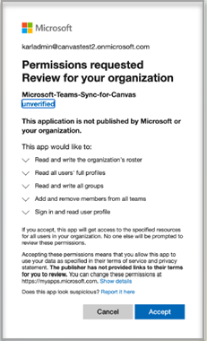
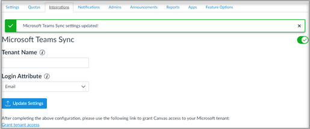
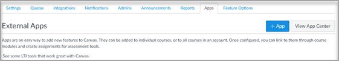
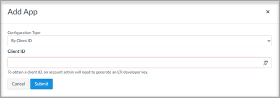

# Use Microsoft Teams classes with Canvas

> [!IMPORTANT]
> Some information relates to prereleased product which may be substantially modified before it's commercially released. Microsoft makes no warranties, express or implied, with respect to the information provided here.

Microsoft Teams classes is a Learning Tools Interoperability (LTI) app that helps educators and students easily navigate between their Learning Management System (LMS) and Teams. Users can access their class teams associated with their course directly from within their LMS.

## Microsoft Office 365 Admin

Before managing the Microsoft Teams integration within Instructure Canvas, it is important to have Canvas’s **Microsoft-Teams-Sync-for-Canvas** Azure app approved by your institution’s Microsoft Office 365 admin in your Microsoft Azure tenant before completing the Canvas admin setup.

1. Sign in to Canvas.
 
2. Select the **Admin** link in the global navigation, and then select your account.

3. In the admin navigation, select the **Settings** link, and then the **Integrations** tab.

4. Enter your Microsoft tenant name and login attribute.

   The login attribute will be used for associating the Canvas user with an Azure Active Directory user.

5. Select **Update Settings** once done.

6. To approve access for Canvas’s **Microsoft-Teams-Sync-for-Canvas** Azure app, select the **Grant tenant access** link. You'll be redirected to the Microsoft Identity Platform Admin Consent Endpoint.

   

7. Select **Accept**.
 
8. Enable the Microsoft Teams sync by turning the toggle on.

   

## Canvas Admin

Set up the Microsoft Teams LTI 1.3 Integration.

As a Canvas Admin, you'll need to add the Microsoft Teams classes LTI app within your environment. Make a note of the LTI Client ID for the app.

 - Microsoft Teams classes - 170000000000570

1. Access **Admin settings** > **Apps**.

2. Select **+ App** to add the Teams LTI apps.
 
   

3. Select **By Client ID** for configuration type.

   

4. Enter the Client ID provided, and then select **Submit**.
   
   You'll notice the Microsoft Teams classes LTI app name for the Client ID for confirmation.

5. Select **Install**.

   The Microsoft Teams classes LTI app will be added to the list of external apps.
