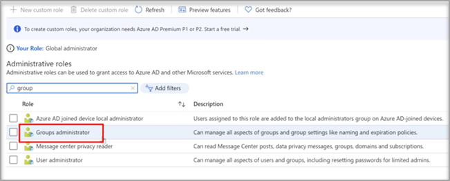
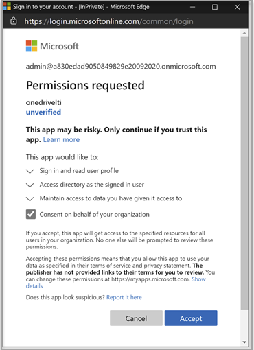
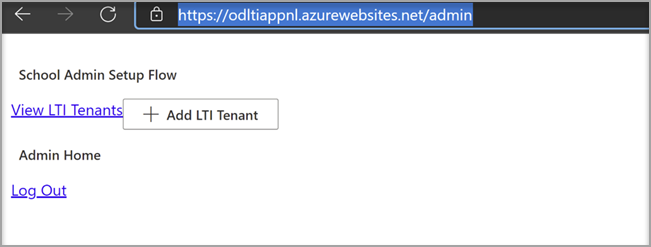
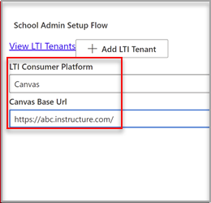
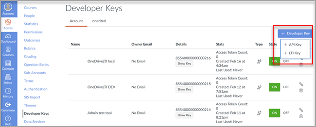
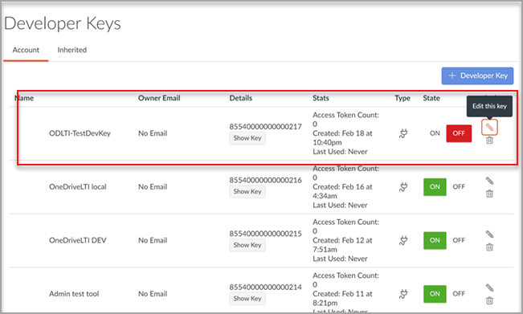

# Use Microsoft OneDrive with your Learning Management System

> [!IMPORTANT]
> Some information relates to prereleased product which may be substantially modified before it's commercially released. Microsoft makes no warranties, express or implied, with respect to the information provided here.

Learn the benefits of using Microsoft OneDrive with your Learning Management System (LMS).

**Brings Microsoft Office 365 directly into your workflows**

The Microsoft OneDrive Learning Tools Interoperability (LTI) App integrates with your LMS to bring Microsoft OneDrive and Microsoft Office 365 directly into your most important workflows that include:

- Attaching resources and organizing content.
- Starting collaborative documents.
- Creating and grading assignments.

**Secure and fully compliant with latest LTI standards**

The Microsoft OneDrive LTI App is compatible with LTI 1.3 and LTI Advantage. This advantage allows for a highly secure and tightly integrated user experience.

**Modern and Rich User Experience**

The Microsoft OneDrive LTI App brings the best of Microsoft right into your LMS experience. We're improving upon the existing Office 365 integration in your LMS by delivering a more modern user experience, complete with a new and expanded Microsoft OneDrive file picker and richer editing experiences for Office files. Microsoft will also fully own the Microsoft OneDrive LTI App going forward, which means you’ll always get the latest and greatest from Microsoft automatically.

The Microsoft OneDrive LTI App allows you to:

- Attach Office 365 files including Word documents, PowerPoint presentations, and Excel from the Rich Content Editor.

- Distribute Office 365 cloud assignments.

- View and organize your personal and course Microsoft OneDrive files.

- Create collaborations where course members can work together on shared documents in real time.

- Access multiple Microsoft OneDrive accounts, including personal and school accounts.

- Integrate Office 365 files with your course modules.

- Use your Microsoft account for single sign-on with your LMS.

## Integrate with Canvas

The person who performs this integration should be an admin of Canvas and an admin of the Microsoft 365 tenant.

1. Sign in to the Microsoft Azure portal with the tenant admin account. The Azure tenant administrator should also have the Group administrator role.

    

2. Sign in to the Microsoft [OneDrive LTI portal](https://odltiappnl.azurewebsites.net/admin).

3. Accept the permissions to complete the sign-in.

    

4. Select **Add LTI Tenant**.

     

5. Select **LTI Consumer Platform** as **Canvas** from the dropdown.

6. Select **Canvas Base URL** and then select **Next**.

    

   The next screen shows fields that are confidential to you.

7. Select **Next** from ?? page. CAN REVIEWERS FILL IN THE BLANK HERE?

8. Select **Next** in the screen that shows information that's confidential to you.

   The final screen of the Azure portal shows the next steps for adding your Canvas instance.

9. Copy the Developer Keys from this screen. You'll use when you create the Canvas instance.

## Add the Canvas instance

1. In your Canvas instance, deselect **Admin** > **Developer Keys**.

2. Choose **LTI Key** in the dropdown on **Developer Key**.

   

3. Paste the developer keys here.

     

   The key gets created in **OFF** mode

   

4. Copy the highlighted text.
    This serves as Client ID in Microsoft OneDrive LTI portal.

5. Paste the text into the **Client ID** field in Microsoft OneDrive LTI portal, and then select **Next**.

6. Select **Save**.

7. View the settings by selecting **View LTI Tenants**.
