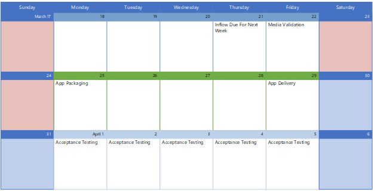

# Working with Microsoft Consulting Services

You can engage with Microsoft Consulting Services (MCS) to get your apps packaged for use with Microsoft Managed Desktop. For exact details, work with your account representative to contact MCS and scope your specific app packaging project.

## Roles and responsibilities

To work with MCS app packaging, **you must provide these elements**:

- The source installer files (for example, setup.exe or .msi).
- The installation instructions, specifying details about how the final installation should look. For example, should there be a desktop shortcut to the app? What should the app's visibility be? Should the app connect to a server and if so, which one? For details, see the [application packaging request template](https://github.com/MicrosoftDocs/microsoft-365-docs/raw/public/microsoft-365/managed-desktop/get-ready/downloads/app-packaging-template.docx).
- You must perform your own acceptance testing to verify that the app works as you need it to in your environment.

**MCS will take care of these actions:**

- Checking whether the app is prohibited or restricted in the Microsoft Managed Desktop environment.
- Testing of installation, starting, and uninstallation of the app to ensure compatibility with Windows 10. If MCS discovers a compatibility issue, they will hand off the app to the [App Assure](https://docs.microsoft.com/fasttrack/products-and-capabilities#app-assure) program for remediation.
- Packaging the app to your specification and then testing app deployment by using Microsoft Intune.

## App delivery schedule

Start the packaging process by uploading the app information to the Microsoft Managed Desktop portal. The packaging team reviews new submissions every Thursday. After review and packaging, the packaged apps are delivered the following Friday. Up to five apps per week can be packaged to start but the service can scale to meet your needs.

You'll be notified once the app has been delivered. At that point, you have 21 days to perform acceptance testing and approve the work in the Microsoft Managed Desktop portal. If discover some problem with the app during your acceptance testing, reject the app in the Microsoft Managed Desktop portal and you will be connected via email with an MCS packager to understand and resolve the issue.

## Testing accounts and environment

For the packaging team to complete the migration to Microsoft Intune, we recommend that you provide certain permissions:
 
-	Access to Microsoft Intune’s App Deployment capabilities for the packager to add and assign the app 
-	Test groups, user accounts, and licenses for the packagers to be able to test the apps

MCS will use those permissions to perform the following actions:
 
-	Ensuring that the app works on virtual machine configured for Microsoft Managed Desktop
-	Uploading the app to Microsoft Intune for deployment to your users

Without these permissions, it is possible for MCS to move forward, but they will not be able to upload the applications to your environment.
