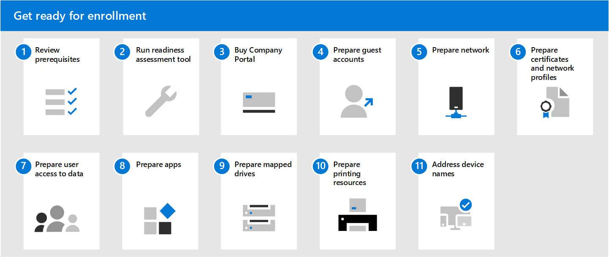

# Get ready for enrollment in Microsoft Managed Desktop

These topics describe the steps you'll need to take in your organization to prepare for enrollment, including checking that your environment meets key prerequisites, configuring networks, setting up certificates, and preparing your apps for inclusion in the service. Once you have run the readiness assessment tools, you can complete the other steps in any order or in parallel. Depending on your environment, some of the steps might not be relevant to you.

1. Review [prerequisites for Microsoft Managed Desktop](prerequisites.md).
2. Run [readiness assessment tools](readiness-assessment-tool.md).
1. Buy [Company Portal](../get-started/company-portal.md).
1. Review [prerequisites for guest accounts](guest-accounts.md).
1. Check [network configuration](network.md).
1. [Prepare certificates and network profiles](certs-wifi-lan.md).
1. [Prepare user access to data](authentication.md).
1. [Prepare apps](apps.md).
1. [Prepare mapped drives](mapped-drives.md).
1. [Prepare printing resources](printing.md).
1. Address [device names](address-device-names.md).
