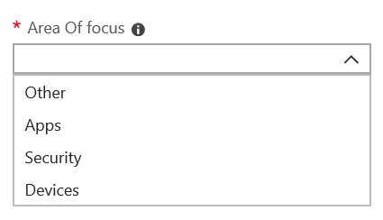

# Add and verify admin contacts in the Admin portal

There are several ways that Microsoft Managed Desktop service communicates with customers. To streamline communication and ensure we’re checking with the right people, you need to provide a set of admin contacts. Microsoft Managed Desktop IT Operations will contact these people for assistance troubleshooting issues for your tenant.

> [!IMPORTANT]
> You might have already added these contacts in the Admin portal. If so, take a moment now to double-check that the contact list is accurate, since Microsoft Managed Desktop **must** be able to reach them if a severe incident occurs.

## Azure Active Directory access for Microsoft Managed Desktop Admin portal

Microsoft Managed Desktop Admin portal requires that people accessing the portal have one of these Azure Active Directory (AD) roles:
- Global Administrator
- Intune Service Administrator
- Global Reader
- Service Support Administrator

The Global Administrator must be the one to enroll your organization in Microsoft Managed Desktop. All five roles have the same access within the Admin portal to initiate and view tasks. For more information on assigning these roles in Azure AD, see [Administrator role permissions in Azure Active Directory](/azure/active-directory/users-groups-roles/directory-assign-admin-roles). 

## Admin contact areas of focus

Admin contacts should be the best person or group that can answer questions and make decisions for different areas of focus. **Microsoft Managed Desktop Operations will contact these Admin contacts for questions involving support requests filed by the customer.** These Admin contacts will receive notifications for support request updates and new messages. These areas include:

Area of focus | For questions about
--- | ---
App packaging | Troubleshooting app packaging
Devices | Device health, troubleshooting with Microsoft Managed Desktop devices
Security | Troubleshooting security issues with Microsoft Managed Desktop devices
IT help desk | in cases where our Support staff hands over user tickets outside of Microsoft Managed Desktop support areas 
Other | For issues not covered by other areas

**Whoever you choose for these contacts needs to have the knowledge and authority to make decisions for your Microsoft Managed Desktop environment.** When you onboard your Microsoft Managed Desktop environment, you’re prompted to add contacts for your local Helpdesk and Security. 

Admin contacts are required when you [submit a Support request](../service-description/support.md). You’ll need to have an admin contact for the focus area of the Support request. 

**To add admin contacts**

1.	Sign in to [Microsoft Managed Desktop admin portal](https://aka.ms/mwaasportal). 

2.	Under **Support**, select **Admin contacts**. 

    

3. Select **Add**.

    

4.	Select an **Area of focus** and enter the info for the contact. 

    

5. Repeat for each area of focus. 

## Steps to get started with Microsoft Managed Desktop

1. Add and verify admin contacts in the Admin portal (this topic)
2. [Adjust conditional access](conditional-access.md)
3. [Assign licenses](assign-licenses.md)
4. [Install Intune Company Portal on on devices](company-portal.md)
5. [Enable Enterprise State Roaming](enterprise-state-roaming.md)
6. [Set up Microsoft Managed Desktop devices](set-up-devices.md)
7. [Get your users ready to use devices](get-started-devices.md)
8. [Deploy apps to devices](deploy-apps.md)