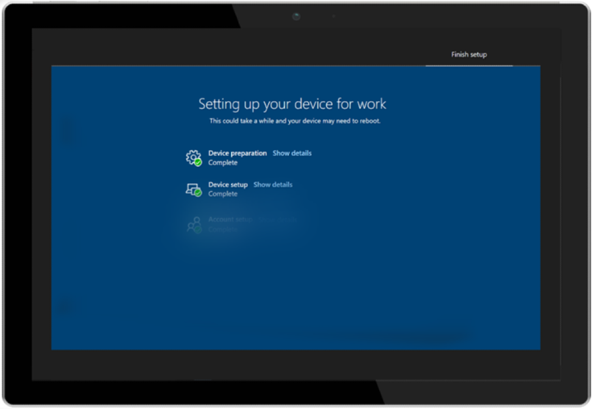

# First-run experience with Autopilot and the Enrollment Status Page

Microsoft Managed Desktop uses both [Windows Autopilot](/windows/deployment/windows-autopilot/windows-autopilot) and Microsoft Intune's [Enrollment Status Page (ESP)](/windows/deployment/windows-autopilot/enrollment-status) to provide the best possible first-run experience to your users.

The Enrollment Status Page is currently in public preview.

## Initial deployment

To provide the ESP experience, you must register devices in the Microsoft Managed Desktop service. For more about registration, see [Register new devices yourself](../get-started/register-devices-self.md) or [Steps for Partners to register devices](../get-started/register-devices-partner.md).

Once your devices are registered with the service, you can enable ESP for your Microsoft Managed Desktop devices by filing a support ticket through the [Admin Portal](https://portal.azure.com/). We will initially deploy the ESP configuration to the Test group when you file the ticket. It is deployed to the other subsequent deployment groups (First, Fast, and Broad) each 24 hours. To pause the deployment, file another ticket asking Operations to hold.

## Autopilot profile settings

Microsoft Managed Desktop uses these settings in the Autopilot profile used for your users' devices:

|Setting  |Value  |
|---------|---------|
|Deployment mode |  User Driven       |
|Join to Azure AD as     |  Azure AD joined       |
|Language (Region)     | User Select        |
|Automatically configure keyboard     | No        |
|Microsoft Software License Terms     |  Hide       |
|Privacy settings     | Hide        |
|Hide change account options     | Show        |
|User account type     |  Standard       |
|Allow White Glove OOBE     |  Yes       |
|Apply device name template     | Yes        |
|Enter a name     | MMD-%RAND:11%        |

## Enrollment Status Page settings

Microsoft Managed Desktop uses these settings for the Enrollment Status Page experience:

|Setting  |Value  |
|---------|---------|
|Show app and profile configuration progress     | Yes        |
|Show an error when installation takes longer than specified number of minutes     |  60       |
|Show custom message when time limit error occurs     |  Yes       |
|Error message     | Yes, It's taking a little longer to set up your device than expected. Click below to get started and we'll finish setting up in the background        |
|Allow users to collect logs about installation errors     |  Yes       |
|Only show page to devices provisioned by out-of-box experience (OOBE)     | Yes        |
|Block device use until all apps and profiles are installed     |  Yes       |
|Allow users to reset device if installation error occurs     |  Yes       |
|Allow users to use device if installation error occurs     |  Yes       |
|Block device use until these required apps are installed if they are assigned to the user/device     |  Modern Workplace - Time Correction       |

The Enrollment Status Page experience occurs in three phases. For more, see [Enrollment Status Page tracking information](/mem/intune/enrollment/windows-enrollment-status#enrollment-status-page-tracking-information).

The experience proceeds as follows:

1. The Autopilot experience starts and the user enters their credentials.
2. The device opens the Enrollment Status Page and proceeds through Device Preparation and Device Setup phases. The third step (Account Setup) is *currently skipped* in the Microsoft Managed Desktop configuration because User ESP is disabled. The device restarts.
3. After restart, the device opens the Windows sign-in page with **Other user**.
4. The users enter their credentials again and the desktop opens.

> [!NOTE]
> Win32 apps are only deployed during ESP if the Windows 10 version is 1903 or later.

## Autopilot for pre-provisioned deployment
> [!NOTE]
> Autopilot for pre-provisioned deployment in Microsoft Managed Desktop is currently in public preview.

## Additional prerequisites for Autopilot for pre-provisioned deployment
- You must have Enrollment Status Page (ESP) enabled. For more information, see [Initial deployment](#initial-deployment).
- Device must have a wired network connection.
- If you have devices that were registered using the Microsoft Managed Desktop portal before August 2020, de-register and register them again.
- Devices must must have a factory image that includes the November 2020 cumulative update [19H1/19H2 2020.11C](https://support.microsoft.com/topic/november-19-2020-kb4586819-os-builds-18362-1237-and-18363-1237-preview-25cbb849-74af-b8b8-29b8-68aa925e8cc3) or [20H1 2020.11C](https://support.microsoft.com/topic/november-30-2020-kb4586853-os-builds-19041-662-and-19042-662-preview-8fb07fb8-a7dd-ea62-d65e-3305da09f92e) as appropriate installed or must be reimaged with the latest Microsoft Managed Desktop image.
- Physical devices must support TPM 2.0 and device attestation. Virtual machines aren't supported. The pre-provisioning process uses Windows Autopilot self-deploying capabilities, so TPM 2.0 is required. The TPM attestation process also requires access to a set of HTTPS URLs that are unique for each TPM provider. For more information, see the entry for Autopilot self-deploying mode and Autopilot pre-provisioned deployment in [Windows Autopilot networking requirements](https://docs.microsoft.com/mem/autopilot/networking-requirements#tpm).

## Sequence of events in Autopilot for pre-provisioned deployment
1. IT Admin reimages or resets the device if needed.
2. IT Admin boots the device, reaches the out-of-box-experience, and presses the Windows key five times.
3. IT Admin selects Windows Autopilot Provisioning and then selects **Continue**. On the Windows Autopilot configuration screen, information will be displayed about the device.
5. IT admin selects **Provision** to start the provisioning process.
6. Device starts ESP and goes through device preparation and setup phases. During the device setup phase, you'll see **App installation x of x** displayed (depending on the exact configuration of the ESP profile).
7. The account setup step is currently skipped in the Microsoft Managed Desktop configuration, since we disable User ESP.
8. The device restarts.

After it restarts, the device will show the green status screen, with a **Reseal** button.

> [!IMPORTANT]
> Known issues : 
> - ESP does not run again after the Autopilot for pre-provisioned deployment reseal function.
> - Device are not being renamed by Autopilot for pre-provisioned deployment. The device will only be renamed after going through the ESP user flow.

## Change to Autopilot and Enrollment Status Page settings

If the setup used by Microsoft Managed Desktop doesn't exactly match your needs, you can  file a support ticket through the [Admin Portal](https://portal.azure.com/). Here are some examples of the types of configuration you might need:

### Autopilot settings change

You might want to request a different device name template. You cannot, however, change Deployment Mode, Join to Azure AD As, Privacy Settings, or User Account Type.

### Enrollment Status Page settings change

- A longer number of minutes for the "Show an error when installation takes longer than specified number of minutes" setting.
- The error message displayed
- Adding or removing applications in the "Block device use until these required apps are installed if they are assigned to the user/device" setting.

## Required applications

- You must target applications in the Modern Workplace *device groups* Test, First, Fast, and Broad. Applications must install in the "System" context. Make sure to complete testing with ESP in the Test group before you assign them to all groups.
- No applications should require the device to restart. We recommend that applications be set to "Do nothing" when you build the application package if they will require a restart.
- Limit required applications to only the core applications that a user needs immediately when they sign in to the device.
- Keep the total size of all applications collectively under 1 GB to avoid timeouts during the application installation phase.
- Ideally, apps should not have any dependencies. If you have apps that *must* have dependencies, be sure you configure, test, and validate them as part of your ESP evaluation.
- No applications that require the "user" context (for example, Teams) can be included in the public preview of ESP.