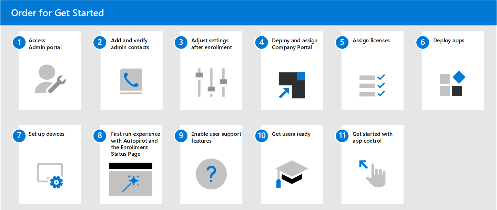

# Get started with Microsoft Managed Desktop

Now that you’re ready to enroll, open [Microsoft Endpoint Manager](https://endpoint.microsoft.com/) and navigate to **Tenant Administration**. Select **Tenant enrollment** under the **Microsoft Managed Desktop** subsection then follow the wizard to enroll your tenant with Microsoft Managed Desktop.

> [!NOTE]
> You must be logged in as a Global Administrator to complete enrollment. For more information, see [access the admin portal](access-admin-portal.md) for details.

Once you’ve finished enrollment, follow the steps below to configure the service. This is the recommended order to follow, but you do have some flexibility in the sequence.

 

1. Access [admin portal](access-admin-portal.md).
1. [Add and verify admin contacts in the Admin portal](add-admin-contacts.md).
1. [Adjust settings after enrollment](conditional-access.md).
1. Deploy and assign [Intune Company Portal](company-portal.md).
1. [Assign licenses](assign-licenses.md).
1. [Deploy apps](deploy-apps.md).
1. [Set up devices](set-up-devices.md).
1. Set up [first-run experience with Autopilot and the Enrollment Status Page](esp-first-run.md).
1. [Enable user support features](enable-support.md).
1. [Get your users ready to use devices](get-started-devices.md).
1. [Get started with app control](get-started-app-control.md).