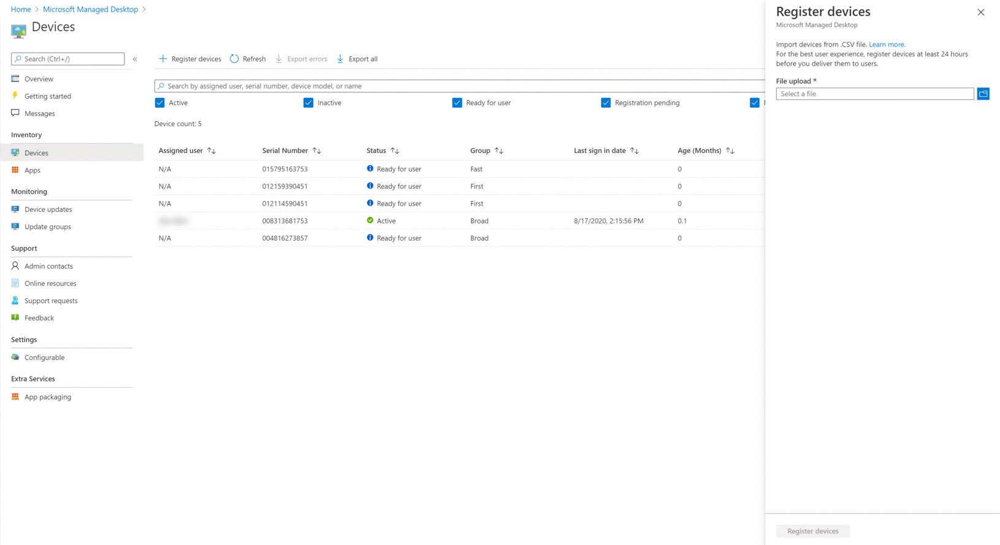

# Register existing devices yourself

>[!NOTE]
>This topic describes the steps for you to reuse devices you already have and register them in Microsoft Managed Desktop. If you are working with brand-new devices, follow the steps in [Register new devices in Microsoft Managed Desktop yourself](register-devices-self.md) instead.

The process for Partners is documented in [Steps for Partners to register devices](register-devices-partner.md).

Microsoft Managed Desktop can work with brand-new devices or you can reuse devices you might already have (which will require that you reimage them). You can register devices with Microsoft Managed Desktop in the Microsoft Endpoint Manager portal.

## Prepare to register existing devices


To register existing devices, follow these steps:

1. [Obtain the hardware hash for each device.](#obtain-the-hardware-hash)
2. [Merge the hash data](#merge-hash-data)
3. [Register the devices in Microsoft Managed Desktop](#register-devices-by-using-the-admin-portal).
4. [Double-check that the image is correct.](#check-the-image)
5. [Deliver the device](#deliver-the-device)

### Obtain the hardware hash

Microsoft Managed Desktop identifies each device uniquely by referencing its hardware hash. You have four options for getting this information from devices you're already using:

- Ask your OEM supplier for the AutoPilot registration file, which will include the hardware hashes.
- Collect information in [Microsoft Endpoint Configuration Manager](#microsoft-endpoint-configuration-manager).
- Run a Windows PowerShell script--either by using [Active Directory](#active-directory-powershell-script-method) or [manually](#manual-powershell-script-method) on each device--and collect the results in a file.
- Start each device--but don't complete the Windows setup experience--and [collect the hashes on a removable flash drive](#flash-drive-method).

#### Microsoft Endpoint Configuration Manager

You can use Microsoft Endpoint Configuration Manager to collect the hardware hashes from existing devices that you want to register with Microsoft Managed Desktop.

> [!IMPORTANT]
> Any devices you want to get this information for must be running Windows 10, version 1703 or later. 

If you've met all these prerequisites, you're ready to collect the information by following these steps:

1. In the Configuration Manager console, select **Monitoring**. 
2. In the Monitoring workspace, expand the **Reporting** node, expand **Reports**, and select the **Hardware - General** node. 
3. Run the report, **Windows Autopilot Device Information**, and view the results.
4. In the report viewer, select the **Export** icon, and choose the **CSV (comma-delimited)** option.
5. After saving the file, you will need to filter results to just those devices you plan to register with Microsoft Managed Desktop and upload the data to Microsoft Managed Desktop. Open Microsoft Endpoint Manager and navigate to the **Devices** menu, then look for Microsoft Managed Desktop section and select **Devices**. Select **+ Register devices**, which opens a fly-in to register new devices.


Refer to [Register devices by using the Admin Portal](#register-devices-by-using-the-admin-portal) for more information.


#### Active Directory PowerShell script method

In an Active Directory environment, you can use the `Get-WindowsAutoPilotInfo` PowerShell cmdlet to remotely collect the information from devices in Active Directory Groups by using WinRM. You can also use the `Get-AD Computer` cmdlet and get filtered results for a specific hardware model name included in the catalog. Before you proceed, first confirm these prerequisites, and then proceed with the steps:

- WinRM is enabled.
- The devices you want to register are active on the network (that is, they are not disconnected or turned off).
- Make sure you have a domain credential parameter that has permission to execute remotely on the devices.
- Make sure that Windows Firewall allows access to WMI. To do that, follow these steps:

    1. Open the **Windows Defender Firewall** control panel and select **Allow an app or feature through Windows Defender Firewall**.
    
    2. Find **Windows Management Instrumentation (WMI)** in the list, enable for both **Private and Public**, and then select **OK**.

1.	Open a PowerShell prompt with administrative rights.

2.	Run *either one* of these scripts:

    ```powershell
    Install-script -name Get-WindowsAutoPilotInfo 
    #example one – leverage Get-ADComputer to enumerate devices 
    Get-ADComputer -filter * | powershell -ExecutionPolicy Unrestricted Get-WindowsAutoPilotInfo.ps1 -credential Domainname\<accountname>
    ```

    ```powershell 
    #example two – target specific devices: 
    Set-ExecutionPolicy powershell -ExecutionPolicy Unrestricted Get-WindowsAutoPilotInfo.ps1 -credential Domainname\<accountname> -Name Machine1,Machine2,Machine3
    ```

3. Access any directories where there might be entries for the devices. Remove entries for each device from *all* directories, including Windows Server Active Directory Domain Services and 
Azure Active Directory. Be aware that removal could take a few hours to completely process.

4. Access management services where there might be entries for the devices. Remove entries for each device from *all* management services, including Microsoft Endpoint Configuration Manager, Microsoft Intune, and Windows Autopilot. Be aware that removal could take a few hours to completely process.

Now you can proceed to [register devices](#register-devices-by-using-the-admin-portal).

#### Manual PowerShell script method

1.	Open a PowerShell prompt with administrative rights.
2.	Run `Install-Script -Name Get-WindowsAutoPilotInfo`
3.	Run `powershell -ExecutionPolicy Unrestricted Get-WindowsAutoPilotInfo -OutputFile <path>\hardwarehash.csv`
4. [Merge the hash data.](#merge-hash-data)

#### Flash drive method

1. On a device other than the one you're registering, insert a USB drive.
2. Open a PowerShell prompt with administrative rights.
3. Run `Save-Script -Name Get-WindowsAutoPilotInfo -Path <pathToUsb>`
4. Turn on the device you are registering, but *do not start the setup experience*. If you accidentally start the setup experience, you'll have to reset or reimage the device.
5. Insert the USB drive, and then press SHIFT + F10.
6. Open a PowerShell prompt with administrative rights, and then run `cd <pathToUsb>`.
7. Run `Set-ExecutionPolicy -ExecutionPolicy Unrestricted`
8. Run `.\Get-WindowsAutoPilotInfo -OutputFile <path>\hardwarehash.csv`
9. Remove the USB drive, and then shut down the device by running `shutdown -s -t 0`
10. [Merge the hash data.](#merge-hash-data)

>[!IMPORTANT]
>Do not power on the device you are registering again until you've completed registration for it. 


### Merge hash data

If you collected the hardware hash data by the manual PowerShell or flash drive methods, you now need to have the data in the CSV files combined into a single file to complete registration. Here's a sample PowerShell script to make it easy:

```powershell
Import-CSV -Path (Get-ChildItem -Filter *.csv) | ConvertTo-Csv -NoTypeInformation | % {$_.Replace('"', '')} | Out-File .\aggregatedDevices.csv
```

With the hash data merged into one CSV file, you can now proceed to [register the devices](#register-devices-by-using-the-admin-portal).


## Register devices by using the Admin Portal

In [Microsoft Endpoint Manager](https://endpoint.microsoft.com/), select **Devices** in the left navigation pane. Look for the Microsoft Managed Desktop section of the menu and select **Devices**. In the Microsoft Managed Desktop Devices workspace, Select **+ Register devices**, which opens a fly-in to register new devices.

<!-- Update with new picture [](../../media/new-registration-ui.png) -->


<!--Registering any existing devices with Managed Desktop will completely re-image them; make sure you've backed up any important data prior to starting the registration process.-->


Follow these steps:

1. In **File upload**, provide a path to the CSV file you created previously.
2. Select a [device profile](../service-description/profiles.md) in the drop-down menu.
3. Select **Register devices**. The system will add the devices to your list of devices on the **Devices blade**, marked as **Registration Pending**. Registration typically takes less than 10 minutes, and when successful the device will show as **Ready for user** meaning it's ready and waiting for a user to start using.

> [!NOTE]
> If you manually change the Azure Active Directory (AAD) group membership of a device, it will be automatically reassigned to the group for its device profile and removed from any conflicting groups.

You can monitor the progress of device registration on the main page. Possible states reported there include:

| State | Description |
|---------------|-------------|
| Registration Pending | Registration is not done yet. Check back later. |
| Registration failed | Registration could not be completed. Refer to [Troubleshooting device registration](#troubleshooting-device-registration) for more information. |
| Ready for user | Registration succeeded and the device is now ready to be delivered to the user. Microsoft Managed Desktop will guide them through first-time set-up, so there’s no need for you to do any further preparations. |
| Active | The device has been delivered to the user and they have registered with your tenant. This also indicates that they are regularly using the device. |
| Inactive | The device has been delivered to the user and they have registered with your tenant. However, they have not used the device recently (in the last 7 days).  | 

### Troubleshooting device registration

| Error message | Details |
|---------------|-------------|
| Device not found | We couldn’t register this device because we could not find a match for the provided manufacturer, model, or serial number. Confirm these values with your device supplier. |
| Hardware hash not valid | The hardware hash you provided for this device was not formatted correctly. Double-check the hardware hash and then resubmit. |
| Device already registered | This device is already registered to your organization. No further action required. |
| Device claimed by another organization | This device has already been claimed by another organization. Check with your device supplier. |
| Unexpected error | Your request could not be automatically processed. Contact Support and provide the Request ID: <requestId> |

## Check the image

If your device has come from a Microsoft Managed Desktop partner supplier, the image should be correct.

You’re also welcome to apply the image on your own if you prefer. To get started, contact the Microsoft representative you’re working with and they will provide you the location and steps for applying the image.

## Deliver the device

> [!IMPORTANT]
> Before you hand off the device to your user, make sure you have obtained and applied the [appropriate licenses](../get-ready/prerequisites.md) for that user.

If all the licenses are applied, you can [get your users ready to use devices](get-started-devices.md), and then your user can start up the device and proceed through the Windows setup experience.


