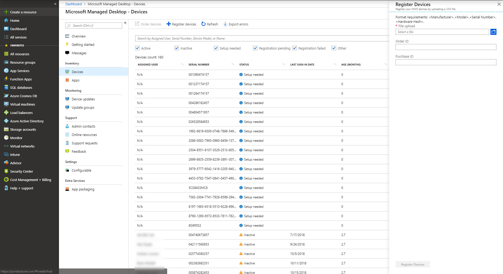

# Register existing devices yourself

>[!NOTE]
>This topic describes the steps for you to re-use devices you already have and register them in Microsoft Managed Desktop. If you are working with brand-new devices, follow the steps in [Register new devices in Microsoft Managed Desktop yourself](register-devices-self.md) instead.

The process for Partners is documented in [Steps for Partners to register devices](register-devices-partner.md).

Microsoft Managed Desktop can work with brand-new devices or you can re-use devices you might already have (which will require that you re-image them). You can register devices by using Microsoft Managed Desktop on the Azure Portal.

## Prepare to register existing devices


To register existing devices, follow these steps:

1. [Obtain the hardware hash for each device.](#obtain-the-hardware-hash)
2. [Merge the hash data](#merge-hash-data)
3. [Register the devices in Microsoft Managed Desktop](#register-devices).
4. [Double-check that the image is correct.](#check-the-image)
5. [Deliver the device](#deliver-the-device)

### Obtain the hardware hash

Microsoft Managed Desktop identifies each device uniquely by referencing its hardware hash. You have four options for getting this information from devices you're already using:

- Ask your OEM supplier for the AutoPilot registration file, which will include the hardware hashes.
- Create a custom report in [Configuration Manager](#configuration-manager).
- Run a Windows PowerShell script--either by using [Active Directory](#active-directory-powershell-script-method) or [manually](#manual-powershell-script-method) on each device--and collect the results in a file.
- Start each device--but don't complete the Windows setup experience--and [collect the hashes on a removable flash drive](#flash-drive-method).

#### Configuration Manager

You can use Microsoft Endpoint Configuration Manager to collect the hardware hashes from existing devices that you want to register with Microsoft Managed Desktop.

> [!IMPORTANT]
> Any devices you want to get this information for must be running Windows 10, version 1703 or later. You also need a device that is a Configuration Manager client connected to the Configuration Manager (Current Branch) site. You also need the Reporting Point Site System role set up in your environment with SQL Server Reporting Services enabled. 

If you've met all these prerequisites, you're ready to collect the information by following these steps:

1. In the Configuration Manager console, select **Monitoring**. 
2. In the Monitoring workspace, expand **Reporting**, and then select **Reports**. 
3. On the **Home** tab, in the **Create** section, select **Create Report** to open the Create Report wizard. 
4. On the **Information** page, set these settings: 
    - **Name:** Specify a name for the report. 
    - **Description:** Specify a description for the report. 
    - **Server:** Displays the name of the report server on which you are creating this report. 
    - **Path:** Select **Browse** to specify a folder in which you want to store the report. 
5. Select **Next**. 
6. On the **Summary** page, review the settings. Select **Previous** to change the settings or select **Next** to create the report in Configuration Manager. 
7. On the **Completion** page, select **Close** to exit the wizard and open **Report Builder** to enter the report settings. Enter your user account and password if you are prompted, and then select **OK.** If Report Builder is not installed on the device, you are prompted to install it. Select **Run to install Report Builder**, which is required to modify and create reports. 


**In Microsoft Report Builder**, provide the SQL statement for the report and follow these steps:

1. In the left pane, select **Datasets**, and then right-click to **Add Dataset**.
2. Go to the **Query** tab, and then enter the name as *DataSet0*. 
3. Select **Use a dataset embedded in my report**; Report Builder opens.
4. In **Report Builder**, select **Data source:**. Select the default data source, which should start with "AutoGen". 
5. Choose **Query type as Text**, and then enter this query:


```sql
SELECT comp.manufacturer0      AS Manufacturer,  
       comp.model0             AS Model,  
       bios.serialnumber0      AS Serial_Number,  
       mdm.devicehardwaredata0 AS HardwareHash  
FROM   Fn_rbac_gs_computer_system(@UserSIDs) comp

       INNER JOIN Fn_rbac_gs_pc_bios(@UserSIDs) bios  
               ON comp.resourceid = bios.resourceid  
       INNER JOIN Fn_rbac_gs_mdm_devdetail_ext01(@UserSIDs) mdm  
               ON comp.resourceid = mdm.resourceid
```


5. Navigate to the **Field** tab, wehre values for **Field Name** and **Field Source** should already be populated. If they aren't, then select **Add**, and then select **Query Field**. Enter the **Field Name** and **Field Source**.
6. Repeat for each of these values: 
    - Manufacturer 
    - Model 
    - Serial_Number 
    - HardwareHash
7. Select **OK**.

**Next, define the report display and create the report** by following these steps:

1. Select **Table or Matrix**; a new wizard will open.
2. In **Choose a dataset**, select **Choose an existing dataset in this report or a shared dataset**.  
3. Select **DataSet0** (the default), and then select **Next**.
4. Drag **Manufacturer**, **Model**, and **Serial Number** into the **Row Groups** box. Drag **HardwareHash** into the **Values** box and then select **Next**.
5. Clear the checkboxes for **Show subtotals and grand totals** and **Expand/collapse groups**. Select **Next**.
6. Select **Finish**.
7. Select **Run** to run your report. Verify that the report provides the information that you expect. If necessary, select **Design** to return to the Design view to modify the report.
8. Select **Save** to save the report to the report server. You can run the new report in the Reports node in the Monitoring workspace. 

**Finally, export the report and use it to register devices** by following these steps. (You should only need to follow Steps 1 and 2 of this section if you have navigated away after the previous steps.):

1. In the Configuration Manager console, select **Monitoring**.
2. In **Monitoring**, expand **Reporting**, and then select **Reports**.
3. Find the report using the name you created earlier.
4. Right-click this report, and select **Run**.
5. In the dialog that opens, select **Export** and then select **Save as CSV**.
6. This version of report extracts hashes from all Windows 10 devices that Configuration Manager communicates with. You will need to filter results to just those devices you plan to register with Microsoft Managed Desktop.


> [!IMPORTANT]
> The query in Configuration Manager doesn’t allow spaces in exported column names; that's why the steps had you enter "Serial_Number" and "HardwareHash." Now that you have the exported CSV file, you must edit the report headers to read *Serial Number* and *Hardware Hash* as shown here before you proceed with device registration.

Now you can proceed to [Register devices by using the Azure Portal](#register-devices-by-using-the-azure-portal).


#### Active Directory PowerShell script method

In an Active Directory environment, you can use the `Get-MMDRegistrationInfo` PowerShell cmdlet to remotely collect the information from devices in Active Directory Groups by using WinRM. You can also use the `Get-AD Computer` cmdlet and get filtered results for a specific hardware model names included in the catalog. To do this, first confirm these prerequisites, and then proceed with the steps:

- WinRM is enabled.
- The devices you want to register are active on the network (that is, they are not disconnected or turned off).
- Make sure you have a domain credential parameter that has permission to execute remotely on the devices.
- Make sure that Windows Firewall allows access to WMI. To do that, follow these steps:
    1. Open the **Windows Defender Firewall** control panel and select **Allow an app or feature through Windows Defender Firewall**.
    2. Find **Windows Management Instrumentation (WMI)** in the list, enable for both **Private and Public**, and then select **OK**.

1.	Open a PowerShell prompt with administrative rights.
2.	Run *either one* of these scripts:
```powershell
Install-script -name Get-MMDRegistrationInfo 
#example one – leverage Get-ADComputer to enumerate devices 
Get-ADComputer -filter * | powershell -ExecutionPolicy Unrestricted Get-MMDRegistrationInfo.ps1 -credential Domainname\<accountname>
```
```powershell 
#example two – target specific devices: 
Set-ExecutionPolicy powershell -ExecutionPolicy Unrestricted Get-MMDRegistrationInfo.ps1 -credential Domainname\<accountname> -Name Machine1,Machine2,Machine3
```
3. Access any directories where there might be entries for the devices. Remove entries for each device from *all* directories, including Windows Server Active Directory Domain Services and 
Azure Active Directory. Be aware that this removal could take a few hours to completely process.
4. Access management services where there might be entries for the devices. Remove entries for each device from *all* management services, including Microsoft Endpoint Configuration Manger, Microsoft Intune, and Windows Autopilot. Be aware that this removal could take a few hours to completely process.

Now you can proceed to [register devices](#register-devices).

#### Manual PowerShell script method

1.	Open a PowerShell prompt with administrative rights.
2.	Run `Install-Script -Name Get-MMDRegistrationInfo`
3.	Run `powershell -ExecutionPolicy Unrestricted Get-MMDRegistrationInfo -OutputFile <path>\hardwarehash.csv`
4. [Merge the hash data.](#merge-hash-data)

#### Flash drive method

1. On a device other than the one you're registering, insert a USB drive.
2. Open a PowerShell prompt with administrative rights.
3. Run `Save-Script -Name Get-MMDRegistrationInfo -Path <pathToUsb>`
4. Turn on the device you are registering, but *do not start the setup experience*. If you accidentally start the setup experience, you'll have to reset or reimage the device.
5. Insert the USB drive, and then press SHIFT + F10.
6. Open a PowerShell prompt with administrative rights, and then run `cd <pathToUsb>`.
7. Run `Set-ExecutionPolicy -ExecutionPolicy Unrestricted`
8. Run `.\Get-MMDRegistrationInfo -OutputFile <path>\hardwarehash.csv`
9. Remove the USB drive, and then shut down the device by running `shutdown -s -t 0`
10. [Merge the hash data.](#merge-hash-data)

>[!IMPORTANT]
>Do not power on the device you are registering again until you've completed registration for it. 


### Merge hash data

If you collected the hardware hash data by the manual PowerShell or flash drive methods, you now need to have the data in the CSV files combined into a single file to complete registration. Here's a sample PowerShell script to make this easy:

`Import-CSV -Path (Get-ChildItem -Filter *.csv) | ConvertTo-Csv -NoTypeInformation | % {$_.Replace('"', '')} | Out-File .\aggregatedDevices.csv`

With the hash data merged into one CSV file, you can now proceed to [register the devices](#register-devices).

### Register devices

The CSV file must be in a particular format for registration. If you collected the data yourself in the previous steps, the file should already be in the right format; if you obtain the file from a supplier, you might need to adjust the format.

>[!NOTE]
>For your convenience, you can download a [template](https://github.com/MicrosoftDocs/microsoft-365-docs/raw/public/microsoft-365/managed-desktop/get-started/downloads/device-registration-sample-partner.xlsx) for this CSV file.

Your file needs to include the **exact same column headings** as the sample one (Manufacturer, Model, etc.), but your own data for the other rows. If you use the template, open it in a text editing tool such as Notepad, and consider leaving all the data in row 1 alone, only entering data in rows 2 and below. 
    
  ```
 Manufacturer,Model,Serial Number,Hardware Hash
  SpiralOrbit,ContosoABC,000000000000,dGhpc2RldmljZWlzYW5tbWRkZXZpY2U
  
  
  ```

>[!NOTE]
>If you forget to change any of the sample data, registration will fail.

#### Register devices by using the Azure Portal

From the Microsoft Managed Desktop [Azure Portal](https://aka.ms/mmdportal), select **Devices** in the left navigation pane. Select **+ Register devices**; the fly-in opens:

[](../../media/register-devices-flyin-sterile.png)


[//]: # (Sadly this isn't true. We can remove this note - but leaving it now until we have a chance to chat about it.)

<!--Registering any existing devices with Managed Desktop will completely re-image them; make sure you've backed up any important data prior to starting the registration process.-->


Follow these steps:

1. In **File upload**, provide a path to the CSV file you created previously.
2. Optionally, you can add an **Order ID** or **Purchase ID** for your own tracking purposes. There are no format requirements for these values.
3. Select **Register devices**. The system will add the devices to your list of devices on the **Devices blade**, marked as **Registration Pending**. Registration typically takes less than 10 minutes, and when successful the device will show as **Ready for user** meaning it's ready and waiting for an end-user to start using.


You can monitor the progress of device registration on the main **Microsoft Managed Desktop - Devices** page. Possible states reported there include:

| State | Description |
|---------------|-------------|
| Registration pending | Registration is not done yet. Check back later. |
| Registration failed | Registration could not be completed. Refer to [Troubleshooting device registration](#troubleshooting-device-registration) for more information. |
| Ready for user | Registration succeeded and the device is now ready to be delivered to the end user. Microsoft Managed Desktop will guide them through first time set-up, so there’s no need for you to do any further preparations. |
| Active | The device has been delivered to the end user and they have registered with your tenant. This also indicates that they are regularly using the device. |
| Inactive | The device has been delivered to the end user and they have registered with your tenant. However, they have not used the device recently (in the last 7 days).  | 

#### Troubleshooting device registration

| Error message | Details |
|---------------|-------------|
| Device not found | We couldn’t register this device because we could not find a match for the provided manufacturer, model, or serial number. Confirm these values with your device supplier. |
| Hardware hash not valid | The hardware hash you provided for this device was not formatted correctly. Double-check the hardware hash and then resubmit. |
| Device already registered | This device is already registered to your organization. No further action required. |
| Device claimed by another organization | This device has already been claimed by another organization. Check with your device supplier. |
| Unexpected error | Your request could not be automatically processed. Contact Support and provide the Request ID: <requestId> |

### Check the image

If your device has come from a Microsoft Managed Desktop partner supplier, the image should be correct.

You’re also welcome to apply the image on your own if you prefer. To get started, contact the Microsoft representative you’re working with and they will provide you the location and steps for applying the image.

### Deliver the device

> [!IMPORTANT]
> Before you hand off the device to your user, make sure you have obtained and applied the [appropriate licenses](../get-ready/prerequisites.md) for that user.

If all the licenses are applied, you can [get your users ready to use devices](get-started-devices.md), and then your user can start up the device and proceed through the Windows setup experience.


