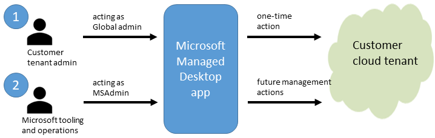

# What is Microsoft Managed Desktop?

With Microsoft Managed Desktop, you get **software as a service** (Microsoft 365 E5), **Device as a service** (Microsoft Surface devices ready to use), and **IT support as a service** (Help desk and more). 

<table>
<tr><th>Software as a service</th><th>Devices as a service</th><th>IT support as a service</th></tr>
<tr><td>
Enterprise Mobility and Security

Windows 10

Office 365

Defender ATP
</td><td>
Procurement

Lifecycle management

Maintenance

Refresh
</td><td>
Service desk

Deployment and migration

Analytics

Monitoring
</td></tr>
</table>

When you enroll in Microsoft Managed Desktop, Microsoft provides you with devices that are configured to join your Azure Active Directory tenant. Windows 10, Office 365, and some apps and features associated with [Microsoft 365 Enterprise E5](https://www.microsoft.com/en-us/microsoft-365/compare-all-microsoft-365-plans) are installed (by Microsoft) on your devices. When your employees who are using these devices need help, they contact Microsoft Managed Desktop support (provided by Microsoft) through a custom chat app. 

Additional information:

- [Learn about the devices and apps you get with Managed Desktop](technologies-and-devices.md)
- [Learn about Microsoft Managed Desktop device configuration](../get-started/device-policies.md)
- [Learn about security in Microsoft Managed Desktop](../get-started/security.md)

<!---
Microsoft will run a cloud application on your tenant to onboard you to Microsoft Managed Desktop. This onboarding app allows Microsoft to take actions against the tenant, while operating within the scope of the required permissions. After onboarding, Microsoft uses another app to manage your tenant and devices.

There are two main phases: onboarding and management.

## Onboarding

This phase uses a Microsoft Managed Desktop app to complete tasks that prepare your tenant.

- Allows the Microsoft Managed Desktop app permissions to take actions on the environment in the context of the user. For more information, see [API permissions and API calls](#ref).
- Create four Azure Active Directory (AD) accounts to support administration and validation within your tenant. 
- Create two accounts to support managing Microsoft Defender Advanced Threat Protection.
- Create four new Active Directory Groups: Test, First, Fast, and Broad. We don’t assign users to the groups at this time. We use these groups for [managing updates and changes](../working-with-managed-desktop/updates.md).
- Create update policies for the four new groups.
- Create security baseline and leave it unassigned. For more information, see [Windows Security Baselines](https://docs.microsoft.com/windows/security/threat-protection/windows-security-baselines) and the Microsoft Managed Desktop-specific information in [Device policies](../get-started/device-policies.md).

## Management

This phase includes ongoing activities performed by the MSAdmin account, using both automated and interactive sessions. Actions include all activities required to manage and operate the tenant. For more information on the API permissions and typical API calls that are made in this phase, see [API permissions and API calls](#reference).

## Reference
### Onboarding phase: API permissions and API calls
- API permissions
    - DeviceManagementServiceConfig.ReadWrite.All
    - Directory.AccessAsUser.All
    - User.ReadWrite.All
    - DeviceManagementConfiguration.ReadWrite.All
    - DeviceManagementManagedDevices.ReadWrite.All
    - Group.ReadWrite.All
- API calls
    - POST /organization/{organizationId}/setMobileDeviceManagementAuthority
    - GET/POST /directoryRoles/{id}/members
    - GET/POST /users
    - GET/POST /groups
    - PATCH /groups/{id}
    - GET/POST /deviceManagement/deviceConfigurations
    - GET /deviceManagement/detectedApps

### Management phase: API permissions and API calls

- API permissions
    - DeviceManagementManagedDevices.ReadWrite.All
    - DeviceManagementApps.ReadWrite.All
    - DeviceManagementConfiguration.ReadWrite.All
    - Reports.Read.All
    - User.ReadWrite.All
    - Group.ReadWrite.All
    - Directory.AccessAsUser.All
- API calls
    - GET/POST /directoryRoles/{id}/members
    - GET/PATCH/POST /users
    - GET/POST /groups
    - PATCH /groups/{id}
    - GET/POST /deviceManagement/deviceConfigurations
    - GET/POST /deviceAppManagement/mobileApps
    - GET /deviceManagement/detectedApps
    - GET /devices
    - POST /users/{id | userPrincipalName}/assignLicense
    - GET /subscribedSkus
-->