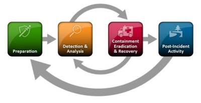

# Security operations in Microsoft Managed Desktop

The Microsoft Managed Desktop Security Operations Center (SOC) works with your IT security staff to help keep your environment secure. Our team responds to security alerts and threats with expert analysis and we drive response activities when security incidents occur. For more information about working with the SOC, see [Admin support for Microsoft Managed Desktop](../working-with-managed-desktop/admin-support.md).

The SOC offers 24/7/365 support from certified security professionals with expertise in the current and emerging threat landscape, including common attack methods through software, network, or human adversaries.

The SOC provides these services: 
- Quick and accurate response to detected events, with analysis of data to identify the impact and assess the overall risk to a device or your environment.
- Driving the security incident response process, ensuring timely and accurate communication with your security team
- Analysis and recommendations based on advanced threat hunting using tools and data to identify and address risks before they're exploited
- Using device management and isolation services to protect your environment from known or suspected compromised devices to prevent spread

## Processes
- Security Operations is staffed by full-time Microsoft employees in Microsoft’s Cyber Defense Operations Center.
- Microsoft uses collective signals from across our company—both internal and external—to protect your data and workloads, even from things we have not yet seen in Microsoft Managed Desktop. 
- Microsoft security solutions align to many cybersecurity protection standards. SOC operations are based on the National Institute of Standards and Technology Computer Security Incident Response Handling Guide (NIST 800-61 r2). 
- The process allows for proper collection of information and evidence, for analysis and documentation and post-recovery insights into ways to better defend your environment through these phases:
    - Preparation, detection, and analysis
    - Containment
    - Eradication
    - Recovery
    - Post-incident activity

 - At your request, the SOC can engage Microsoft Threat Experts on your behalf. They will provide insights to understand better the complex threats affecting your organization, including alert inquiries, potentially compromised devices, root cause of a suspicious network connection, and additional threat intelligence regarding ongoing advanced persistent threat campaigns. For more information, see Microsoft Threat Experts. 
- SOC’s Threat and Vulnerability Management uses some of Microsoft’s services to help inform recommendations for your organization to protect against threats. The SOC consumes data from your Advanced Threat Protection Security Center and from relevant vulnerability data sources within and outside of Microsoft to discover vulnerabilities and misconfigurations and provide actionable reporting. 

