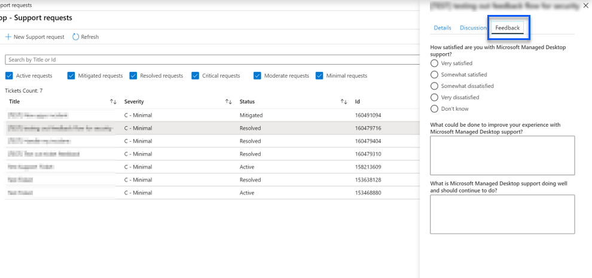

# Admin support for Microsoft Managed Desktop

You can submit support tickets or feedback requests to Microsoft using the Microsoft Managed Desktop Administrative Portal. Support requests are always prioritized over feedback submissions. Support requests are triaged and managed according to severity as outlined in the [severity definition table](#sev). Feedback is reviewed, and a response provided where requested. 

>[!IMPORTANT]
>Make sure that you [set up an Admin contact](../get-started/add-admin-contacts.md) for app packaging, devices, security, and other. You are unable to submit a support request in any of these areas if an admin contact is not configured.

**To submit a support request**
1. Sign in to [Microsoft Endpoint Manager](https://endpoint.microsoft.com/) and navigate to the **Tenant administration** menu.
2. Look for the Microsoft Managed Desktop section, select **Service request**.
3. On **Support requests**, select **+ New Support ticket**.
4. Select the **Support request type** that matches the help you need. The table below outlines the options. 
5. Select the **Severity level**. For more information, see [Support request severity definitions](#sev). 

Support request type | When to use
--- | ---
Incident | You require the Microsoft Managed Desktop Operations Team to investigate, like widespread impact of a change or service outage.
Request for information | You are planning a change for networking, proxy configuration, VPN systems, certificate expiration, or just need some information about the service. A response from the Microsoft Managed Desktop Operations Team is advised when communicating a change within your organization.
Change request | You require the Microsoft Managed Desktop Operations Team to make a change, such as moving devices between update groups.

## Support request severity definitions

Initial response time is the period from when you submit your support request to when a Microsoft Managed Desktop engineer contacts you and starts working on your support request. The initial response time varies with the business impact of the request, based on the severity of the request.

Severity level	| Customer situation |	Initial response time	| Expected customer response
--- | --- | --- | ---
**Severity A – Critical Impact** |	**Critical business impact**  Customer’s business has significant loss or degradation of services and requires immediate attention.  **Major application compatibility impact**  The customer’s entire business is experiencing financial impact due to crashing or loss of critical functionality | Initial: < 1 hour Update: 60 minutes 24x7 available | When you select Severity A, you confirm that the issue has critical business impact, with severe loss and degradation of services.   The issue demands an immediate response, and you commit to continuous 24x7 operation every day with the Microsoft team until resolution, otherwise, Microsoft may at its discretion decrease the Severity to level B.   You also ensure that Microsoft has your accurate contact information. 
**Severity B – Moderate Impact** |	**Moderate business impact**  Customer’s business has moderate loss or degradation of services, but work can reasonably continue in an impaired manner.  **Moderate application compatibility impact**  A specific business group is no longer productive, due to crashing behavior or loss of critical functionality. |	Initial: < 4 hours Update: 12 hours Business hours (24x7 available) | When you select Severity B, you confirm that the issue has moderate impact to your business with loss and degradation of services, but workarounds enable reasonable, albeit temporary, business continuity.   The issue demands an urgent response. If you chose 24x7 when you submit the support request, you commit to a continuous 24x7 operation every day with the Microsoft team until resolution, otherwise, Microsoft might at its discretion decrease the severity to level C. If you chose business-hours support when you submit a Severity B incident, Microsoft will contact you during business hours only.  You also ensure that Microsoft has your accurate contact information.
**Severity C – Minimal Impact** |	**Minimum business impact**   Customer’s business is functioning with minor impediments of services.  **Minor application compatibility impact**  Potentially unrelated users experience minor compatibility issues that do not prevent productivity |	Initial: < 8 hours Update: 24 hours Business hours  |	When you select Severity C, you confirm that the issue has minimum impact to your business with minor impediment of service.  For a Severity C incident, Microsoft will contact you during business hours only.  You also ensure that Microsoft has your accurate contact information

More details:
- **Support languages** - All support is provided in English.
- **Severity level changes** - Microsoft may downgrade the severity level if the customer is not able to provide adequate resources or responses to enable Microsoft to continue with problem resolution efforts. 
- **Application compatibility** - For an application compatibility issue to be considered, there must be a reproducible error, of the same version of the application, between the previous and current version of Windows or Office. To resolve application compatibility issues, Microsoft requires a customer point of contact to work with. The individual must work directly with our Fast Track team to investigate and resolve the issue.
- **Customer response time** If a customer is unable to meet the expected response requirements, Microsoft will downgrade the request by one severity level, to a minimum of Severity C. If a customer is unresponsive to requests for action, Microsoft will mitigate and close the support request within 48 hours of the last request.

## Provide feedback

We appreciate your feedback and use it to improve the admin support experience.

Once a ticket is in the **Mitigated** or **Resolved** state, you can share your feedback on your experience with that particular issue. To share feedback, go to the **Service requests** page in the **Troubleshooting + support** menu of the MEM portal. Select the specific ticket. The ticket details will appear in the fly-in on the right side, select the **Feedback** tab, and provide the requested information. Be careful not to include any personal information in the feedback form. For more information about privacy, see the [Microsoft Privacy Statement](https://privacy.microsoft.com/privacystatement).

## More resources
- [User support for Microsoft Managed Desktop](end-user-support.md). 
- [Support for Microsoft Managed Desktop](../service-description/support.md). 
- If you already subscribe to Microsoft Managed Desktop, you can find detailed procedures, process flows, work instructions, and FAQs in the Microsoft Managed Desktop Admin Guide in the **Online resources** page under the **Microsoft Managed Desktop** section of the **Tenant administration** menu in [Microsoft Endpoint Manager](https://endpoint.microsoft.com/).
