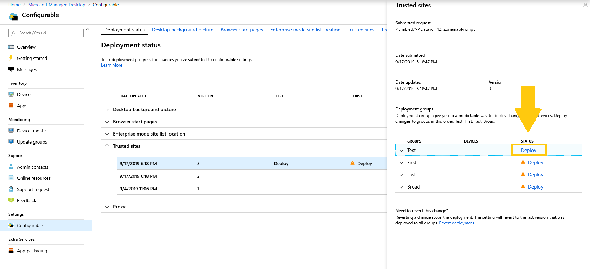
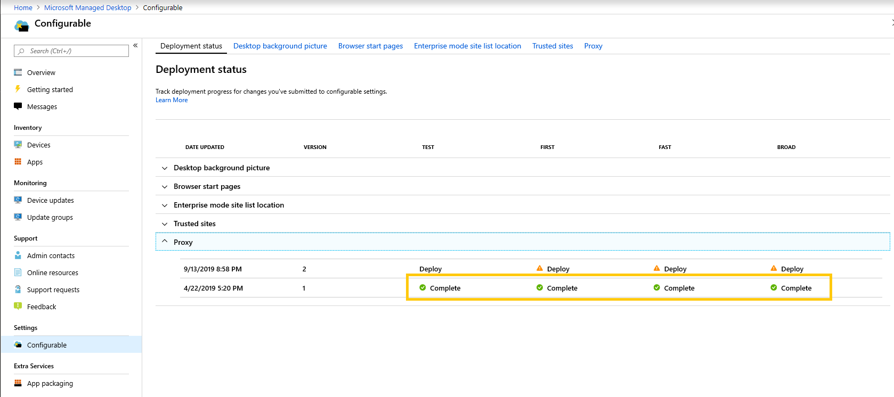

# Deploy and track configurable settings - Microsoft Managed Desktop

After you make changes to your setting categories and stage a deployment, the Deployment status page allows you to begin deploying your settings to groups. This page shows a summary of each configurable setting. By opening a setting category you can deploy settings to groups and track the progress of these deployments.

## Deployment statuses 

These are the statuses you’ll see for each deployment.

Status	| Explanation 
--- | --- 
Deploy | Your change is waiting to be deployed to this group.
In progress | The change is being applied to active devices in this group. 
Complete | The change completed on all active devices in this group. 
Failed | The change failed on a 10 percent of active devices in the group, so the deployment was stopped.   A support request will be automatically opened with Microsoft Managed Desktop operations to troubleshoot the deployment. 
Reverted | The change was reverted to the last change that was successfully deployed to all deployment groups.

## Deploy changes

We’ll show Desktop background picture in these instructions. After you’ve staged a deployment, you deploy changes from the Deployment status page. 

**To deploy changes**

1. Sign in to [Microsoft Endpoint Manager](https://endpoint.microsoft.com/) and navigate to the **Devices** menu
2. Look for the Microsoft Managed Desktop section, select **Settings**.
3. In **Deployment status** workspace, select the setting you want to deploy, and then select the staged deployment to deploy.
4. Select **Deploy** to deploy the change to one of the deployment groups.

> [!NOTE] 
> The orange caution icon indicates there is a previous group available for deployment as it’s recommended to roll out in order. 

<!-- Needs picture updated to show MEM  -->

We recommend deploying to deployment groups in this order: Test, First, Fast, and then Broad. 

When changes complete in each group, the status changes to **Complete**.

<!-- Needs picture updated to show MEM  -->

## Revert deployment

After you’ve deployed a change, you can revert from **Deployment status**. When you revert a change that is **In progress** or **Complete**, the current deployment stops. The setting will revert to the last version that was deployed to all groups. 

We’ll show the steps to revert a change using the Desktop background picture as an example. 

**To revert a change**
1. Sign in to [Microsoft Endpoint Manager](https://endpoint.microsoft.com/) and navigate to the **Devices** menu
2. Look for the Microsoft Managed Desktop section, select **Settings**.
3. In **Deployment status** workspace, select the setting you want to revert, and then select the staged deployment to revert.
4. Under **Need to revert this change?**, select **Revert deployment**.

<!-- Needs picture updated to show MEM  -->

## Additional resources
- [Configurable settings overview](config-setting-overview.md)
- [Configurable settings reference](config-setting-ref.md) 
