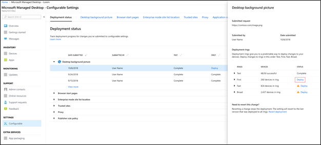
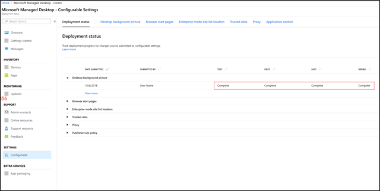
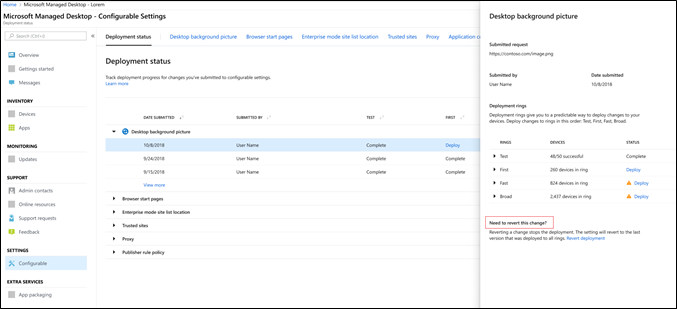

# Deploy and track configurable settings - Microsoft Managed Desktop

After you make changes to your setting categories and stage a deployment, you can deploy and track progress for the deployment on Deployment status. This page shows a summary of each configurable setting. Open a setting category to see each deployment and their details, to deploy the changes. 

## Deployment statuses 

These are the statues you’ll see for each deployment.

Status	| Explanation 
--- | --- 
Deploy | Your change is waiting to be deployed to this ring.
In progress | The change is being applied to active devices in this ring. 
Complete | The change completed on all active devices in this ring. 
Failed | The change failed on a 10 percent of active devices in the ring, so the deployment was stopped.   A support request will be automatically opened with Microsoft Managed Desktop operations to troubleshoot the deployment. 
Reverted | The change was reverted to the last change that was successfully deployed to all deployment rings.

## Deploy changes

We’ll show Desktop background picture in these instructions. After you’ve staged a deployment, you deploy changes from Deployment status. 

**To deploy changes**

1. Sign in to [Microsoft Managed Desktop Admin portal](http://aka.ms/mwaasportal)
2. Under **Settings**, select **Configurable**.
3. In **Deployment status** workspace, select the setting you want to deploy, and then select the staged deployment to deploy.
4. Select **Deploy** to deploy the change to one of the deployment rings.

Microsoft Managed Desktop recommends deploying to deployment rings in this order: Test, First, Fast, and then Broad. 

When changes complete in each ring, the status changes to **Complete**.

## Revert deployment

We’ll show Desktop background picture in these instructions. 

After you’ve deployed a change, you can revert from **Deployment status**. When you revert a change that is **In progress** or **Complete**, the current deployment stops. The setting will revert to the last version that was deployed to all rings. 

**To revert a change**
1. Sign in to [Microsoft Managed Desktop Admin portal](http://aka.ms/mwaasportal)
2. Under **Settings**, select **Configurable**.
3. In **Deployment status** workspace, select the setting you want to revert, and then select the staged deployment to revert.
4. Under **Need to revert this change**, select **Revert deployment**.

 

## Additional resources
- [Configurable settings overview](config-setting-overview.md)
- [Configurable settings reference](config-setting-ref.md) 