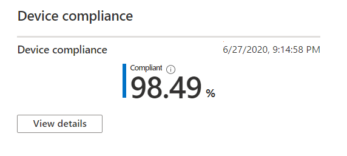
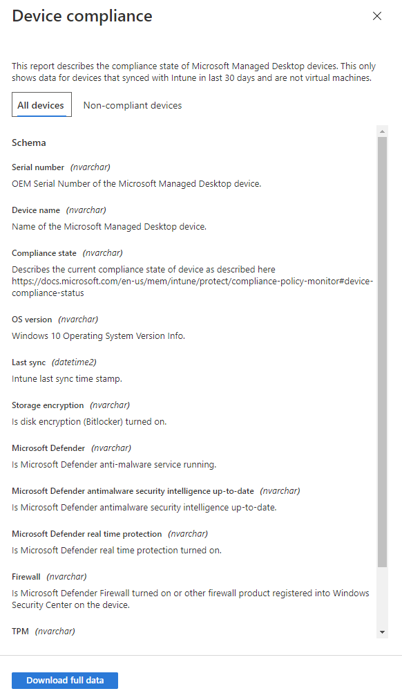

# Device compliance report

This view shows the percentage of your Microsoft Managed Desktop devices that conform to compliance policies set in Microsoft Intune.

Select **View details** to view specific information for either all of your Microsoft Managed Desktop devices or only those that do not conform to compliance policies. Use the pulldown menu to switch between these views. To appear in this view, a device must be a physical machine and have synced with Intune in the last 30 days.

From this view, select **Download full data** to export a comma-delimited file with the same information. In the export file, the areas displayed as **Schema** appear as columns.