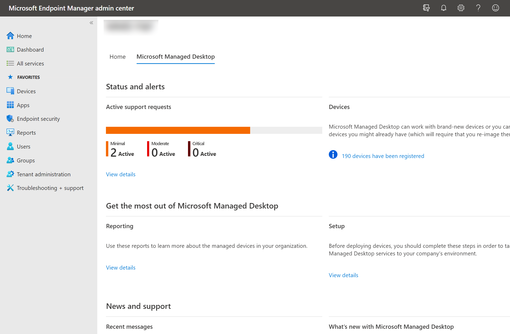

# Work with insights

Microsoft Managed Desktop provides a number of dashboards that IT admins in your tenant can use to understand various aspects of the population of devices. You access these directly, in the [Microsoft 365 Admin Center](https://admin.microsoft.com/adminportal/home?previewoff=false#/microsoftmanageddesktop).

With these dashboards you can find the answers to questions like these:

- How many devices are active and when were they last used?
- Which apps are most used and during which times?
- Which apps are causing trouble by crashing or hanging a lot?
- How is Microsoft Managed Desktop Operations mitigating or resolving such problems?
- Which apps are consuming the most energy?
- What's the predicted battery life my devices?
- What is the current status of security updates on devices?
- How long did it take for 95% of the devices to get current with the latest security update?

To access these views from the [Microsoft Endpoint Manager](https://endpoint.microsoft.com/), navigate to the Microsoft Managed Desktop tab on the homepage and select **View details** in the **Reporting** area:

## Usage insights
This view provides usage metrics for your Microsoft Managed Desktop devices. 

To view usage data, select the **Usage** tab.

Learn more about [usage insights](usage-insights.md).

## Reliability insights
This view provides you with a health summary of your managed devices. To view reliability data, select the **Reliability** tab.

Learn more about [reliability insights](reliability-insights.md).

## Battery insights
This view shows you information about the energy consumption of apps and projected battery life for devices in your environment. To view this information, select the **Battery** tab.

Learn more about [Battery insights](battery-insights.md).

## Windows security update insights
This view shows you information about the status of security updates for your Microsoft Managed Desktop devices. To view this information, select the **Windows security updates** tab.

Learn more about [Security update insights](security-update-insights.md).
