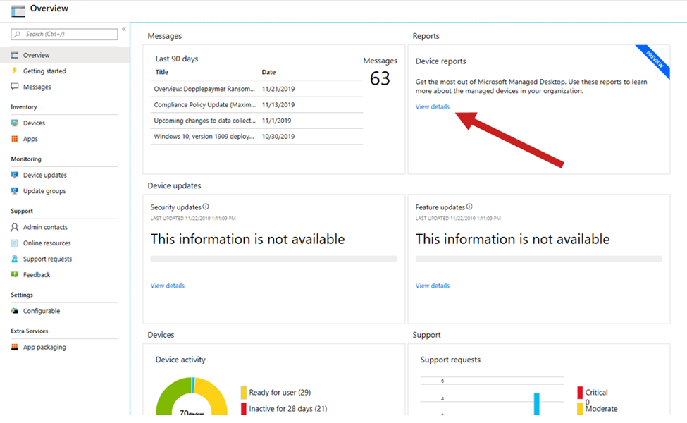

# Work with insights

Microsoft Managed Desktop provides a number of dashboards that IT admins in your tenant can use to understand various aspects of the population of devices. You access these through the Microsoft 365 Admin Center.

With these dashboards you can find the answers to questions like these:

- How many devices are active and when were they last used?
- Which apps are most used and during which times?
- Which apps are causing trouble by crashing or hanging a lot?
- How is Microsoft Managed Desktop Operations mitigating or resolving such problems?

To access these views from the Microsoft 365 Admin Center, select **View details** in the **Reports** area:

## Usage insights
This view provides usage metrics for your Microsoft Managed Desktop devices. 

To view usage data, select the **Usage** tab.

Learn more about [usage insights](usage-insights.md).

## Reliability insights
This view provides you with a health summary of your managed devices. To view reliability data, select the **Reliability** tab.

Learn more about [reliability insights](reliability-insights.md).

## Battery insights
This view shows you information about the energy consumption of apps and projected battery life for devices in your environment. To view this information, select the **Battery** tab.

Learn more about [Battery insights](battery-insights.md).