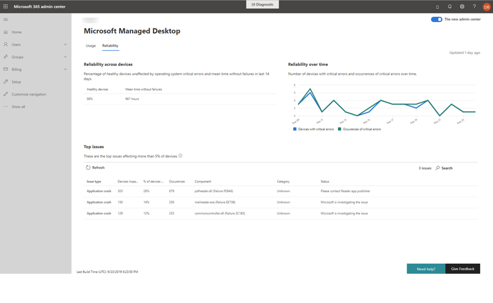

# Reliability insights

This view provides you with a health summary of your managed devices. To view reliability data, select the **Reliability** tab.

The **Reliability across devices** section offers a quick health summary of your deployment over the last 14 days by reporting the percentage of devices considered to be “healthy” and the mean time observed since the last reported failure. 

 
The **Reliability over time** graph on the right reports the number of devices with critical errors and the total number of observed critical errors over time.

The **Top issues** section details specific detected issues that affect at least 5% of your managed devices. Reported details include:

- The type of issue
    - Application crashes, in which an app stops functioning or unexpectedly stops
    - Application hangs, where an application stops responding to input
    - Critical errors, which occur when Windows has encountered an issue it can't recover from
- The number of devices affected by the same issue
- The percentage of managed devices that number represents
- The total count of occurrences of the specific issue
- The software component that appears to be the source of the problem
- The category of the detected problem:
    - Browser (Edge, Chrome, IE)
    - Unknown (Non-Microsoft components)
    - Driver (audio, graphics, or other drivers)
    - Productivity (Slack, G-Suites, Microsoft Office and its add-ons or extensions, Teams)
    - Media (image, music, or video apps
    - Security (Windows security components)
- The current status as Microsoft Managed Desktop Operations investigates and remediates the issue

