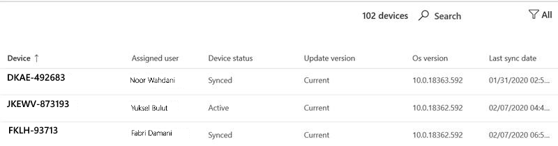

# Windows security update insights
This view provides an overview of the status of security updates for your Microsoft Managed Desktop devices. 

To view usage data, select the <strong>Windows security updates</strong> tab.

## Device status

For devices to be updated by Windows Update, they must be connected to the Internet and not hibernating for a minimum of six hours, two of which must be continuous. Although it's possible that a device that doesn't meet these requirements will be updated, devices that meet them have the highest likelihood of being updated. 

We categorize device activity in the context of Windows Update with these terms:

- <strong>Active:</strong> Devices that have met the minimum activity criteria (six hours, two continuous) for the most recent security update release and have checked in with Microsoft Intune at least every five days
- <strong>Synced:</strong> Devices that have checked in with Intune within the last 28 days
- <strong>Out of sync:</strong> Devices that have <i>not</i> checked in with Intune in the last 28 days

## Update version status

Microsoft releases security updates every second Tuesday of the month. Each release adds important updates for known security vulnerabilities. Microsoft Managed Desktop ensures that 95% of its managed devices are updated with the latest available security update every month. Security updates are sometimes released at other times to urgently address new threats. Microsoft Managed Desktop deploys these updates in a similar fashion.

We categorize the status of security update versions with these terms:

- <strong>Current:</strong> Devices that are running the update released in the current month
- <strong>Previous:</strong> Devices running the update that was released in the previous month
- <strong>Older:</strong> Devices running any security update released prior to the previous month

You should see few devices in the <strong>Older</strong> category--a large or growing population probably indicates a systemic problem that you should report to Microsoft Managed Desktop so we can investigate.

## Deployment progress

At the beginning of each security update release cycle, Microsoft Managed Desktop takes a snapshot of the device population and sets its deployment target at 95% of that population. The <strong>Deployment progress</strong> area shows a historical trend, updated daily, tracking how closely the update deployment meets this target for each release. This graph only shows devices with Active status.

You can view this data for previous update cycles by using the dropdown menu in the upper right. The period you select in this menu applies to all of the information on the whole page.

The <strong>Updated active devices by deployment group</strong> area offers a different view by showing the progress of the update installation for each of the Microsoft Managed Desktop deployment groups.

The <strong>Days to reach target</strong> area displays how long it took for 95% of the total number of devices to be updated with the current security update. While deployment is underway, this area displays <strong>Still updating</strong> until the 95% target is reached for the selected update.

## Device details area

The bottom of the dashboard is a table showing detailed information for your devices, including the [Device status](#device-status) and the [Update version status](#update-version-status). You can search this list or filter it by any listed value.

