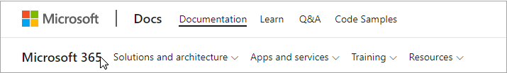
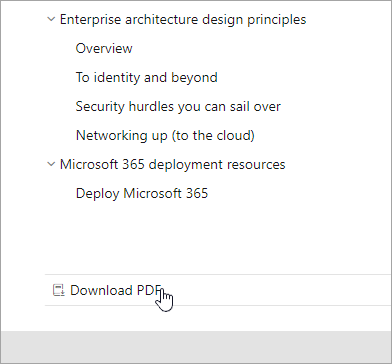
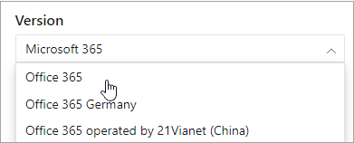
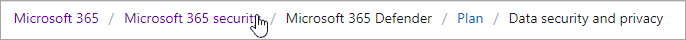
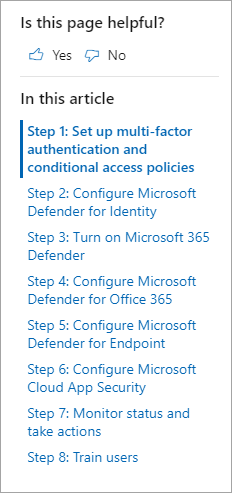
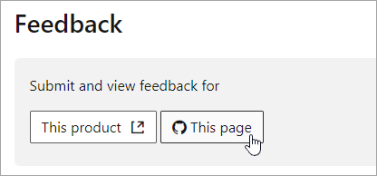

# Microsoft 365 docs navigation guide

This topic provides some tips and tricks for navigating the Microsoft 365 technical documentation space.  

## Hub page

The Microsoft 365 hub page can be found at [https://aka.ms/microsoft365docs](./index.yml) and is the entry point for finding relevant Microsoft 365 content.

You can always navigate back to this page by selecting **Microsoft 365** from the header at the top of every page within the Microsoft 365 technical documentation set:

## Offline documentation

If you would like to view the Microsoft 365 documentation on an offline system, you can create a PDF wherever you are in the Microsoft 365 technical documentation.

If you'd like to create a PDF, select the **Download PDF** link found at the bottom of every table of contents.

## TOC search 
On docs.microsoft.com, you can search the content in the table of contents by using the filter search box at the top:

## Version filter
The Microsoft 365 technical documentation provides content for additional products, including Office 365 Germany and Office 365 operated by 21 Vianet (China). Features can vary between these versions, and as such, sometimes the content itself can vary.

You can use the version filter to ensure that you are seeing content for the appropriate version of Microsoft 365:

## Breadcrumbs

Breadcrumbs can be found below the header and above the table of contents, and indicate where the current article is located in the table of contents.  Not only does this help set the context to what type of content you're reading, but it also allows you to navigate back up the table of contents tree:

## Article section navigation

The right-hand navigation pane allows you to quickly navigate to sections within an article, as well as identify your location within the article.  

## Submit docs feedback

If you find something wrong within an article, you can submit feedback to the SQL Content team for that article by scrolling down to the bottom of the page and selecting **Content feedback**.

## Contribute to Microsoft 365 documentation

Did you know that you could edit the content on docs.microsoft.com yourself? If you do so, not only will our documentation improve, but you'll also be credited as a contributor to the page. To get started, see:

- [Microsoft Docs contributor guide](/contribute/)

## Next steps

- Get started with the [Microsoft 365 technical documentation](index.yml).