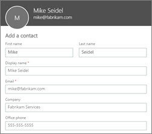

# Quick help: Contacts

If you need shared contacts that everyone in your organization can get to, create them in the Microsoft 365 admin center. The contacts you create here can be seen by you and your users as part of the global address list.
  
## How do I add contacts in the admin center?

To add contacts:

1. In the admin center, go to the **Users** \> <a href="https://go.microsoft.com/fwlink/p/?linkid=2053302" target="_blank">Contacts</a> page.

2. On the **Contacts** page, select **Add a contact**.
  
3. On the **New Contact** page, fill in details and select **Add** to create a contact.
  

  
## How are these contacts different from My Contacts?

My Contacts are contacts that you create for yourself and your users create for themselves but others can't see ([learn more](https://support.office.com/article/5fe173cf-e620-4f62-9bf6-da5041f651bf.aspx)). The contacts you create in the admin center are contacts for the organization and everyone can see them in addition to their own.
  
## How does everyone get to the contacts I created in the admin center?

 They can go to **People** in Office 365, expand **Directory** and select **All Contacts**. They can view each contact and their information from there.
  
## Can anyone create and edit these organizational contacts?

No. Only **Global** and **Exchange** administrators can create, edit, or delete these contacts. Everyone else can only view them. 
  
## Can I use this to manage my business clients?

You can use Office 365 contacts however you like, but there are limitations. Learn about [other ways to manage contacts](ways-to-manage-contacts.md)
  
## How do I bulk import organizational contacts?

Use Windows PowerShell and a CSV (Comma Separated Value) file to bulk import external contacts as described in [Bulk import external contacts to Exchange Online](https://support.office.com/article/bed936bc-0969-4a6d-a7a5-66305c14e958).
  
## What if my question still hasn't been answered?

Visit the rest of our [admin help](https://support.office.com/article/17d3ff3f-3601-466e-b5a1-482b31cfb791.aspx) or give us your feedback below. 
  

