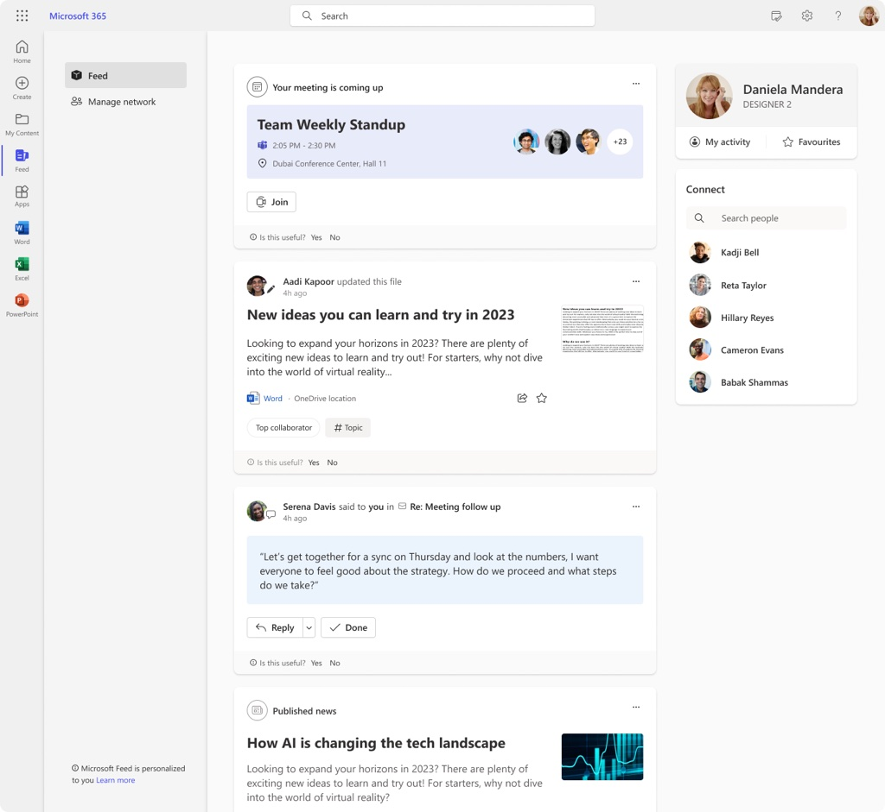

# Overview of Microsoft Feed

Microsoft Feed is powered by Microsoft Graph and aims to help users discover and learn about people and interests relevant to their work. Microsoft Feed shows users a mix of content and activity from across Microsoft 365. Users might, for example, see updates to documents they’re working on with others, links shared with them in Teams chats, suggested tasks to follow up, highlights about colleagues, and much more.

Read more about how the feed works here:  [Discover and learn with Microsoft Feed](https://support.microsoft.com/en-us/office/discover-and-learn-with-microsoft-feed-9c190800-e348-46b7-9d46-41c628b80ebb)

## Where can users see Microsoft Feed?

In **Microsoft 365** (previously Office.com), while signed in with a work or school account, select **Feed** from the left navigation bar.

In **Microsoft Edge**, select the **Microsoft 365** page when opening a new tab.

See the section *Find your way around* in [Discover and learn with Microsoft Feed](https://support.microsoft.com/en-us/office/discover-and-learn-with-microsoft-feed-9c190800-e348-46b7-9d46-41c628b80ebb)

## Availability

In Microsoft 365, the new Feed experience will be rolled out gradually to customers, beginning with the tenants who have selected a Targeted Release attribute in their Microsoft 365 Admin Center.

In Microsoft Edge Enterprise New Tab Page, the new Feed experience will be rolled out in February-March 2023.

## Privacy in Microsoft Feed

The information in Microsoft Feed is tailored to each user. Users will only see documents or other content they have access to or that was shared directly with them. This can be documents that are stored in a shared folder in OneDrive or on a SharePoint site that the user has access to, or a link that someone shared in an email conversation or a Teams chat.

Microsoft Feed doesn’t change any permissions, so each user has a unique feed based on what they already have access to. Documents and information are not stored in Microsoft Feed, and changing permissions must be done from where the information is stored, such as in OneDrive or SharePoint.

## What controls are available?

Microsoft Feed is built on Microsoft 365 and implicitly respects all settings and restrictions enabled by admins and users, such as People Insights (see more information on how to [Customize people insights privacy in Microsoft Graph](/graph/insights-customize-people-insights-privacy)), and Item Insights (see more information on how item insights setting works [Item insights overview](/graph/item-insights-overview)).

In addition, Microsoft Feed respects LinkedIn visibility settings (when a user prefers to limit the visibility of their profile information outside of LinkedIn). To learn more, see [Off-LinkedIn Visibility | LinkedIn Help](https://www.linkedin.com/help/linkedin/answer/a1340507), and [Disconnecting Your LinkedIn and Microsoft Accounts and Managing Your Data | LinkedIn Help](https://www.linkedin.com/help/linkedin/answer/a552108).

In Microsoft 365, as a tenant admin, if you want to disable the new experience, you can contact Microsoft via a service request to turn off Microsoft Feed. This is a temporary solution which removes the Feed icon from the left navigation of Microsoft 365.

1.    [Sign in to Microsoft 365](https://admin.microsoft.com) with your Microsoft 365 admin account.
2.    **Select Support** > **New service request.**
3.    If you're in the admin center, select **Support** > **New service request.**
4.    To re-enable the feature, you can create a **New service request.**

In Microsoft Edge, while signed in with a work or school account, as a tenant admin, if you want to disable the new experience, you can choose to *not show* Microsoft 365 content on the Microsoft Edge new tab page:

1.    Sign in to the [Microsoft 365 admin center](https://admin.microsoft.com)
2.    Go to **Org settings** > **News.**
3.    Under **News**, select **Microsoft Edge new tab page**.
4.    *Clear* the box that says **Show Microsoft 365 content on the Microsoft Edge new tab page.**
5.    To re-enable the feature, check the box that says **Show Microsoft 365 content on the Microsoft Edge new tab page.**

## Provide feedback

We would love to hear from you! To let us know what you think of this feature, you can reach us by:

1.    Responding to our Message Center post with feedback. This option is only available for tenant admins with access to the Microsoft Admin Center in Microsoft 365.
2.    Providing general feature feedback when viewing Microsoft Feed by clicking on "Feedback" in the lower right-hand corner.

## Frequently Asked Questions (FAQ)

1. **What documents can users see in Microsoft Feed?**

When a user creates and stores a document in a folder in OneDrive, and this folder is shared with other people, the document can be picked up and showed in those people’s feeds, even if the user hasn’t explicitly shared the document with others (yet). The same is the case if a user stores a document on a SharePoint site that others have access to.

2. **How does following work?**

Following is synchronized between Microsoft Feed and Viva Engage. Following features in Microsoft Feed are only available to users who have a Viva Engage license. If users don’t have a Viva Engage license, the My network page is not available, and the users can’t follow others from Microsoft Feed.

3. **What's the connection between** [Office Delve](https://delve.office.com) **and Microsoft Feed?**

Office Delve and Microsoft Feed are both based on Microsoft Graph. However, turning off Office Delve will not turn off Microsoft Feed.