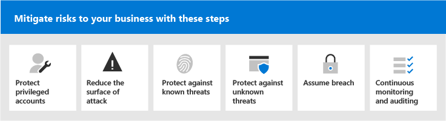
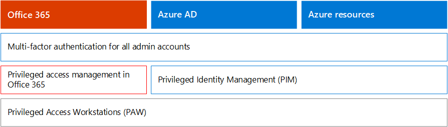
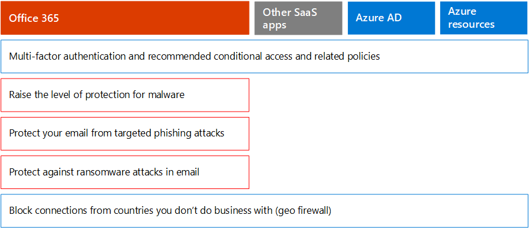
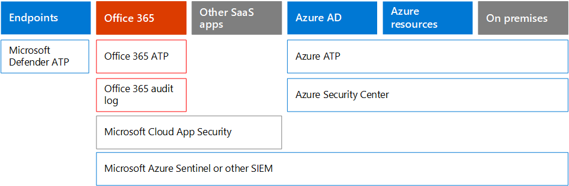

# Microsoft 365 Security for Business Decision Makers (BDMs)

This article discusses some of the most common threat and attack scenarios currently faced by organizations for their Microsoft 365 environments, and recommended actions for mitigating these risks. While Microsoft 365 comes with a wide array of pre-configured security features, it also requires you as the customer to take responsibility to secure your own identities, data, and devices used to access cloud services. This guidance was developed by Kozeta Beam (Microsoft Cloud Security Architect) and Thiagaraj Sundararajan (Microsoft Senior Consultant).

This article is organized by priority of work, starting with protecting those accounts used to administer the most critical services and assets, such as your tenant, e-mail, and SharePoint. It  provides a methodical way for approaching security and works together with the following spreadsheet so you can track your progress with stakeholders and teams across your organization: [Microsoft 365 security for BDMs spreadsheet](https://github.com/MicrosoftDocs/microsoft-365-docs/raw/public/microsoft-365/downloads/Microsoft-365-BDM-security-recommendations-spreadsheet.xlsx). 

Microsoft provides you with the Secure Score tool within your tenant to automatically analyze your security posture based on your regular activities, assign a score, and provide security improvement recommendations. Before taking the actions recommended in this article, take note of your current score and recommendations. The actions recommended in this article will increase your score. The goal is not to achieve the max score, but to be aware of opportunities to protect your environment in a way that does not negatively affect productivity for your users. See [Microsoft Secure Score](defender/microsoft-secure-score.md).

One more thing before we get started . . . be sure to [turn on the audit log](../compliance/search-the-audit-log-in-security-and-compliance.md). You'll need this data later, in the event you need to investigate an incident or a breach. 

## Protect privileged accounts

As a first step, we recommend ensuring critical accounts in the environment are given an extra layer of protection as these accounts have access and permissions to manage and alter critical services and resources, which can negatively impact the entire organization, if compromised. Protecting privileged accounts is one of the most effective ways to protect against an attacker who seeks to elevate the permissions of a compromised account to an administrative one. 

|Recommendation  |E3 |E5  |
|---------|---------|---------|
|Enforce multi-factor authentication (MFA) for all administrative accounts.||| 
|Implement Azure Active Directory (Azure AD) Privileged Identity Management (PIM) to apply just-in-time privileged access to Azure AD and Azure resources. You can also discover who has access and review privileged access.|         | |
|Implement privileged access management to manage granular access control over privileged admin tasks in Office 365. |         | |
|Configure and use Privileged Access Workstations (PAW) to administer services. Do not use the same workstations for browsing the Internet and checking email not related to your administrative account.|  | | 

The following diagram illustrates these capabilities.

Additional recommendations:
- Ensure accounts that are synchronized from on-premises are not assigned admin roles for cloud services. This helps prevent an attacker from applying on-premises accounts to gain administrative access to cloud services. 
- Ensure service accounts are not assigned admin roles. These accounts are often not monitored and set with passwords that do not expire. Start by ensuring the AADConnect and ADFS services accounts are not Global Admins by default.
- Remove licenses from admin accounts. Unless there is a specific use case to assign licenses to specific admin accounts, remove licenses from these accounts. 

## Reduce the surface of attack

The next focus area is reducing the surface of attack. This can be accomplished with minimal effort and impact to your users and services. By reducing the surface area of attack, attackers have fewer ways to launch an attack against your organization.

Here are some examples:
- Disable POP3, IMAP, and SMTP protocols. Most modern organizations no longer use these older protocols. You can safely disable these and allow exceptions only as needed. 
- Reduce and keep the number of Global Admins in the tenant to the absolute minimum required. This directly reduces the surface area of attack for all Cloud applications. 
- Retire servers and applications that are no longer used in your environment. 
- Implement a process for disabling and deleting accounts that are no longer used. 

## Protect against known threats

Known threats include malware, compromised accounts, and phishing. Some protections against these threats can be implemented quickly with no direct impact to your users, while others require more planning and user training. 

|Recommendation  |E3  |E5  |
|---------|---------|---------|
|**Setup multi-factor authentication and use recommended conditional access policies, including sign-in risk policies**. Microsoft recommends and has tested a set of policies that work together to protect all cloud apps, including Office 365 and Microsoft 365 services. See [Identity and device access configurations](./office-365-security/microsoft-365-policies-configurations.md). | ||
|**Require multi-factor authentication for all users**. If you don't have the licensing required to implement the recommended conditional access policies, at a minimum require multi-factor authentication for all users.|||
|**Raise the level of protection against malware in mail**. Your Office 365 or Microsoft 365 environment includes protection against malware, but you can increase this protection by blocking attachments with file types that are commonly used for malware.|||
|**Protect your email from targeted phishing attacks**. If you've configured one or more custom domains for your Office 365 or Microsoft 365 environment, you can configure targeted anti-phishing protection. Anti-phishing protection, part of Defender for Office 365, can help protect your organization from malicious impersonation-based phishing attacks and other phishing attacks. If you haven't configured a custom domain, you do not need to do this.| ||
|**Protect against ransomware attacks in email**. Ransomware takes away access to your data by encrypting files or locking computer screens. It then attempts to extort money from victims by asking for "ransom," usually in form of cryptocurrencies like Bitcoin, in exchange for returning access to your data. You can help defend against ransomware by creating one or more mail flow rules to block file extensions that are commonly used for ransomware, or to warn users who receive these attachments in email.|||
|**Block connections from countries that you don't do business with**. Create an Azure AD conditional access policy to block any connections coming from these countries, effectively creating a geo firewall around your tenant.| ||

The following diagram illustrates these capabilities.

## Protect against unknown threats

After adding extra protections to your privileged accounts and protecting against known attacks, shift your attention to protecting against unknown threats. The more determined and advanced adversaries use innovative and new, unknown methods to attack organizations. With Microsoft's vast telemetry of data gathered over billions of devices, applications, and services, we are able to perform Defender for Office 365 on Windows, Office 365, and Azure to prevent against Zero-Day attacks, utilizing sand box environments, and checking validity before allowing access to your content. 

|Recommendation  |E3  |E5  |
|---------|---------|---------|
|**Configure Microsoft Defender for Office 365**: *    Safe Attachments *    Safe Links *    Microsoft Defender for Endpoint for SharePoint, OneDrive, and Microsoft Teams *    Anti-phishing in Defender for Office 365 protection|         | |
|**Configure Microsoft Defender for Endpoint capabilities**: *    Windows Defender Antivirus  *    Exploit protection   *    Attack surface reduction   *    Hardware-based isolation  *    Controlled folder access     |         | |
|**Use Microsoft Cloud App Security** to discover SaaS apps and begin to use behavior analytics and anomaly detection. |         | |

The following diagram illustrates these capabilities.

Additional recommendations:
- Secure partner channel communications like Emails using TLS.
- Open Teams Federation only to Partners you communicate with.
- Do not add sender domains, individual senders, or source IPs to your allowlist as this allows these to bypass spam and malware checks — A common practice with customers is adding their own accepted domains or a number of other domains where email flow issues may have been reported to the allowlist. Do not add domains in the Spam and Connection Filtering list as this potentially bypasses all spam checks. 
- Enable outbound spam notifications — Enable outbound spam notifications to a distribution list internally to the Helpdesk or IT Admin team to report if any of the internal users are sending out Spam emails externally. This could be an indicator that the account has been compromised.
- Disable Remote PowerShell for all users — Remote PowerShell is mainly used by Admins to access services for administrative purposes or programmatic API access. We recommended disabling this option for non-Admin users to avoid reconnaissance unless they have a business requirement to access it. 
- Block access to the Microsoft Azure Management portal to all non-administrators. You can accomplish this by creating a conditional access rule to block all users, except for admins. 

## Assume breach

While Microsoft takes every possible measure to prevent against threats and attacks, we recommend always working under the "Assume Breach" mindset. Even if an Attacker has managed to intrude into the environment, we need to make sure they are unable to exfiltrate data or identity information from the environment. For this reason, we recommend enabling protection against sensitive data leaks such as Social Security numbers, credit cards numbers, additional personal information, and other organizational level confidential information. 

The "Assume Breach" mindset requires implementing a zero trust network strategy, which means users are not fully trusted just because they are internal to the network. Instead, as part of authorization of what users can do, sets of conditions are specified, and when such conditions are met, certain controls are enforced. Conditions may include device health status, application being accessed, operations being performed, and user risk. For example, a device enrollment action should always trigger MFA authentication to ensure no rouge devices are added to your environment. 

A zero trust network strategy also requires that you know where your information is stored and apply appropriate controls for classification, protection, and retention. To effectively protect your most critical and sensitive assets you need to first identify where these are located and take inventory, which can be challenging. Next, work with your organization to define a governance strategy. Defining a classification schema for an organization and configuring policies, labels, and conditions require careful planning and preparation. It is important to realize that this is not an IT driven process. Be sure to work with your legal and compliance team to develop an appropriate classification and labeling schema for your organization's data.

Microsoft 365 information protection capabilities can help you discover what information you have, where it is stored, and which information requires additional protection. Information protection is a continuous process and Microsoft 365 capabilities provide you with visibility into how users are using and distributing sensitive information, where your information is currently stored, and where it flows. You can also see how users handling information that is regulated to be sure the appropriate labels and protections are applied.

|Recommendation |E3|E5 |
|---------|---------|---------|
|**Review and optimize your conditional access and related policies to align with your objectives for a zero trust network**. Protecting against known threats includes implementing a set of [recommended policies](./office-365-security/microsoft-365-policies-configurations.md). Review your implementation of these policies to ensure you're protecting your apps and data against hackers who have gained access to your network. The recommended Intune app protection policy for Windows 10 enables Windows Information Protection (WIP). WIP protects against accidental leaks of your organization data through apps and services, like email, social media, and the public cloud. |         ||
|**Disable external email forwarding**. Hackers who gain access to a user's mailbox can steal your mail by setting the mailbox to automatically forward email. This can happen even without the user's awareness. You can prevent this from happening by configuring a mail flow rule.| ||
|**Disable anonymous external calendar sharing**. By default external anonymous calendar sharing is allowed. [Disable calendar sharing](/exchange/sharing/sharing-policies/modify-a-sharing-policy) to reduce potential leaks of sensitive information.| ||
|**Configure data loss prevention policies for sensitive data**. Create a Data Loss Prevention Policy in the Security &amp; Compliance center to discover and protect sensitive data such as credit card numbers, Social Security numbers and bank account numbers. Microsoft 365 includes many predefined sensitive information types you can use in data loss prevention policies. You can also create your own sensitive information types for sensitive data that is custom to your environment. |||
|**Implement data classification and information protection policies**. Implement sensitivity labels and use these to classify and apply protection to sensitive data. You can also use these labels in data loss prevention policies. If you are using Azure Information Protection labels, we recommend that you avoid creating new labels in other admin centers.|         ||
|**Protect data in third-party apps and services by using Cloud App Security**. Configure Cloud App Security policies to protect sensitive information across third-party cloud apps, such as Salesforce, Box, or Dropbox. You can use sensitive information types and the sensitivity labels you created in Cloud App Security policies and apply these across your SaaS apps.   Microsoft Cloud App Security allow you to enforce a wide range of automated processes. Policies can be set to provide continuous compliance scans, legal eDiscovery tasks, DLP for sensitive content shared publicly, and more. Cloud App Security can monitor any file type based on more than 20 metadata filters (for example, access level, file type). |         ||
|**Use [Microsoft  Defender for Endpoint](/windows/security/threat-protection/microsoft-defender-atp/information-protection-in-windows-overview) to identify if users store sensitive information on their Windows devices**. |         ||
|**Use [AIP Scanner](/azure/information-protection/deploy-aip-scanner) to identify and classify information across servers and file shares**. Use the AIP reporting tool to view the results and take appropriate actions.|         ||

The following diagram illustrates these capabilities.

## Continuous monitoring and auditing

Last, but not least Continuous Monitoring and Auditing of the Microsoft 365 environment along with the Windows and Devices is critical to making sure you are able to quickly detect and remediate any intrusions. Tools such as Secure Score, Security Center, and Microsoft Intelligent Graph's advanced analytics provide invaluable information into your tenant and link massive amounts of threat intelligence and security data to provide you unparalleled threat protection and detection.

|Recommendation |E3 |E5 |
|---------|---------|---------|
|Ensure the **audit log** is turned on.|||
|**Review Secure Score weekly** — Secure score is a central location to access the Security status of your company and take actions based on Secure score recommendations. It is recommended to perform this check weekly.|||
|Use **Microsoft Defender for Office 365** tools: *    Threat investigation and response capabilities  *    Automated investigation and response |         ||
|Use **Microsoft  Defender for Endpoint**:  *    [Endpoint detection and response](/windows/security/threat-protection/microsoft-defender-atp/overview-endpoint-detection-response)   *    Automated investigation and remediation Secure score  *    [Advanced hunting](/windows/security/threat-protection/microsoft-defender-atp/advanced-hunting-overview)  |         ||
|Use **Microsoft Cloud App Security** to detect unusual behavior across cloud apps to identify ransomware, compromised users or rogue applications, analyze high-risk usage and remediate automatically to limit the risk to your organization.|         ||
|Use **Microsoft Azure Sentinel** or your current SIEM tool to monitor for threats across your environment. |         ||
|**Deploy [Microsoft Defender for Identity](/azure-advanced-threat-protection/what-is-atp)** to monitor and protect against threats targeted to your on-premises Active Directory environment.   |         | |
|Use the **Azure Defender*** to monitor for threats across hybrid and cloud workloads. Azure Defender* includes a free tier of capabilities and a standard tier of capabilities that are paid for based on resource hours or transactions.|         |         |

The following diagram illustrates these capabilities.

Top recommended monitoring actions:
- **Review Microsoft Secure Score weekly** — Secure score is a central location to access the security status of your tenant and to take actions based on top recommendations. It is recommended to perform this check weekly. Secure Score includes recommendations from across Azure AD, Intune, Cloud App Security, and Microsoft Defender for Endpoint, as well as Office 365. 
- **Review risky logins weekly** — Use the Azure AD admin center to review risky sign-ins weekly. The recommended identity and device access ruleset includes a policy to enforce password change on risky sign-ins.  
- **Review top malware and phished users weekly** — Use Microsoft Defender for Office 365 Threat Explorer to review top users targeted with malware and phish and to find out the root cause of why these users are affected.