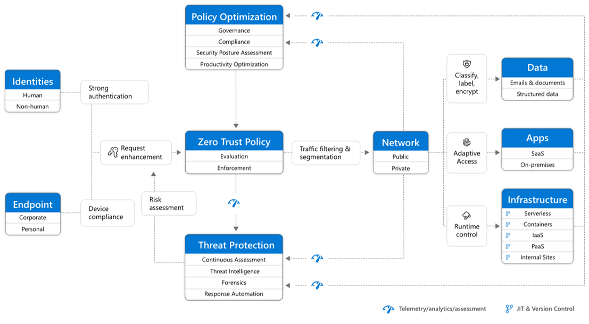
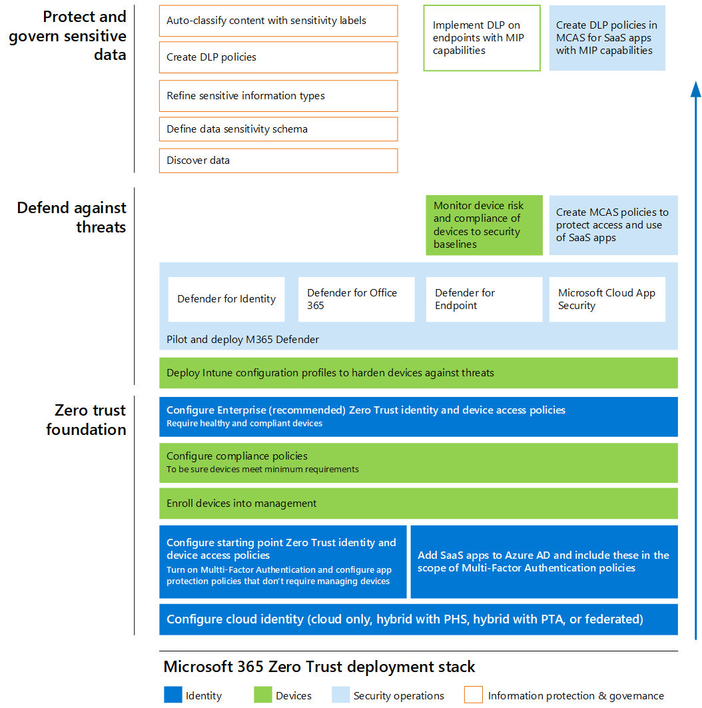
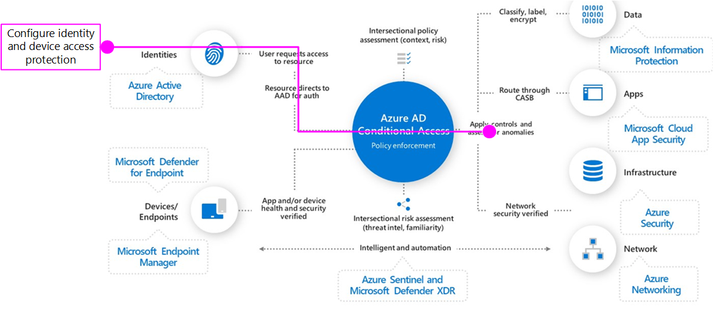
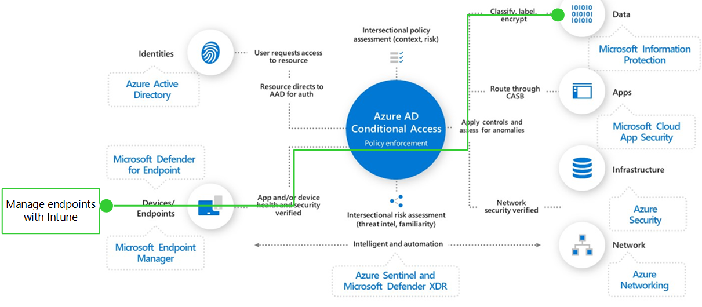
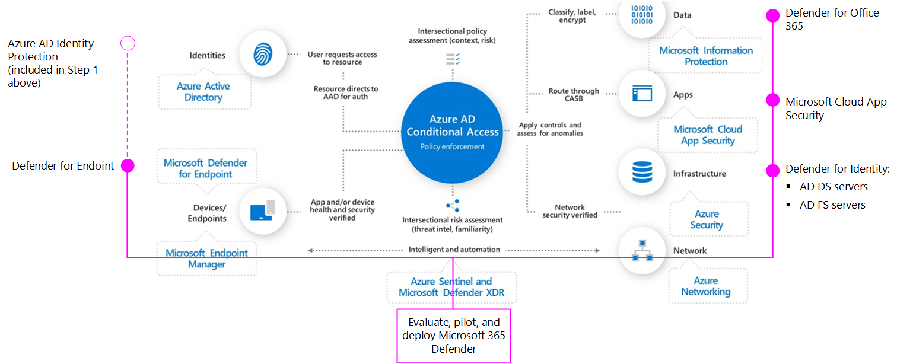

# Microsoft 365 Zero Trust deployment plan

This article provides a deployment plan for building **Zero Trust** security with Microsoft 365. Zero Trust is a new security model that assumes breach and verifies each request as though it originated from an uncontrolled network. Regardless of where the request originates or what resource it accesses, the Zero Trust model teaches us to "never trust, always verify."

## Zero Trust security architecture

A Zero Trust approach extends throughout the entire digital estate and serves as an integrated security philosophy and end-to-end strategy. 

This illustration provides a representation of the primary elements that contribute to Zero Trust.

In the illustration:
- Security policy enforcement is at the center of a Zero Trust architecture. This includes multi-factor authentication with conditional access that takes into account user account risk, device status, and other criteria and policies that you set.
- Identities, devices, data, apps, network, and other infrastructure components are all configured with appropriate security. Policies that are configured for each of these components are coordinated with your overall Zero Trust strategy. For example, device policies determine the criteria for healthy devices and conditional access policies require healthy devices for access to specific apps and data.
- Threat protection and intelligence monitors the environment, surfaces current risks, and takes automated action to remediate attacks.

For more information about this architecture, including deployment objectives for your entire digital estate, see [Zero Trust Rapid Modernization Plan (RaMP)](https://review.docs.microsoft.com/security/zero-trust/zero-trust-ramp-overview?branch=zt-content-prototype). 

For more information about Zero Trust, see Microsoft's [Zero Trust Guidance Center](https://docs.microsoft.com//security/zero-trust/).

## Deploying Zero Trust for Microsoft 365

Microsoft 365 is built intentionally with many security and information protection capabilities to help you build Zero Trust into your environment. Many of the capabilities can be extended to protect access to other SaaS apps your organization uses and the data within these apps.

This illustration represents the work of deploying Zero Trust capabilities. This work is broken into units of work that can be configured together, starting from the bottom and working to the top to ensure that prerequisite work is complete.

In this illustration:
- Zero Trust begins with a foundation of identity and device protection. 
- Threat protection capabilities are built on top of this foundation to provide real-time monitoring and remediation of security threats. 
- Information protection and governance provides sophisticated controls targeted at specific types of data to protect your most valuable information and to help you comply with compliance standards, including protecting personal information.

## Step 1. Configure Zero Trust identity and device access protection

The first step is to build your Zero Trust foundation by configuring identity and device access protection. 

Go to [Zero Trust identity and device access protection](office-365-security/microsoft-365-policies-configurations.md) for prescriptive guidance to accomplish this. This series of articles describes a set of identity and device access prerequisite configurations and a set of Azure Active Directory (Azure AD) Conditional Access, Microsoft Intune, and other policies to secure access to Microsoft 365 for enterprise cloud apps and services, other SaaS services, and on-premises applications published with Azure AD Application Proxy.

|Includes  |Prerequisites  |Doesn't include  |
|---------|---------|---------|
|Recommended identity and device access policies for three tiers of protection: - Baseline - Sensitive - Highly regulated  Additional recommendations for: - External and guest users - Microsoft Teams - SharePoint Online - Microsoft Cloud App Security | Microsoft E3 or E5  Azure Active Directory in either of these modes: - Cloud-only - Hybrid with password hash sync (PHS) authentication - Hybrid with pass-through authentication (PTA) - Federated     |Device enrollment for policies that require managed devices. see “Manage endpoints with Intune” to enroll devices |
| | | |

## Step 2. Manage endpoints with Intune

Next, enroll your devices into management and begin managing these. 

Go to Manage endpoints with Intune. This series of articles . . . 

|Includes  |Prerequisites  |Doesn't include  |
|---------|---------|---------|
|Enroll devices with Intune - Corporate-owned devices - Autopilot/automated - enrollment  Configure and deploy configuration policies - Keeps devices up to date and secure - Includes recommended settings   | Register endpoints with Azure AD     | Configuring information protection capabilities, including: - Sensitive information types - Labels - DLP policies For information on configuring these, see . . .        |
|    |         |         |

## Step 3. Evaluate, pilot, and deploy Microsoft 365 Defender

Microsoft 365 Defender is an extended detection and response (XDR) solution that automatically collects, correlates and analyzes signal, threat and alert data from across your Microsoft 365 environment, including endpoint, email, applications and identities.

Go to [Evaluate and pilot Microsoft 365 Defender](defender/eval-overview.md) for a methodical guide to piloting and deploying Microsoft 365 Defender components. 

|Includes  |Prerequisites  |Doesn't include  |
|---------|---------|---------|
| Setup the evaluation and pilot environment for all components: - Defender for Identity - Defender for Office 365 - Defender for Endpoint - Microsoft Cloud App Security Protect against threats  Investigate and respond to threats   | See the guidance to read about the architecture requirements for each component of Microsoft 365 Defender.        | Azure AD Identity Protection is not included in this solution guide. It is included in Step 1: Configure Zero Trust identity and device access protection.        |
|    |         |         |

## Step 4. Protect and govern sensitive data

more information . . .