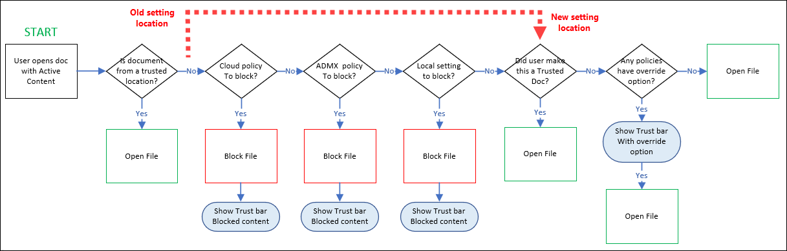

# Manage active content in Office documents for IT admins

Office documents can be automatically refreshed, updated or executed when they contain active content. Macros, ActiveX, and Office add-ins are examples of active content. When used appropriately, active content is powerful and useful, but can pose a threat when misused as Attackers can use active content to deliver malware. IT admins can set policies for security settings within their organization to limit the use of active content to specific sets of users, or to disable entirely.

Users can configure their own security and privacy settings in the Office Trust Center in their Office apps at **File** \> **Options** \> **Trust Center**.

> [!IMPORTANT]
> Starting in MONTH YEAR, policies blocking active content set by IT admins (Group policy or Cloud policy) will now be enforced on trusted documents. Previously, end users could create a trusted documents which would allow active content to run even when an IT Admin had set policy blocking the active content. Moving forward, IT Admin deployed policies will take precedence. Your users may run into issues using active content in trusted documents if the IT Admin has implemented policies to block active content.

The updated Trust Center logic is described in the following diagram:

1. A user opens an Office document that contains active content.

2. If the document is from a trusted location, the document is opened with the active content enabled. If the document is not from a trusted location, the evaluation continues.

3. This is where the updated behavior takes effect:
   - Previously, the next evaluated setting would have been if the user had identified this document as a trusted document. If they did, the document would open with the active content enabled.
   - Now, whether or not the user identified the document as a trusted document is not considered here (now at step 8).

     This is the fundamental change in behavior: cloud policies (step 4), group policies (step 6) and local settings (step 7) are checked _before_ the user designation of a trusted document is even considered. If any of those steps block access to the active content **and** none of the steps allow user overrides, then user identification of the document as a trusted document is basically irrelevant.

4. Cloud policies are checked to see if this type of active content is allowed or blocked. If the active content is not blocked, the evaluation continues to step 6.

   If the active content is blocked by policy, the experience is described in step 5.

5. The opening of the document is blocked with a notification in the trust bar. What happens next is controlled by the user override settings in the policy:
   a. **User override not allowed**: The user can't open the document and the evaluation stops.
   b. **User override allowed**: The user can click the link in the trust bar to open the document with the active content enabled.

6. Group policies are checked to see if this type of active content is allowed or blocked. If the active content is not blocked, the evaluation continues to step 7.

   If the active content is blocked by policy, the experience is described in step 5.

7. Local settings are checked to see if this type of active content is allowed or blocked. If the active content is blocked, the opening of the document is blocked with a notification in the trust bar. If the active content is not blocked, the evaluation continues.

8. If the user previously identified the document as a trusted document, the document is opened with the active content enabled. If not, the opening of the document is blocked.

## What is a trusted document?

Trusted documents are Office documents that open without any security prompts for macros, ActiveX controls and other types of active content in the document. The document will not open in Protected View or Application Guard. When users open a Trusted Document, and all active content will be enabled. Even if the document contains new active content or updates to existing active content, users won't receive any security prompts the next time they open the document.

Because of this behavior, users should clearly trust documents only if they trust the document source.

If an admin blocks active content by using a policy, or if end-users set a Trust Center setting that blocks active content, the the active content will remain blocked.

For more information, see the following articles:

- [Trusted documents](https://support.microsoft.com/topic/trusted-documents-cf872bd8-47ec-4c02-baa5-1fdba1a11b53)
- [Add, remove, or change a trusted location](https://support.microsoft.com/topic/add-remove-or-change-a-trusted-location-7ee1cdc2-483e-4cbb-bcb3-4e7c67147fb4)
- [Active content types in your files](https://support.microsoft.com/topic/active-content-types-in-your-files-b7ff2e8a-4055-47d4-8c7d-541e19f62bea)

## Configure trusted document settings in Office policies

Admins have many ways to configure Office in an organization. For example:

- **Office cloud policy service**: Set up a user-based policy that applies to a user on any device accessing files in Office apps with their Azure AD account. See the steps for [creating an Office cloud policy configuration](/DeployOffice/overview-office-cloud-policy-service) in the [Office Cloud Policy Service](https://config.office.com/officeSettings/officePolicies).
- **Office policies in Intune**: Use the Intune Settings catalog or Administrative templates to deploy HKCU policies to Windows 10 PCs: In the [MEM admin center](https://endpoint.microsoft.com/#blade/Microsoft_Intune_DeviceSettings/DevicesMenu/configurationProfiles) under **Devices** \> **Configuration Profiles**.
| - ***Administrative Templates***: See instructions to use Windows 10 templates to configure [Administrative Templates](/mem/intune/configuration/administrative-templates-windows).
| - ***Settings catalog (preview)***: See instructions to use the [Settings catalog (preview)](/mem/intune/configuration/settings-catalog).
- **Group policy**: Use your on-premise Active Directory to deploy group policy objects (GPOs) to users and computers. To create a GPO for this setting, download the latest [Administrative Template files (ADMX/ADML) and Office Customization Tool for Microsoft 365 Apps for enterprise, Office 2019, and Office 2016](https://www.microsoft.com/download/details.aspx?id=49030).

## Admin options for restricting active content

There's a big difference in the level of trust in internally created content vs. content that users download from the internet. Consider allowing active content in internal documents and globally not allowing active content in documents from the internet.

If your users don't need specific types of active content, your most secure option is to use policies to turn off user access to that active content, and allow exceptions as needed

The following policies are are available:

- **Turn off Trusted Locations**: Exceptions for groups available.
- **Turn off Trusted Documents**: Exceptions for groups available.
- **Turn off all active content**: Exceptions for individuals.

The tables in the following sections describe the settings that control active content. They also include the recommended security baselines setting, and other settings where User prompt to override is available (allow the user to enable the active content).

### HKEY_CURRENT_USER settings

****
|Category|App|Policy setting name|Security baseline setting (recommended)|User prompt and override available?|
|---|---|---|---|---|
|ActiveX|Office|ActiveX Control Initialization|**6**|**Yes** for the following values: <ul><li>**3**</li><li>**4**</li><li>**5**</li><li>**6**</li></ul>|
|ActiveX|Office|Allow Active X One Off Forms|**Load only Outlook Controls**|n/a|
|ActiveX|Office|Load Controls in Forms3|**1**|**Yes** for the following values: <ul><li>**2**</li><li>**3**</li></ul>|
|DDE|Excel|Don't allow Dynamic Data Exchange (DDE) server launch in Excel|**Enabled**|**Yes** for the value **Not configured**.|
|DDE|Excel|Don't allow Dynamic Data Exchange (DDE) server lookup in Excel|**Enabled**|**Yes** for the following values: <ul><li>**Disabled**</li><li>**Not configured**</li></ul>|
|DDE|Word|Dynamic Data Exchange|**Disabled**|n/a|
|Jscript & VBScript|Outlook||Allow scripts in one-off Outlook forms|**Disabled**n/a|
|Jscript & VBScript|Outlook|Do not allow Outlook object model scripts to run for public folders|**Enabled**|n/a|
|Jscript & VBScript|Outlook|Do not allow Outlook object model scripts to run for shared folders|**Enabled**|n/a|
|Macros|Access 
 Excel 
 PowerPoint 
 Visio 
 Word|Block macros from running in Office files from the Internet|**Enabled**|**Yes** for the following values: <ul><li>**Disabled**</li><li>**Not configured**</li></ul>|
|Macros|Access 
 Excel 
 PowerPoint 
 Project 
 Publisher 
 Visio 
 Word|VBA Macro Notification Settings|**Disable all except digitally signed macros** 
 and 
 **Require macros to be signed by a trusted publisher**|**Yes** for the following values: <ul><li>**Disabled**</li><li>**Not configured**</li></ul>|
|Macros|Excel|Scan encrypted macros in Excel Open XML workbooks|**Scan encrypted macros (default)**|n/a|
|Macros - General & Embedded|Office|Allow VBA to load typelib references by path from untrusted intranet locations|**Disabled**|n/a|
|Macros - General & Embedded|Office|Automation Security|**Use application macro security level**|n/a|
|Macros - General & Embedded|Office|Disable additional security checks on VBA library references that may refer to unsafe locations on the local machine|**Disabled**|n/a|
|Macros - General & Embedded|Office|Macro Runtime Scan Scope|**Enable for all documents**|n/a|
|Macros|Outlook|Security setting for macros|**Warn for signed, disable unsigned**|**Yes** for the following values: <ul><li>**Always warn**</li><li>**Warn for signed, disable unsigned**</li><li>**Disabled**</li><li>**Not configured**</li></ul>|
|Macros|Outlook|Outlook Security Mode|**Use Outlook Security Group Policy**|Required to enable all Outlook GPO settings. 
 Mentioned as a dependency (this policy doesn't block active content itself).|
|Macros|PowerPoint|Scan encrypted macros in PowerPoint Open XML presentations|**Scan encrypted macros (default)**|n/a|
|Macros|Publisher|Publisher Automation Security Level|**By UI (prompted)**|n/a|
|Macros|Word|Scan encrypted macros in Word Open XML documents|**Scan encrypted macros (default)**|n/a|
|ActiveX|Office|Disable All ActiveX|???|**Yes** for the following values: <ul><li>**Disabled**</li><li>**Not configured**</li></ul>|
|ActiveX|Office|Check ActiveX objects|???|n/a|
|Macros|Office|Only trust VBA macros that use V3 signatures|???|n/a|
|Add-ins & Extensibility|Excel|Do not show AutoRepublish warning alert|**Disabled**|n/a|
|Add-ins & Extensibility|Excel 
 PowerPoint 
 Project 
 Publisher 
 Visio 
 Word|Disable Trust Bar Notification for unsigned application add-ins and block them|**Enabled**|**Yes** for the value **Disabled**.|
|Add-ins & Extensibility|Excel 
 PowerPoint 
 Project 
 Publisher 
 Visio 
 Word|**Enabled**|Require that application add-ins are signed by Trusted Publisher|n/a|
|Add-ins & Extensibility|Excel|WEBSERVICE Function Notification Settings|**Disable all with notification**|**Yes** for the following values: <ul><li>**Disable all with notification**</li><li>**Disabled**</li><li>**Not configured**</li></ul>|
|Add-ins & Extensibility|Office|Disable the Office client from polling the SharePoint Server for published links|**Disabled**|n/a|
|Add-ins & Extensibility|Office|Disable UI extending from documents and templates|Disallow in Word = True 
 Disallow in Project = False 
 Disallow in Excel = True 
 Disallow in Visio= False 
 Disallow in PowerPoint = True 
 Disallow in Access = True 
 Disallow in Outlook = True 
 Disallow in Publisher = True 
 Disallow in InfoPath = True|n/a|
|Add-ins & Extensibility|Outlook|Configure Outlook object model prompt when accessing an address book|**Automatically Deny**|**Yes** for the following values: <ul><li>**Prompt user**</li><li>**Prompt user based on computer security**</li><li>**Disabled**</li><li>**Not configured**</li></ul>|
|Add-ins & Extensibility|Outlook|Configure Outlook object model prompt When accessing the Formula property of a UserProperty object|**Automatically Deny**|**Yes** for the following values: <ul><li>**Prompt user**</li><li>**Prompt user based on computer security**</li><li>**Disabled**</li><li>**Not configured**</li></ul>|
|Add-ins & Extensibility|Outlook|Configure Outlook object model prompt when executing Save As|**Automatically Deny**|**Yes** for the following values: <ul><li>**Prompt user**</li><li>**Prompt user based on computer security**</li><li>**Disabled**</li><li>**Not configured**</li></ul>|
|Add-ins & Extensibility|Outlook|Configure Outlook object model prompt when reading address information|**Automatically Deny**|**Yes** for the following values: <ul><li>**Prompt user**</li><li>**Prompt user based on computer security**</li><li>**Disabled**</li><li>**Not configured**</li></ul>|
|Add-ins & Extensibility|Outlook|Configure Outlook object model prompt when responding to meeting and task requests|**Automatically Deny**|**Yes** for the following values: <ul><li>**Prompt user**</li><li>**Prompt user based on computer security**</li><li>**Disabled**</li><li>**Not configured**</li></ul>|
|Add-ins & Extensibility|Outlook|Configure Outlook object model prompt when sending mail|**Automatically Deny**|**Yes** for the following values: <ul><li>**Prompt user**</li><li>**Prompt user based on computer security**</li><li>**Disabled**</li><li>**Not configured**</li></ul>|
|Add-ins & Extensibility|Outlook|Set Outlook object model custom actions execution prompt|**Automatically Deny**|**Yes** for the following values: <ul><li>**Prompt user**</li><li>**Prompt user based on computer security**</li><li>**Disabled**</li><li>**Not configured**</li></ul>|
|Add-ins & Extensibility|PowerPoint|Run Programs|**disable (don't run any programs)**|**Yes** for the value **Enable (prompt user before running)**|
|Add-ins & Extensibility|Word 
 Excel|Disable Smart Document's use of manifests|**Enabled**|n/a|
|

### HKEY_LOCAL_MACHINE settings

****
|Category|App|Policy setting name|Security baseline setting (recommended)|User prompt and override available?|
|---|---|---|:---:|
|ActiveX|Office|Restrict ActiveX Install|**Enabled**|n/a|
|Add-ins & Extensibility|Office|???|Add-on Management|n/a|
|Add-ins & Extensibility|Office|???|Block Flash activation in Office documents|n/a|
|Jscript & VBScript|Office|Restrict legacy JScript execution for Office|**Enabled**|n/a|
|Jscript & VBScript|Office|Scripted Window Security Restrictions|???|n/a|
|
