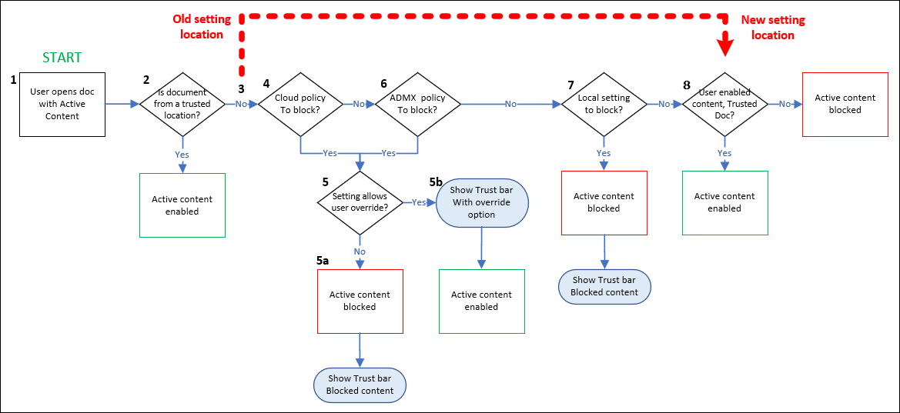

# Manage active content in Office documents for IT admins

Office documents can be automatically refreshed, updated or executed when they contain active content. Macros, ActiveX, and Office add-ins are examples of active content. When used appropriately, active content is powerful and useful, but can pose a threat when misused as Attackers can use active content to deliver malware. IT admins can set policies for security settings within their organization to limit the use of active content to specific sets of users, or to disable entirely.

Users can configure their own security and privacy settings in the Office Trust Center in their Office apps at **File** \> **Options** \> **Trust Center**.

> [!IMPORTANT]
> Starting in MONTH YEAR, policies blocking active content set by IT admins (Group policy or Cloud policy) will now be enforced on trusted documents. Previously, end users could create a trusted documents which would allow active content to run even when an IT Admin had set policy blocking the active content. Moving forward, IT Admin deployed policies will take precedence. Your users may run into issues using active content in trusted documents if the IT Admin has implemented policies to block active content.

The updated Trust Center logic is described in the following diagram:

1. A user opens an Office document that contains active content.

2. If the document is from a trusted location, the document is opened. If the document is not from a trusted location, the evaluation continues.

3. This is where the updated behavior takes effect:
   - Previously, the next evaluated setting would have been if the user had identified this document as a trusted document. If they did, the document would open.
   - Now, whether or not the user identified the document as a trusted document is not considered here (now at step 6).

     Cloud policies are checked to see if this type of active content is allowed or blocked. If the content is blocked, the opening of the document is blocked with a notification in the trust bar. If the active content is not blocked, the evaluation continues.

     This is the fundamental change in behavior: cloud policies (this step), group policies (step 4) and local settings (step 5) are checked _before_ the user designation of a trusted document is even considered. If any of those steps block access to the active content **and** none of the steps allow user overrides, then user identification of the document as a trusted document is basically irrelevant.

4. Group policies are checked to see if this type of active content is allowed or blocked. If the content is blocked, the opening of the document is blocked with a notification in the trust bar. If the active content is not blocked, the evaluation continues.

5. Local settings are checked to see if this type of active content is allowed or blocked. If the content is blocked, the opening of the document is blocked with a notification in the trust bar. If the active content is not blocked, the evaluation continues.

6. If the user has previously identified the document as a trusted document, the document is opened. If not, the evaluation continues.

7. If any of the previously evaluated policies block the active content **and** that policy is configured with an override option, the document is blocked with a notification in the trust bar **along with** the option to open the document.

## What is a trusted document?

Trusted documents are Office documents that open without any security prompts for macros, ActiveX controls and other types of active content in the document. The document will not open in Protected View or Application Guard. When users open a Trusted Document, and all active content will be enabled. Even if the document contains new active content or updates to existing active content, users won't receive any security prompts the next time they open the document.

Because of this behavior, users should clearly trust documents only if they trust the document source.

If an admin blocks active content by using a policy, or if end-users set a Trust Center setting that blocks active content, the the active content will remain blocked.

For more information, see the following articles:

- [Trusted documents](https://support.microsoft.com/topic/trusted-documents-cf872bd8-47ec-4c02-baa5-1fdba1a11b53)
- [Add, remove, or change a trusted location](https://support.microsoft.com/topic/add-remove-or-change-a-trusted-location-7ee1cdc2-483e-4cbb-bcb3-4e7c67147fb4)
- [Active content types in your files](https://support.microsoft.com/topic/active-content-types-in-your-files-b7ff2e8a-4055-47d4-8c7d-541e19f62bea)

## Configure trusted document settings in Office policies

Admins have many ways to configure Office in an organization. For example:

- **Office cloud policy service**: Set up a user based policy which applies to a user on any device accessing files in Office apps with their AAD account. In the [Office Cloud Policy Service](https://config.office.com/officeSettings/officePolicies), See steps for  [creating an Office cloud policy configuration](/DeployOffice/overview-office-cloud-policy-service)
- **Office policies in Intune**: Use the Intune Settings catalog or Administrative templates to deploy HKCU policies to Windows 10 PCs: In the [MEM admin center](https://endpoint.microsoft.com/#blade/Microsoft_Intune_DeviceSettings/DevicesMenu/configurationProfiles) under **Devices > Configuration Profiles**.
  - ***Administrative Templates***: See instructions to use Windows 10 templates to configure [Administrative Templates](mem/intune/configuration/administrative-templates-windows)
  - ***Settings catalog (preview)***: See instructions to use the [Settings catalog (preview)](mem/intune/configuration/settings-catalog)
- **Group policy**: Use your on-premise AD DS to deploy Group Policy Objects (GPO) to users and computers. To create a GPO for this setting, download the latest 
[Administrative Template files (ADMX/ADML) and Office Customization Tool for Microsoft 365 Apps for enterprise, Office 2019, and Office 2016](https://www.microsoft.com/download/details.aspx?id=49030)

## Admin options for restricting active content

There's a big difference in the level of trust in internally created content vs. content that users download from the internet. Consider allowing active content in internal documents and globally not allowing active content in documents from the internet.

If your users don't need specific types of active content, your most secure option is to use policies to turn off user access to that active content, and allow exceptions as needed

The following policies are are available:

- **Turn off Trusted Locations**: Exceptions for groups available.
- **Turn off Trusted Documents**: Exceptions for groups available.
- **Turn off all active content**: Exceptions for individuals.
