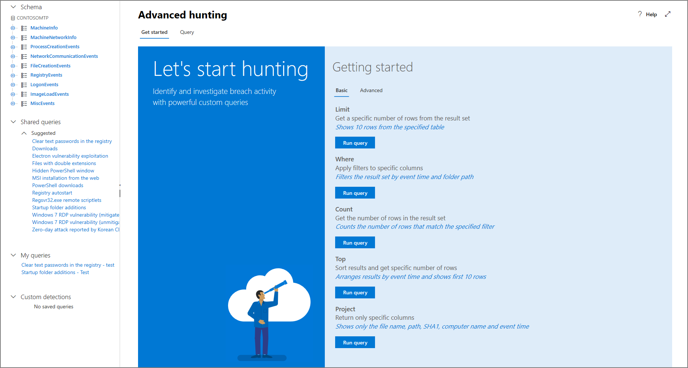

**Applies to**:
- Microsoft 365 security center

# Learn the advanced hunting query language

## Try your first query

In Microsoft 365 security center, go to XXXXX to run your first query. Use the following example:

~~~
// Finds PowerShell execution events that could involve a download.
ProcessCreationEvents  
| where EventTime > ago(7d)
| where FileName in ("powershell.exe", "POWERSHELL.EXE", "powershell_ise.exe", "POWERSHELL_ISE.EXE") 
| where ProcessCommandLine has "Net.WebClient"
        or ProcessCommandLine has "DownloadFile"
        or ProcessCommandLine has "Invoke-WebRequest"
        or ProcessCommandLine has "Invoke-Shellcode"
        or ProcessCommandLine contains "http:"
| project EventTime, ComputerName, InitiatingProcessFileName, FileName, ProcessCommandLine
| top 100 by EventTime'
~~~

This is how it will look like in advanced hunting.

The query starts with a short comment describing what it is for. This helps if you later decide to save your query and share it with others in your organization.

~~~
// Finds PowerShell execution events that could involve a download.
ProcessCreationEvents
~~~

The query itself will typically start with a table name followed by a series of elements started by a pipe **|**. In this example, we start by adding  with the table name **ProcessCreationEvents** and add piped elements as needed.

The first piped element defines a time filter to review only the records from the previous seven days. Keeping the time range as narrow as possible ensures that queries perform well, return manageable results, and don't time out.

The time range is immediately followed by a search for files representing the PowerShell application.

~~~
| where EventTime > ago(7d)
| where FileName in ("powershell.exe", "POWERSHELL.EXE", "powershell_ise.exe", "POWERSHELL_ISE.EXE")
~~~

Afterwards, we look for command lines that are known to be used with PowerShell to download files.

~~~
| where ProcessCommandLine has "Net.WebClient"
        or ProcessCommandLine has "DownloadFile"
        or ProcessCommandLine has "Invoke-WebRequest"
        or ProcessCommandLine has "Invoke-Shellcode"
        or ProcessCommandLine contains "http:"
~~~

Now that your query clearly identifies the data you want to locate, you can add elements that define what the results look like. _Project_ returns specific columns and _top_ limits the number of results, making the results well-formatted and reasonably large and easy to process. 

~~~
| project EventTime, ComputerName, InitiatingProcessFileName, FileName, ProcessCommandLine
| top 100 by EventTime'
~~~

Click **Run query** to see the results. You can expand the screen view so you can focus on your hunting query and related results.

## Learn common query operators for advanced hunting

Now that you've run your first query and have a general idea of its components, it's time to backtrack a little bit and learn some basics. The Kusto query language used by advanced hunting supports a range of operators, including the following common ones.

| Operator | Description and usage |
|--|--|
| **where** | Filter a table to the subset of rows that satisfy a predicate. |
| **summarize** | Produce a table that aggregates the content of the input table. |
| **join** | Merge the rows of two tables to form a new table by matching values of the specified column(s) from each table. |
| **count** | Return the number of records in the input record set. |
| **top** | Return the first N records sorted by the specified columns. |
| **limit** | Return up to the specified number of rows. |
| **project** | Select the columns to include, rename or drop, and insert new computed columns. |
| **extend** | Create calculated columns and append them to the result set. |
| **makeset** |  Return a dynamic (JSON) array of the set of distinct values that Expr takes in the group. |
| **find** | Find rows that match a predicate across a set of tables. |

To see a live example of these operators, run them as part of the **Get started** section.

## Understand data types and their query syntax implications

Data in advanced hunting tables are generally classified into the following data types.

| Data type | Description and query implications |
|--|--|
| **datetime** | Data and time information typically representing event timestamps |
| **string** | Character string |
| **bool** | True or false |
| **int** | 32-bit numeric value  |
| **long** | 64-bit numeric value |

## Use sample queries

As soon as you open advanced hunting you will find a few simple queries based on commonly used operators. Try running these queries and making small modifications to them.

>[!Note] Apart from the basic query samples, you can also access [shared queries](advanced-hunting-shared-queries.md) for specific threat hunting scenarios. Explore the shared queries on the left side of the page or the GitHub query repository.

## Access query language documentation

For more information on the query language and supported operators, see  [Query Language](https://docs.microsoft.com/azure/log-analytics/query-language/query-language).

>Want to experience Microsoft Defender ATP? [Sign up for a free trial.](https://www.microsoft.com/en-us/WindowsForBusiness/windows-atp?ocid=docs-wdatp-advancedhunting-belowfoldlink)

## Related topics
- [Proactively hunt for threats](advanced-hunting.md)
- [Use shared queries](advanced-hunting-shared-queries.md)
- [Understand the data tables](advanced-hunting-schema-tables.md)
- [Understand the data columns](advanced-hunting-column-reference.md)
- [Find miscellaneous events](advanced-hunting-misc-events.md)
- [Apply query best practices](advanced-hunting-best-practices.md)

