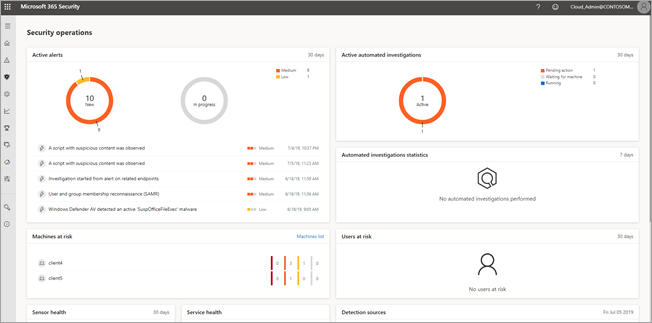
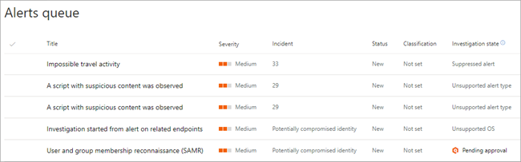
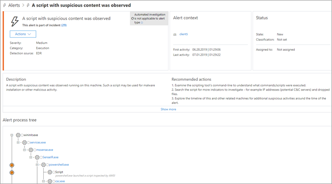
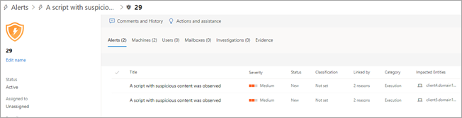

# Analyze alerts and investigations in Microsoft 365

**Applies to**:
- Microsoft 365

When an automated investigation is underway or has completed, you can view details and results of the investigation. To do that, you can use [the automated investigations dashboard](autoir-dashboard-overview.md). You can also conduct further analysis on alerts or investigations (including alerts that are not handled by automated investigation), and see your recommended next steps.

Here are some examples:
- Investigate an alert that isn't handled by automated investigation and remediation
- Examine malware that was detected in email or on a user's machine
- Get the details of a compromised user account was
- Determine whether a URL changed from safe to malicious
- ... and more.

The following sections include examples of analysis you can conduct in the Microsoft 365 security center.

> [!NOTE]
> You must be a global administrator, security administrator, security operator, or security reader to perform the tasks described in this article. To learn more, see [Microsoft 365 security center: roles and permissions](https://docs.microsoft.com/office365/securitycompliance/microsoft-security-and-compliance#required-licenses-and-permissions).

## Analyze an alert that is not handled by automated investigation

**Example**: Investigate an unsupported alert type

Suppose that you have one automated investigation underway, but 11 new alerts. Perhaps one or more of your new alerts must be investigated manually. The following steps describe one possible way to analyze the alert.

1. Starting from your security dashboard, click a chart in the **Active alerts** widget. This opens the **Alerts queue**.

    

2. In the **Alerts queue**, in the **Investigation state** column, look for alerts that have values, such as **Unsupported alert type** or **Unsupported OS**. These are alerts for which automated investigation capabilities are not available. You can investigate these manually.

    

3. Select an alert to view more details, including recommended actions. In the following example, we selected an alert pertaining to a script with suspicious content. 

    

4. Follow the steps in the **Recommended actions** section for the alert.

5. To explore the alert further, do any of the following:
   - If the alert is associated with an incident, click its link to view more details about the incident.
   - If an entity is listed in the **Alert context** pane, click its link to view more details.
   - Use the **Actions** menu to take next steps, such as managing the alert, viewing a timeline, opening the associated incident page, or printing details about the alert.

## Investigate an entity from an alert that is not handled by automated investigation

**Example**: View information about a machine associated with an alert that is not included in an automated investigation

Suppose that an alert involving a script with suspicious content is triggered, and the alert is not included in an automated investigation. The following steps describe a possible way to analyze the incident.

1. Starting with a view showing details about an alert, if there is an associated incident, click its number.

    

    This opens a detailed view about the incident.

    

2. Use the various tabs to view details about the incident. In our example, the **Machines** tab lists two client machines.

    

3. To view more information, select an item. In our example, we selected **client5** to view more information about that machine. 

    

4. On the details page, you can take certain actions, such as any of the following:

    |Use this button or tab... |To do this  |
    |---------|---------|
    |**Manage Tags**     |Add (or remove) tags for internal use. (Tags will vary by organization.)         |
    |**Initiate Automated Investigation**     |Trigger a general automated investigation       |
    |**Collect investigation package**     |Download forensic information about the machine        |
    |**Run antivirus scan**     |Scan the machine for malware        |
    |**Restrict app execution**     |Prevent apps, such as non-Microsoft apps, from running       |
    |**Isolate machine** |Disconnect the machine from your corporate network, while keeping the machine connected to Microsoft Defender|
    |**Action center** |View status of submitted actions. (If no actions are taken yet, this button might not be active.) |
    |**Alerts** |View a list of alerts associated with the machine  |
    |**Timeline** |View a timeline of activities and events that have occurred on the machine. Such activities can include security-related events, registry events, firewall events, and much more. You can filter the results to focus on specific events, and adjust the timeline view for a specific time period. |
    |**Security recommendations** |View a list of recommendations. For example, you might have a recommendation to update Office or to enable automatic updates. |
    |**Software inventory** |View a list of software installed on the machine. |
    |**Discovered vulnerabilities** |View a list of vulnerabilities. An example might include a spoofing vulnerability, or an information disclosure vulnerability. |

## Next steps

- [Manage actions related to automated investigation](autoir-actions.md)

- [Hunt for malware and other threats in Microsoft 365](hunting.md)
