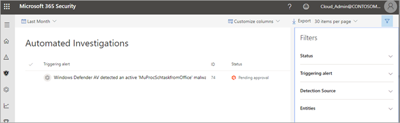
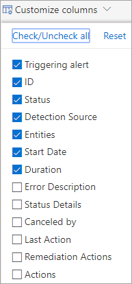

# Learn about the automated investigations dashboard

**Applies to**:
- Microsoft 365

In the Microsoft 365 security center, you can view detailed information about automated investigations by using widgets and views, such as:
- [The Active automated investigations widget](#the-active-automated-investigations-widget)
- [The Automated investigations view](#the-automated-investigations-view)
- [The Investigation details page](#the-investigation-details-page)

>[!NOTE]
>If your organization has implemented role-based access to manage portal access, only authorized users or user groups who have permission to view investigation data. To learn more, see [Microsoft 365 security center: roles and permissions](https://docs.microsoft.com/office365/securitycompliance/microsoft-security-and-compliance#required-licenses-and-permissions). 

## The Active automated investigations widget

The **Active automated investigations** widget shows you at a glance the number of active investigations along with their status. For example, the following image indicates that one active investigation is in progress.

Clicking the chart opens the **Automated investigations** view.

## The Automated investigations view

The **Automated investigations** view provides details about current and previous investigations. 

In addition to viewing information about triggering alerts, status, detection source, entities, and duration, you can do any of the following in this view:
- Use filters to focus on specific information
- Export results to a file in .csv format
- Choose which columns to include in the report
- Select a value to see more detailed information
- Navigate to additional charts or views
- ...and more.

## The Investigation details page

## Filters

To open and use filters, in the upper right corner of a view, such as Automated investigations, select the **Filters** icon ().

The following table describes filtering options you might see in your investigation dashboard and reports.

|Filter type  |Option  |Description  |
|---------|---------|---------|
|**Status**     |Any         |Shows all automated investigations, regardless of status.         |
|     |No threats found         |Shows investigations in which no malicious entities were found.         |
| |Pending approval |Shows investigations that have one or more actions that require approval, typically from a member of the security operations team. |
| |Running |Shows investigations that are currently running. |
| |Waiting for machine|Shows investigations that are currently paused because one or more machines included in the investigations are not available. (For example, a machine might be turned off.) |
| | Failed   | A problem has interrupted the investigation, preventing it from completing. |
|**Triggering alert** |(varies) |The alert or action that triggered the investigation is listed here. If multiple actions triggered investigations, you can select one or more to view details about those investigations. |
|**Detection source**|(varies) |Detection sources can include antivirus protection, anti-malware, security & compliance policy violations, and so on. If multiple detection sources are listed, you can select one or more to view details about those investigations.|
|**Entities** |Threat     |The category of threat detected during the Automated investigation.         |
| |Tags     |Manually added tags that capture the context of an automated investigation.         |
| |Machines |Filtering on a specific machine enables you to see other investigations related to the machine.|
| |Machine groups | Specific machine groups that you might have created.|
| |Comments | View investigations that do (or do not) have comments.|

## Choosing which columns to include

Create a report that includes the information you want to see. Use the **Customize columns** list to select (or clear) columns that you'd like to show (or hide). The report updates to display information in the columns you selected. 

## Exporting results

Use the **Export** button to export results to a file in .csv format. When you select **Export**, you'll be prompted to specify how many results you want to include.

## Navigating to additional reports or views

Reports and views about automated investigations are visual and interactive. Click an item to view more detailed information about that item, or to jump to another, more detailed view. Here are a few examples:
- In the **Active automated investigations** widget, click the chart to go to the **Automated investigations** view
- In the **Automated investigations** view, click an item in the **Triggering alert** column to go to the **Investigation details** page
- On the **Investigation details** page, click an item in the graph to go to a tab with more details about that item

## Next steps

[Analyze automated investigations](analyze-autoir.md)

[Manage actions related to automated investigation](autoir-actions.md)

