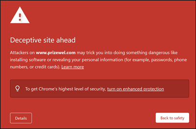
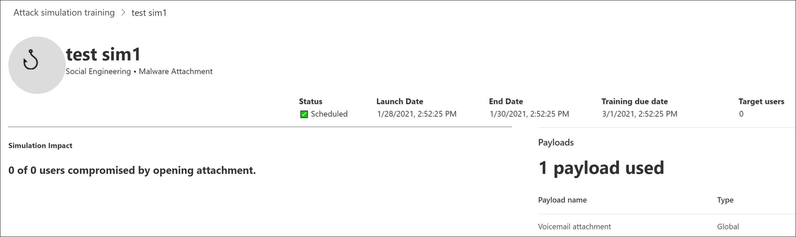
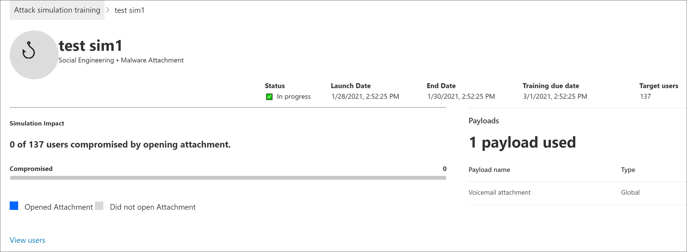
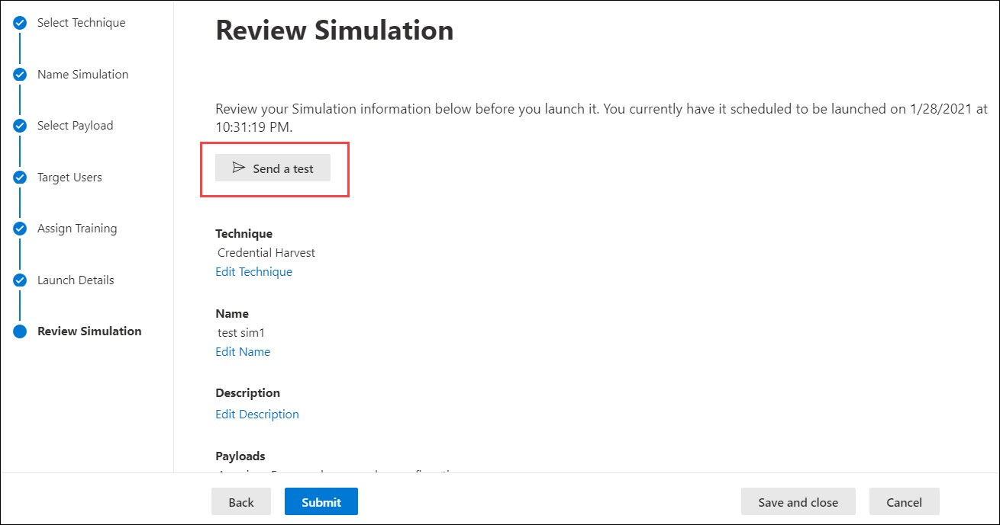

# Attack simulation training deployment considerations and FAQ

Attack simulation training is now [generally available](https://techcommunity.microsoft.com/t5/microsoft-security-and/attack-simulation-training-in-microsoft-defender-for-office-365/ba-p/2037291). Attack simulation training enables Microsoft 365 E5 or Microsoft Defender for Office 365 Plan 2 organizations to measure and manage social engineering risk by allowing the creation and management of phishing simulations that are powered by real-world, de-weaponized phishing payloads. Hyper-targeted training, delivered in partnership with Terranova security, helps improve knowledge and change employee behavior.

For more information about getting started with Attack simulation training, see [Get started using Attack simulation training](attack-simulation-training-get-started.md).

While the whole simulation creation and scheduling experience has been designed to be free-flowing and frictionless, running simulations at an enterprise scale often requires planning. This article helps address specific challenges that we see as our customers run simulations in their own environments.

## Issues with end user experiences

### Phishing simulation URLs blocked by Google Safe Browsing

A URL reputation service might identify one or more of the URLs that are used by Attack simulation training as unsafe. Google Safe Browsing in Google Chrome blocks some of the simulated phishing URLs with a **Deceptive site ahead** message. While we work with many URL reputation vendors to always allow our simulation URLs, we don't always have full coverage.

Note that this issue does not affect Microsoft Edge.

As part of the planning phase, be sure to check the availability of the URL in your supported web browsers before you use the URL in a phishing campaign. If the URLs are blocked by Google Safe Browsing, [follow this guidance](https://support.google.com/chrome/a/answer/7532419) from Google to allow access to the URLs.

Refer to [Get started using Attack simulation training](attack-simulation-training-get-started.md) for the list of URLs that are currently used by Attack simulation training.

### Phishing simulation and admin URLs blocked by network proxy solutions and filter drivers

Both phishing simulation URLs and admin URLs might be blocked or dropped by your intermediate security devices or filters. For example:

- Firewalls
- Web Application Firewall (WAF) solutions
- Third-party filter drivers (for example, kernel mode filters)

While we have seen few customers being blocked at this layer, it does happen. If you encounter problems, consider configuring the following URLs to bypass scanning by your security devices or filters as required:

- The simulated phishing URLs as described in [Get started using Attack simulation training](attack-simulation-training-get-started.md).
- <https://security.microsoft.com/attacksimulator>
- <https://security.microsoft.com/attacksimulationreport>
- <https://security.microsoft.com/trainingassignments>

### Simulation messages not delivered to all targeted users

It's possible that the number of users who actually receive the simulation email messages is less than the number of users who were targeted by the simulation. The following types of users will be excluded as part of target validation:

- Invalid recipient email addresses.
- Guest users.
- Users that are no longer active in Azure Active Directory (Azure AD).

Only valid, non-guest users with a valid mailbox will be included in simulations. If you use distribution groups or mail-enabled security groups to target users, you can use the [Get-DistributionGroupMember](https://docs.microsoft.com/powershell/module/exchange/get-distributiongroupmember) cmdlet in [Exchange Online PowerShell](https://docs.microsoft.com/powershell/exchange/connect-to-exchange-online-powershell) to view and validate distribution group members.

## Issues with Attack simulation training reporting

### Attack simulation training reports do not contain any activity details

Attack simulation training comes with rich, actionable insights that keep you informed of the threat readiness progress of your employees. If Attack simulation training reports are not populated with data, verify that audit log search is turned on in your organization (it's on by default).

Audit log search is required by Attack simulation training so events can be captured, recorded, and read back. Turning off audit log search has the following consequences for Attack simulation training:

- Reporting data is not available across all reports. The reports will appear empty.
- Training assignments are blocked, because data is not available.

To turn on audit log search, see [Turn audit log search on or off](../../compliance/turn-audit-log-search-on-or-off.md).

> [!NOTE]
> Empty activity details can also be caused by no E5 licenses being assigned to users. Verify at least one E5 license is assigned to an active user to ensure that reporting events are captured and recorded.

### Simulation reports are not updated immediately

Detailed simulation reports are not updated immediately after you launch a campaign. Don't worry; this behavior is expected.

Every simulation campaign has a lifecycle. When first created, the simulation is in the **Scheduled** state. When the simulation starts, it transitions to the **In progress** state. When completed, the simulation transitions to the **Completed** state.

While a simulation is in the **Scheduled** state, the simulation reports will be mostly empty. During this stage, the simulation engine is resolving the target user email addresses, expanding distribution groups, removing guest users from the list, etc.:

Once the simulation enters the **In progress** stage, you will notice information starting to trickle into the reporting:

It can take up to 30 minutes for the individual simulation reports to update after the transition to the **In progress** state. The report data continues to build until the simulation reaches the **Completed** state. Reporting updates occur at the following intervals:

- Every 10 minutes for the first 60 minutes.
- Every 15 minutes after 60 minutes until 2 days.
- Every 30 minutes after 2 days until 7 days.
- Every 60 minutes after 7 days.

Widgets on the **Overview** page provide a quick snapshot of your organization's simulation-based security posture over time. Because these widgets reflect your overall security posture and journey over time, they're updated after each simulation campaign is completed.

> [!NOTE]
> You can use the **Export** option on the various reporting pages to extract data.

### Messages reported as phishing by users aren't appearing in simulation reports

Simulation reports in Attack simulator training provide details on user activity. For example:

- Users who clicked on the link in the message.
- Users who gave up their credentials.
- Users who reported the message as phishing.

If messages that users reported as phishing aren't captured in Attack simulation training simulation reports, there might be an Exchange mail flow rule (also known as a transport rule) that's blocking the delivery of the reported messages to Microsoft. Verify that any mail flow rules aren't blocking delivery to the following email addresses:

- junk@office365.microsoft.com
- abuse@messaging.microsoft.com
- phish@office365.microsoft.com
- not\_junk@office365.microsoft.com

## Other frequently asked questions

### Q: What is the recommended method to target users for simulation campaigns?

A: Several options are available to target users:

- Include all users (currently available to organizations with less than 40,000 users).
- Choose specific users.
- Select users from a CSV file.
- Azure AD group-based targeting.

We've found that campaigns where the targeted users are identified by Azure AD groups are generally easier to manage.

### Q: Are there any limits in targeting users while importing from a CSV or adding users?

A: The limit for importing recipients from a CSV file or adding individual recipients to a simulation is 40,000.

A recipient can be an individual user or a group. A group might contain hundreds or thousands of recipients, so an actual limit isn't placed on the number of individual users.

Managing a large CSV file or adding many individual recipients can be cumbersome. Using Azure AD groups will simplify the overall management of the simulation.

### Q: Does Microsoft provide payloads in other languages?

A: Currently, there are 5 localized payloads available. We've noticed than any direct or machine translations of existing payloads to other languages will lead to inaccuracies and decreased relevance.

That being said, you can create your own payload in the language of your choice using the custom payload authoring experience. We also strongly recommend that you harvest existing payloads that were used to target users in a specific geography. In other words, let the attackers localize the content for you.

### Q: How can I switch to other languages for my admin portal and training experience?

A: In Microsoft 365 or Office 365, language configuration is specific and centralized for each user account. For instructions on how to change your language setting, see [Change your display language and time zone in Microsoft 365 for Business](https://support.microsoft.com/office/6f238bff-5252-441e-b32b-655d5d85d15b).

Note that the configuration change might take up to 30 minutes to synchronize across all services.

### Q: Can I trigger a test simulation to understand what it looks like prior to launching a full-fledged campaign?

A: Yes you can! On the very last **Review Simulation** page in the wizard to create a new simulation, there's an option to **Send a test**. This option will send a sample phishing simulation message to the currently logged in user. After you validate the phishing message in your Inbox, you can submit the simulation.

### Q: Can I target users that belong to a different tenant as part of the same simulation campaign?

A: No. Currently, cross-tenant simulations are not supported. Verify that all of your targeted users are in the same tenant. Any cross-tenant users or guest users will be excluded from the simulation campaign.

### Q: How does region aware delivery work?

A: Region aware delivery uses the TimeZone attribute of the targeted user's mailbox and 'not before' logic to determine when to deliver the message. For example, consider the following scenario:

- At 7:00 AM in the Pacific time zone (UTC-8), an admin creates and schedules a campaign to start at 9:00 AM on the same day.
- UserA is in the Eastern time zone (UTC-5).
- UserB is also in the Pacific time zone.

At 9:00 AM on the same day, the simulation message is sent to UserB. With region-aware delivery, the message is not sent to UserA on the same day, because 9:00 AM Pacific time is 12:00 PM Eastern time. Instead, the message is sent to UserA at 9:00 AM Eastern time on the following day.

So, on the initial run of a campaign with region aware delivery enabled, it might appear that the simulation message was sent only to users in a specific time zone. But, as time passes and more users come into scope, the targeted users will increase.
