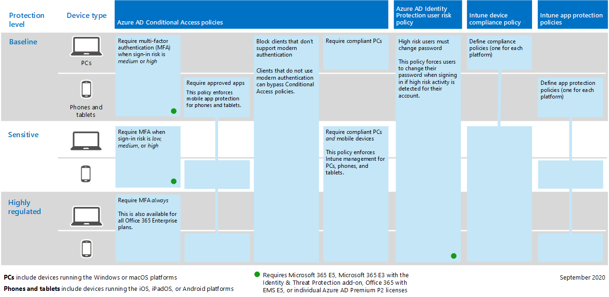
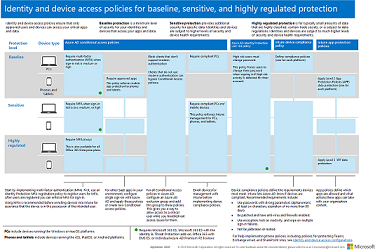
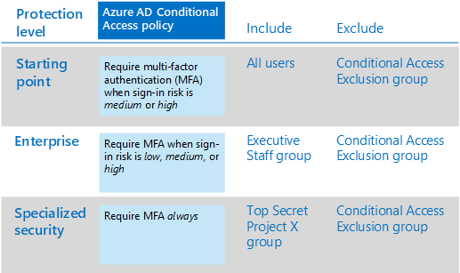
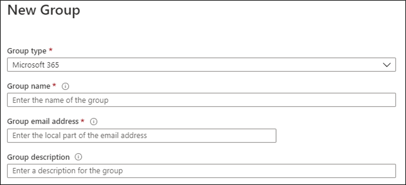
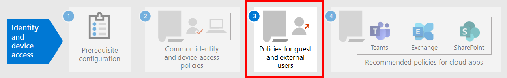

# Common identity and device access policies

**Applies to**
- [Exchange Online Protection](exchange-online-protection-overview.md)
- [Microsoft Defender for Office 365 plan 1 and plan 2](defender-for-office-365.md)
- Azure

This article describes the common recommended policies for securing access to Microsoft 365 cloud services, including on-premises applications published with Azure Active Directory (Azure AD) Application Proxy.

This guidance discusses how to deploy the recommended policies in a newly-provisioned environment. Setting up these policies in a separate lab environment allows you to understand and evaluate the recommended policies before staging the rollout to your preproduction and production environments. Your newly provisioned environment can be cloud-only or hybrid to reflect your evaluation needs.

## Policy set

The following diagram illustrates the recommended set of policies. It shows which tier of protections each policy applies to and whether the policies apply to PCs or phones and tablets, or both categories of devices. It also indicates where you configure these policies.

[See a larger version of this image](https://github.com/MicrosoftDocs/microsoft-365-docs/raw/public/microsoft-365/media/microsoft-365-policies-configurations/Identity_device_access_policies_byplan.png)

Here's a one-page PDF summary with links to the individual policies:

   [View as a PDF](../../downloads/MSFT-cloud-architecture-identity-device-protection-handout.pdf) \| [Download as a PDF](https://github.com/MicrosoftDocs/microsoft-365-docs/raw/public/microsoft-365/downloads/MSFT-cloud-architecture-identity-device-protection-handout.pdf)

The rest of this article describes how to configure these policies.

> [!NOTE]
> Requiring the use of multi-factor authentication (MFA) is recommended before enrolling devices in Intune to assure that the device is in the possession of the intended user. You must enroll devices in Intune before you can enforce device compliance policies.

To give you time to accomplish these tasks, we recommend implementing the baseline policies in the order listed in this table. However, the MFA policies for sensitive and highly regulated levels of protection can be implemented at any time.

|Protection level|Policies|More information|
|---|---|---|
|**Baseline**|[Require MFA when sign-in risk is *medium* or *high*](#require-mfa-based-on-sign-in-risk)||
||[Block clients that don't support modern authentication](#block-clients-that-dont-support-multi-factor)|Clients that do not use modern authentication can bypass Conditional Access policies, so it's important to block these.|
||[High risk users must change password](#high-risk-users-must-change-password)|Forces users to change their password when signing in if high-risk activity is detected for their account.|
||[Apply app data protection policies](#apply-app-data-protection-policies)|One Intune App Protection policy per platform (Windows, iOS/iPadOS, Android).|
||[Require approved apps and app protection](#require-approved-apps-and-app-protection)|Enforces mobile app protection for phones and tablets using iOS, iPadOS, or Android.|
||[Define device compliance policies](#define-device-compliance-policies)|One policy for each platform.|
||[Require compliant PCs](#require-compliant-pcs-but-not-compliant-phones-and-tablets)|Enforces Intune management of PCs using Windows or MacOS.|
|**Sensitive**|[Require MFA when sign-in risk is *low*, *medium*, or *high*](#require-mfa-based-on-sign-in-risk)||
||[Require compliant PCs *and* mobile devices](#require-compliant-pcs-and-mobile-devices)|Enforces Intune management for both PCs (Windows or MacOS) and phones or tablets (iOS, iPadOS, or Android).|
|**Highly regulated**|[*Always* require MFA](#require-mfa-based-on-sign-in-risk)|
|

## Assigning policies to groups and users

Before configuring policies, identify the Azure AD groups you are using for each tier of protection. Typically, baseline protection applies to everybody in the organization. A user who is included for both baseline and sensitive protection will have all the baseline policies applied plus the sensitive policies. Protection is cumulative and the most restrictive policy is enforced.

A recommended practice is to create an Azure AD group for Conditional Access exclusion. Add this group to all of your Conditional Access policies in the **Exclude** value of the **Users and groups** setting in the **Assignments** section. This gives you a method to provide access to a user while you troubleshoot access issues. This is recommended as a temporary solution only. Monitor this group for changes and be sure the exclusion group is being used only as intended.

Here's an example of group assignment and exclusions for requiring MFA.

Here are the results:

- All users are required to use MFA when the sign-in risk is medium or high.

- Members of the Executive Staff group are required to use MFA when the sign-in risk is low, medium, or high.

  In this case, members of the Executive Staff group match both the baseline and sensitive Conditional Access policies. The access controls for both policies are combined, which in this case is equivalent to the sensitive Conditional Access policy.

- Members of the Top Secret Project X group are always required to use MFA

  In this case, members of the Top Secret Project X group match both the baseline and highly-regulated Conditional Access policies. The access controls for both policies are combined. Because the access control for the highly-regulated Conditional Access policy is more restrictive, it is used.

Be careful when applying higher levels of protection to groups and users. For example, members of the Top Secret Project X group will be required to use MFA every time they sign in, even if they are not working on the highly-regulated content for Project X.

All Azure AD groups created as part of these recommendations must be created as Microsoft 365 groups. This is important for the deployment of sensitivity labels when securing documents in Microsoft Teams and SharePoint.

## Require MFA based on sign-in risk

You should have your users register for MFA prior to requiring its use. If you have Microsoft 365 E5, Microsoft 365 E3 with the Identity & Threat Protection add-on, Office 365 with EMS E5, or individual Azure AD Premium P2 licenses, you can use the MFA registration policy with Azure AD Identity Protection to require that users register for MFA. The [prerequisite work](identity-access-prerequisites.md) includes registering all users with MFA.

After your users are registered, you can require MFA for sign-in with a new Conditional Access policy.

1. Go to the [Azure portal](https://portal.azure.com), and sign in with your credentials.
2. In the list of Azure services, choose **Azure Active Directory**.
3. In the **Manage** list, choose **Security**, and then choose **Conditional Access**.
4. Choose **New policy** and type the new policy's name.

The following tables describes the Conditional Access policy settings to require MFA based on sign-in risk.

In the **Assignments** section:

|Setting|Properties|Values|Notes|
|---|---|---|---|
|Users and groups|Include|**Select users and groups > Users and groups**:  Select specific groups containing targeted user accounts.|Start with the group that includes pilot user accounts.|
||Exclude|**Users and groups**: Select your Conditional Access exception group; service accounts (app identities).|Membership should be modified on an as-needed, temporary basis.|
|Cloud apps or actions|**Cloud apps > Include**|**Select apps**: Select the apps you want this policy to apply to. For example, select Exchange Online.||
|Conditions|||Configure conditions that are specific to your environment and needs.|
||Sign-in risk||See the guidance in the following table.|
|

### Sign-in risk condition settings

Apply the risk level settings based on the protection level you are targeting.

|Level of protection|Risk level values needed|Action|
|---|---|---|
|Baseline|High, medium|Check both.|
|Sensitive|High, medium, low|Check all three.|
|Highly regulated||Leave all options unchecked to always enforce MFA.|
|

In the **Access controls** section:

|Setting|Properties|Values|Action|
|---|---|---|---|
|Grant|**Grant access**||Select|
|||**Require Multi-factor authentication**|Check|
||**Require all the selected controls**||Select|
|

Choose **Select** to save the **Grant** settings.

Finally, select **On** for **Enable policy**, and then choose **Create**.

Also consider using the [What if](https://docs.microsoft.com/azure/active-directory/active-directory-conditional-access-whatif) tool to test the policy.

## Block clients that don't support multi-factor

Use the settings in these tables for a Conditional Access policy to block clients that don't support multi-factor authentication.

See [this article](../../enterprise/microsoft-365-client-support-multi-factor-authentication.md) for a list of clients in Microsoft 365 that do support multi-factor authentication.

In the **Assignments** section:

|Setting|Properties|Values|Notes|
|---|---|---|---|
|Users and groups|Include|**Select users and groups > Users and groups**:  Select specific groups containing targeted user accounts.|Start with the group that includes pilot user accounts.|
||Exclude|**Users and groups**: Select your Conditional Access exception group; service accounts (app identities).|Membership should be modified on an as-needed, temporary basis.|
|Cloud apps or actions|**Cloud apps > Include**|**Select apps**: Select the apps corresponding to the clients that do not support modern authentication.||
|Conditions|**Client apps**|Choose **Yes** for **Configure** 
 Clear the check marks for **Browser** and **Mobile apps and desktop clients**||
|

In the **Access controls** section:

|Setting|Properties|Values|Action|
|---|---|---|---|
|Grant|**Block access**||Select|
||**Require all the selected controls**||Select|
|

Choose **Select** to save the **Grant** settings.

Finally, select **On** for **Enable policy**, and then choose **Create**.

Consider using the [What if](https://docs.microsoft.com/azure/active-directory/active-directory-conditional-access-whatif) tool to test the policy.

For Exchange Online, you can use authentication policies to [disable Basic authentication](https://docs.microsoft.com/exchange/clients-and-mobile-in-exchange-online/disable-basic-authentication-in-exchange-online), which forces all client access requests to use modern authentication.

## High risk users must change password

To ensure that all high-risk users' compromised accounts are forced to perform a password change when signing-in, you must apply the following policy.

Log in to the [Microsoft Azure portal (https://portal.azure.com)](https://portal.azure.com/) with your administrator credentials, and then navigate to **Azure AD Identity Protection > User Risk Policy**.

In the **Assignments** section:

|Type|Properties|Values|Action|
|---|---|---|---|
|Users|Include|**All users**|Select|
|User risk|**High**||Select|
|

In the second **Assignments** section:

|Type|Properties|Values|Action|
|---|---|---|---|
|Access|**Allow access**||Select|
|||**Require password change**|Check|
|

Choose **Done** to save the **Access** settings.

Finally, select **On** for **Enforce policy**, and then choose **Save**.

Consider using the [What if](https://docs.microsoft.com/azure/active-directory/active-directory-conditional-access-whatif) tool to test the policy.

Use this policy in conjunction with [Configure Azure AD password protection](https://docs.microsoft.com/azure/active-directory/authentication/concept-password-ban-bad), which detects and blocks known weak passwords and their variants and additional weak terms that are specific to your organization. Using Azure AD password protection ensures that changed passwords are strong ones.

## Apply APP data protection policies

App Protection Policies (APP) define which apps are allowed and the actions they can take with your organization's data. The choices available in APP enable organizations to tailor the protection to their specific needs. For some, it may not be obvious which policy settings are required to implement a complete scenario. To help organizations prioritize mobile client endpoint hardening, Microsoft has introduced taxonomy for its APP data protection framework for iOS and Android mobile app management.

The APP data protection framework is organized into three distinct configuration levels, with each level building off the previous level:

- **Enterprise basic data protection** (Level 1) ensures that apps are protected with a PIN and encrypted and performs selective wipe operations. For Android devices, this level validates Android device attestation. This is an entry level configuration that provides similar data protection control in Exchange Online mailbox policies and introduces IT and the user population to APP.
- **Enterprise enhanced data protection** (Level 2) introduces APP data leakage prevention mechanisms and minimum OS requirements. This is the configuration that is applicable to most mobile users accessing work or school data.
- **Enterprise high data protection** (Level 3) introduces advanced data protection mechanisms, enhanced PIN configuration, and APP Mobile Threat Defense. This configuration is desirable for users that are accessing high risk data.

To see the specific recommendations for each configuration level and the minimum apps that must be protected, review [Data protection framework using app protection policies](https://docs.microsoft.com/mem/intune/apps/app-protection-framework).

Using the principles outlined in [Identity and device access configurations](microsoft-365-policies-configurations.md), the Baseline and Sensitive protection tiers map closely with the Level 2 enterprise enhanced data protection settings. The Highly regulated protection tier maps closely to the Level 3 enterprise high data protection settings.

|Protection level|App Protection Policy|More information|
|---|---|---|
|Baseline|[Level 2 enhanced data protection](https://docs.microsoft.com/mem/intune/apps/app-protection-framework#level-2-enterprise-enhanced-data-protection)|The policy settings enforced in level 2 include all the policy settings recommended for level 1 and only adds to or updates the below policy settings to implement more controls and a more sophisticated configuration than level 1.|
|Sensitive|[Level 2 enhanced data protection](https://docs.microsoft.com/mem/intune/apps/app-protection-framework#level-2-enterprise-enhanced-data-protection)|The policy settings enforced in level 2 include all the policy settings recommended for level 1 and only adds to or updates the below policy settings to implement more controls and a more sophisticated configuration than level 1.|
|Highly Regulated|[Level 3 enterprise high data protection](https://docs.microsoft.com/mem/intune/apps/app-protection-framework#level-3-enterprise-high-data-protection)|The policy settings enforced in level 3 include all the policy settings recommended for level 1 and 2 and only adds to or updates the below policy settings to implement more controls and a more sophisticated configuration than level 2.|
|

To create a new app protection policy for each platform (iOS and Android) within Microsoft Endpoint Manager using the data protection framework settings, you can:

1. Manually create the policies by following the steps in [How to create and deploy app protection policies with Microsoft Intune](https://docs.microsoft.com/mem/intune/apps/app-protection-policies).
2. Import the sample [Intune App Protection Policy Configuration Framework JSON templates](https://github.com/microsoft/Intune-Config-Frameworks/tree/master/AppProtectionPolicies) with [Intune's PowerShell scripts](https://github.com/microsoftgraph/powershell-intune-samples).

## Require approved apps and APP protection

To enforce the APP protection policies you applied in Intune, you must create a Conditional Access policy to require approved client apps and the conditions set in the APP protection policies.

Enforcing APP protection policies requires a set of policies described in in [Require app protection policy for cloud app access with Conditional Access](https://docs.microsoft.com/azure/active-directory/conditional-access/app-protection-based-conditional-access). These policies are each included in this recommended set of identity and access configuration policies.

To create the Conditional Access policy that requires approved apps and APP protection, follow "Step 1: Configure an Azure AD Conditional Access policy for Microsoft 365" in [Scenario 1: Microsoft 365 apps require approved apps with app protection policies](https://docs.microsoft.com/azure/active-directory/conditional-access/app-protection-based-conditional-access#scenario-1-office-365-apps-require-approved-apps-with-app-protection-policies), which allows Outlook for iOS and Android, but blocks OAuth capable Exchange ActiveSync clients from connecting to Exchange Online.

   > [!NOTE]
   > This policy ensures mobile users can access all Office endpoints using the applicable apps.

If you are enabling mobile access to Exchange Online, implement [Block ActiveSync clients](secure-email-recommended-policies.md#block-activesync-clients), which prevents Exchange ActiveSync clients leveraging basic authentication from connecting to Exchange Online. This policy is not pictured in the illustration at the top of this article. It is described and pictured in [Policy recommendations for securing email](secure-email-recommended-policies.md).

To create the Conditional Access policy that requires Edge for iOS and Android, follow "Step 2: Configure an Azure AD Conditional Access policy for Microsoft 365" in [Scenario 2: Browser apps require approved apps with app protection policies](https://docs.microsoft.com/azure/active-directory/conditional-access/app-protection-based-conditional-access#scenario-2-browser-apps-require-approved-apps-with-app-protection-policies), which allows Edge for iOS and Android, but blocks other mobile device web browsers from connecting to Microsoft 365 endpoints.

 These policies leverage the grant controls [Require approved client app](https://docs.microsoft.com/azure/active-directory/conditional-access/concept-conditional-access-grant#require-approved-client-app) and [Require app protection policy](https://docs.microsoft.com/azure/active-directory/conditional-access/concept-conditional-access-grant#require-app-protection-policy).

Finally, blocking legacy authentication for other client apps on iOS and Android devices ensures that these clients cannot bypass Conditional Access policies. If you're following the guidance in this article, you've already configured [Block clients that don't support modern authentication](#block-clients-that-dont-support-multi-factor).

<!---
With Conditional Access, organizations can restrict access to approved (modern authentication capable) iOS and Android client apps with Intune app protection policies applied to them. Several Conditional Access policies are required, with each policy targeting all potential users. Details on creating these policies can be found in [Require app protection policy for cloud app access with Conditional Access](https://docs.microsoft.com/azure/active-directory/conditional-access/app-protection-based-conditional-access).

1. Follow "Step 1: Configure an Azure AD Conditional Access policy for Microsoft 365" in [Scenario 1: Microsoft 365 apps require approved apps with app protection policies](https://docs.microsoft.com/azure/active-directory/conditional-access/app-protection-based-conditional-access#scenario-1-office-365-apps-require-approved-apps-with-app-protection-policies), which allows Outlook for iOS and Android, but blocks OAuth capable Exchange ActiveSync clients from connecting to Exchange Online.

   > [!NOTE]
   > This policy ensures mobile users can access all Office endpoints using the applicable apps.

2. If enabling mobile access to Exchange Online, implement [Block ActiveSync clients](secure-email-recommended-policies.md#block-activesync-clients), which prevents Exchange ActiveSync clients leveraging basic authentication from connecting to Exchange Online.

   The above policies leverage the grant controls [Require approved client app](https://docs.microsoft.com/azure/active-directory/conditional-access/concept-conditional-access-grant#require-approved-client-app) and [Require app protection policy](https://docs.microsoft.com/azure/active-directory/conditional-access/concept-conditional-access-grant#require-app-protection-policy).

3. Disable legacy authentication for other client apps on iOS and Android devices. For more information, see [Block clients that don't support modern authentication](#block-clients-that-dont-support-modern-authentication).
-->

## Define device-compliance policies

Device-compliance policies define the requirements that devices must meet to be determined as compliant. You create Intune device compliance policies from within the Microsoft Endpoint Manager admin center.

You must create a policy for each PC, phone, or tablet platform:

- Android device administrator
- Android Enterprise
- iOS/iPadOS
- macOS
- Windows 8.1 and later
- Windows 10 and later

To create device compliance policies, log in to the [Microsoft Endpoint Manager Admin Center](https://endpoint.microsoft.com) with your administrator credentials, and then navigate to **Devices** \> **Compliance policies** \> **Policies**. Select **Create Policy**.

For device compliance policies to be deployed, they must be assigned to user groups. You assign a policy after you create and save it. In the admin center, select the policy and then select **Assignments**. After selecting the groups that you want to receive the policy, select **Save** to save that group assignment and deploy the policy.

For step-by-step guidance on creating compliance policies in Intune, see [Create a compliance policy in Microsoft Intune](https://docs.microsoft.com/mem/intune/protect/create-compliance-policy) in the Intune documentation.

### Recommended settings for Windows 10 and later

The following settings are recommended for PCs running Windows 10 and later, as configured in **Step 2: Compliance settings**, of the policy creation process.

For **Device health > Windows Health Attestation Service evaluation rules**, see this table.

|Properties|Value|Action|
|---|---|---|
|Require BitLocker|Require|Select|
|Require Secure Boot to be enabled on the device|Require|Select|
|Require code integrity|Require|Select|
|

For **Device properties**, specify appropriate values for operating system versions based on your IT and security policies.

For **Configuration Manager Compliance**, select **Require**.

For **System security**, see this table.

|Type|Properties|Value|Action|
|---|---|---|---|
|Password|Require a password to unlock mobile devices|Require|Select|
||Simple passwords|Block|Select|
||Password type|Device default|Select|
||Minimum password length|6|Type|
||Maximum minutes of inactivity before password is required|15|Type 
 This setting is supported for Android versions 4.0 and above or KNOX 4.0 and above. For iOS devices, it's supported for iOS 8.0 and above.|
||Password expiration (days)|41|Type|
||Number of previous passwords to prevent reuse|5|Type|
||Require password when device returns from idle state (Mobile and Holographic)|Require|Available for Windows 10 and later|
|Encryption|Encryption of data storage on device|Require|Select|
|Device Security|Firewall|Require|Select|
||Antivirus|Require|Select|
||Antispyware|Require|Select 
 This setting requires an Anti-Spyware solution registered with Windows Security Center.|
|Defender|Microsoft Defender Antimalware|Require|Select|
||Microsoft Defender Antimalware minimum version||Type 
 Only supported for Windows 10 desktop. Microsoft recommends versions no more than five behind from the most recent version.|
||Microsoft Defender Antimalware signature up to date|Require|Select|
||Real-time protection|Require|Select 
 Only supported for Windows 10 desktop|
|

#### Microsoft Defender for Endpoint

|Type|Properties|Value|Action|
|---|---|---|---|
|Microsoft Defender for Endpoint rules|Require the device to be at or under the machine-risk score|Medium|Select|
|

## Require compliant PCs (but not compliant phones and tablets)

Before adding a policy to require compliant PCs, be sure to enroll devices for management into Intune. Using multi-factor authentication is recommended before enrolling devices into Intune for assurance that the device is in the possession of the intended user.

To require compliant PCs:

1. Go to the [Azure portal](https://portal.azure.com), and sign in with your credentials.
2. In the list of Azure services, choose **Azure Active Directory**.
3. In the **Manage** list, choose **Security**, and then choose **Conditional Access**.
4. Choose **New policy** and type the new policy's name.

5. Under **Assignments**, choose **Users and groups** and include who you want the policy to apply to. Also exclude your Conditional Access exclusion group.

6. Under **Assignments**, choose **Cloud apps or actions**.

7. For **Include**, choose **Select apps > Select**, and then select the desired apps from the **Cloud apps** list. For example, select Exchange Online. Choose **Select** when done.

8. To require compliant PCs (but not compliant phones and tablets), under **Assignments**, choose **Conditions > Device platforms**. Select **Yes** for **Configure**. Choose  **Select device platforms**, select **Windows** and **macOS**, and then choose **Done**.

9. Under **Access controls**, choose **Grant** .

10. Choose **Grant access** and then check **Require device to be marked as compliant**. For multiple controls, select **Require all the selected controls**. When complete, choose **Select**.

11. Select **On** for **Enable policy**, and then choose **Create**.

> [!NOTE]
> Make sure that your device is compliant before enabling this policy. Otherwise, you could get locked out and will be unable to change this policy until your user account has been added to the Conditional Access exclusion group.

## Require compliant PCs *and* mobile devices

To require compliance for all devices:

1. Go to the [Azure portal](https://portal.azure.com), and sign in with your credentials.
2. In the list of Azure services, choose **Azure Active Directory**.
3. In the **Manage** list, choose **Security**, and then choose **Conditional Access**.
4. Choose **New policy** and type the new policy's name.

5. Under **Assignments**, choose **Users and groups** and include who you want the policy to apply to. Also exclude your Conditional Access exclusion group.

6. Under **Assignments**, choose **Cloud apps or actions**.

7. For **Include**, choose **Select apps > Select**, and then select the desired apps from the **Cloud apps** list. For example, select Exchange Online. Choose **Select** when done.

8. Under **Access controls**, choose **Grant** .

9. Choose **Grant access** and then check **Require device to be marked as compliant**. For multiple controls, select **Require all the selected controls**. When complete, choose **Select**.

10. Select **On** for **Enable policy**, and then choose **Create**.

> [!NOTE]
> Make sure that your device is compliant before enabling this policy. Otherwise, you could get locked out and will be unable to change this policy until your user account has been added to the Conditional Access exclusion group.

## Next step

[Learn about policy recommendations for guest and external users](identity-access-policies-guest-access.md)
