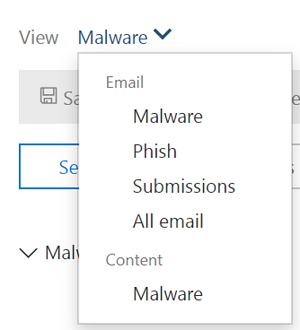
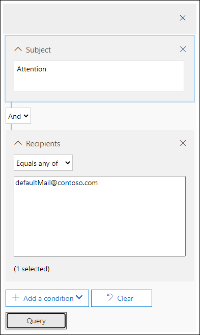
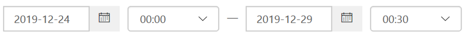

# Investigate malicious email that was delivered in Office 365

[!INCLUDE [Microsoft 365 Defender rebranding](../includes/microsoft-defender-for-office.md)]

**Applies to**

- [Microsoft Defender for Office 365 plan 1 and plan 2](defender-for-office-365.md)
- [Microsoft 365 Defender](../defender/microsoft-365-defender.md)

[Microsoft Defender for Office 365](defender-for-office-365.md) enables you to investigate activities that put people in your organization at risk, and to take action to protect your organization. For example, if you are part of your organization's security team, you can find and investigate suspicious email messages that were delivered. You can do this by using [Threat Explorer (or real-time detections)](threat-explorer.md).

> [!NOTE]
> Jump to the remediation article [here](remediate-malicious-email-delivered-office-365.md).

## Before you begin

Make sure that the following requirements are met:

- Your organization has [Microsoft Defender for Office 365](defender-for-office-365.md) and [licenses are assigned to users](../../admin/manage/assign-licenses-to-users.md).

- [audit logging](../../compliance/turn-audit-log-search-on-or-off.md) is turned on for your organization.

- Your organization has policies defined for anti-spam, anti-malware, anti-phishing, and so on. See [Protect against threats in Office 365](protect-against-threats.md).

- You are a global administrator, or you have either the Security Administrator or the Search and Purge role assigned in the Security & Compliance Center. See [Permissions in the Security & Compliance Center](permissions-in-the-security-and-compliance-center.md). For some actions, you must also have a new Preview role assigned.

### Preview role permissions

To perform certain actions, such as viewing message headers or downloading email message content, you must have a new role called *Preview* added to another appropriate role group. The following table clarifies required roles and permissions.

****

|Activity|Role group|Preview role needed?|
|---|---|---|
|Use Threat Explorer (and real-time detections) to analyze threats |Global Administrator 
 Security Administrator 
 Security Reader|No|
|Use Threat Explorer (and real-time detections) to view headers for email messages as well as preview and download quarantined email messages|Global Administrator 
 Security Administrator 
 Security Reader|No|
|Use Threat Explorer to view headers, preview email (only in the email entity page) and download email messages delivered to mailboxes|Global Administrator 
 Security Administrator 
 Security Reader 
 Preview|Yes|
|

> [!NOTE]
> *Preview* is a role and not a role group; the Preview role must be added to an existing role group for Office 365 (at <https://protection.office.com>). Go to **Permissions**, and then either edit an existing role group or add a new role group with the **Preview** role assigned.
> The Global Administrator role is assigned the Microsoft 365 admin center (<https://admin.microsoft.com>), and the Security Administrator and Security Reader roles are assigned in the Security & Compliance Center (<https://protection.office.com>). To learn more about roles and permissions, see [Permissions in the Security & Compliance Center](permissions-in-the-security-and-compliance-center.md).

We understand previewing and downloading email are sensitive activities, and so we auditing is enabled for these. Once an admin performs these activities on emails, audit logs are generated for the same and can be seen in the Office 365 Security & Compliance Center (<https://protection.office.com>). Go to **Search** > **Audit log search** and filter on the admin name in Search section. The filtered results will show activity **AdminMailAccess**. Select a row to view details in the **More information** section about previewed or downloaded email.

## Find suspicious email that was delivered

Threat Explorer is a powerful report that can serve multiple purposes, such as finding and deleting messages, identifying the IP address of a malicious email sender, or starting an incident for further investigation. The following procedure focuses on using Explorer to find and delete malicious email from recipient's mailboxes.

> [!NOTE]
> Default searches in Explorer don't currently include Zapped items.  This applies to all views, for example malware or phish views. To include Zapped items you need to add a **Delivery action** set to include **Removed by ZAP**. If you include all options, you'll see all delivery action results, including Zapped items.

1. **Navigate to Threat Explorer**: Go to <https://protection.office.com> and sign in using your work or school account for Office 365. This takes you to the Security & Compliance Center.

2. In the left navigation quick-launch, choose **Threat management** \> **Explorer**.

    

    You may notice the new **Special actions** column. This feature is aimed at telling admins the outcome of processing an email. The **Special actions** column can be accessed in the same place as **Delivery action** and **Delivery location**. Special actions might be updated at the end of Threat Explorer's email timeline, which is a new feature aimed at making the hunting experience better for admins.

3. **Views in Threat Explorer**: In the **View** menu, choose **All email**.

    

    The *Malware* view is currently the default, and captures emails where a malware threat is detected. The *Phish* view operates in the same way, for Phish.

    However, *All email* view lists every mail received by the organization, whether threats were detected or not. As you can imagine, this is a lot of data, which is why this view shows a placeholder that asks a filter be applied. (This view is only available for Defender for Office 365 P2 customers.)

    *Submissions* view shows up all mails submitted by admin or user that were reported to Microsoft.

4. **Search and filter in Threat Explorer**: Filters appear at the top of the page in the search bar to help admins in their investigations. Notice that multiple filters can be applied at the same time, and multiple comma-separated values added to a filter to narrow down the search. Remember:

    - Filters do exact matching on most filter conditions.
    - Subject filter uses a CONTAINS query.
    - URL filters work with or without protocols (ex. https).
    - URL domain, URL path, and URL domain and path filters don't require a protocol to filter.
    - You must click the Refresh icon every time you change the filter values to get relevant results.

5. **Advanced filters**: With these filters, you can build complex queries and filter your data set. Clicking on *Advanced Filters* opens a flyout with options.

   Advanced filtering is a great addition to search capabilities. A boolean **NOT** filter has been introduced on *Recipient*, *Sender* and *Sender domain* to allow admins to investigate by excluding values. This option appears under selection parameter *Contains none of*. **NOT** will let admins exclude alert mailboxes, default reply mailboxes from their investigations, and is useful for cases where admins search for a specific subject (subject="Attention") where the Recipient can be set to *none of defaultMail\@contoso.com*. This is an exact value search.

   

   *Filtering by hours* will help your organization's security team drill down quickly. The shortest allowed time duration is 30 minutes. If you can narrow the suspicious action by time-frame (e.g. it happened 3 hours ago), this will limit the context and help pinpoint the problem.

   

6. **Fields in Threat Explorer**: Threat Explorer exposes a lot more security-related mail information such as *Delivery action*, *Delivery location*, *Special action*, *Directionality*, *Overrides*, and *URL threat*. It also allows your organization's security team to investigate with a higher certainty.

    *Delivery action* is the action taken on an email due to existing policies or detections. Here are the possible actions an email can take:

    - **Delivered** – email was delivered to inbox or folder of a user and the user can directly access it.
    - **Junked** (Delivered to junk)– email was sent to either user's junk folder or deleted folder, and the user has access to email messages in their Junk or Deleted folder.
    - **Blocked** – any email messages that are quarantined, that failed, or were dropped. (This is completely inaccessible by the user.)
    - **Replaced** – any email where malicious attachments are replaced by .txt files that state the attachment was malicious

    **Delivery location**: The Delivery location filter is available in order to help admins understand where suspected malicious mail ended-up and what actions were taken on it. The resulting data can be exported to spreadsheet. Possible delivery locations are:

    - **Inbox or folder** – The email is in the Inbox or a specific folder, according to your email rules.
    - **On-prem or external** – The mailbox doesn't exist in the Cloud but is on-premises.
    - **Junk folder** – The email is in a user's Junk mail folder.
    - **Deleted items folder** – The email is in a user's Deleted items folder.
    - **Quarantine** – The email in quarantine, and not in a user's mailbox.
    - **Failed** – The email failed to reach the mailbox.
    - **Dropped** – The email was lost somewhere in the mail flow.

    **Directionality**: This option allows your security operations team to filter by the 'direction' a mail comes from, or is going. Directionality values are *Inbound*, *Outbound*, and *Intra-org* (corresponding to mail coming into your org from outside, being sent out of your org, or being sent internally to your org, respectively). This information can help security operations teams spot spoofing and impersonation, because a mismatch between the Directionality value (ex. *Inbound*), and the domain of the sender (which *appears* to be an internal domain) will be evident! The Directionality value is separate, and can differ from, the Message Trace. Results can be exported to spreadsheet.

    **Overrides**: This filter takes information that appears on the mail's details tab and uses it to expose where organizational, or user policies, for allowing and blocking mails have been *overridden*. The most important thing about this filter is that it helps your organization's security team see how many suspicious emails were delivered due to configuration. This gives them an opportunity to modify allows and blocks as needed. This result set of this filter can be exported to spreadsheet.

    ****

    |Threat Explorer Overrides|What they mean|
    |---|---|
    |Allowed by Org Policy|Mail was allowed into the mailbox as directed by the organization policy.|
    |Blocked by Org policy|Mail was blocked from delivery to the mailbox as directed by the organization policy.|
    |File extension blocked by Org Policy|File was blocked from delivery to the mailbox as directed by the organization policy.|
    |Allowed by User Policy|Mail was allowed into the mailbox as directed by the user policy.|
    |Blocked by User Policy|Mail was blocked from delivery to the mailbox as directed by the user policy.|
    |

    **URL threat**: The URL threat field has been included on the *details* tab of an email to indicate the threat presented by a URL. Threats presented by a URL can include *Malware*, *Phish*, or *Spam*, and a URL with *no threat* will say *None* in the threats section.

7. **Email timeline view**: Your security operations team might need to deep-dive into email details to investigate further. The email timeline allows admins to view actions taken on an email from delivery to post-delivery. To view an email timeline, click on the subject of an email message, and then click Email timeline. (It appears among other headings on the panel like Summary or Details.) These results can be exported to spreadsheet.

    Email timeline will open to a table that shows all delivery and post-delivery events for the email. If there are no further actions on the email, you should see a single event for the original delivery that states a result, such as *Blocked*, with a verdict like *Phish*. Admins can export the entire email timeline, including all details on the tab and email (such as, Subject, Sender, Recipient, Network, and Message ID). The email timeline cuts down on randomization because there is less time spent checking different locations to try to understand events that happened since the email arrived. When multiple events happen at, or close to, the same time on an email, those events show up in a timeline view.

8. **Preview / download**: Threat Explorer gives your security operations team the details they need to investigate suspicious email. Your security operations team can either:

    - [Check the delivery action and location](#check-the-delivery-action-and-location).

    - [View the timeline of your email](#view-the-timeline-of-your-email).

### Check the delivery action and location

In [Threat Explorer (and real-time detections)](threat-explorer.md), you now have **Delivery Action** and **Delivery Location** columns instead of the former **Delivery Status** column. This results in a more complete picture of where your email messages land. Part of the goal of this change is to make investigations easier for security operations teams, but the net result is knowing the location of problem email messages at a glance.

Delivery Status is now broken out into two columns:

- **Delivery action** - What is the status of this email?

- **Delivery location** - Where was this email routed as a result?

Delivery action is the action taken on an email due to existing policies or detections. Here are the possible actions an email can take:

- **Delivered** – email was delivered to inbox or folder of a user and the user can directly access it.

- **Junked** – email was sent to either user's junk folder or deleted folder, and the user has access to email messages in their Junk or Deleted folder.

- **Blocked** – any email messages that are quarantined, that failed, or were dropped. (This is completely inaccessible by the user.)

- **Replaced** – any email where malicious attachments are replaced by .txt files that state the attachment was malicious.

Delivery location shows the results of policies and detections that run post-delivery. It's linked to a Delivery Action. This field was added to give insight into the action taken when a problem mail is found. Here are the possible values of delivery location:

- **Inbox or folder** – The email is in the inbox or a folder (according to your email rules).

- **On-prem or external** – The mailbox doesn't exist on cloud but is on-premises.

- **Junk folder** – The email is in a user's Junk folder.

- **Deleted items folder** – The email is in a user's Deleted items folder.

- **Quarantine** – The email in quarantine, and not in a user's mailbox.

- **Failed** – The email failed to reach the mailbox.

- **Dropped** – The email gets lost somewhere in the mail flow.

### View the timeline of your email

**Email Timeline** is a field in Threat Explorer that makes hunting easier for your security operations team. When multiple events happen at or close to the same time on an email, those events show up in a timeline view. Some events that happen post-delivery to email are captured in the **Special actions** column. Combining information from the timeline of an email message with any special actions that were taken post-delivery gives admins insight into policies and threat handling (such as where the mail was routed, and, in some cases, what the final assessment was).

> [!IMPORTANT]
> Jump to a remediation topic [here](remediate-malicious-email-delivered-office-365.md).

## Related topics

[Remediate malicious email delivered in Office 365](remediate-malicious-email-delivered-office-365.md)

[Microsoft Defender for Office 365](office-365-ti.md)

[Protect against threats in Office 365](protect-against-threats.md)

[View reports for Defender for Office 365](view-reports-for-mdo.md)
