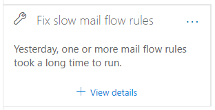
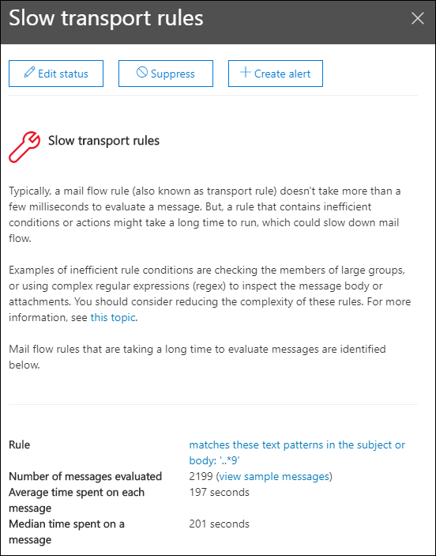

# Fix slow mail flow rules insight in the Security & Compliance Center

[!INCLUDE [Microsoft 365 Defender rebranding](../includes/microsoft-defender-for-office.md)]

**Applies to**
- [Exchange Online Protection](exchange-online-protection-overview.md)
- [Microsoft Defender for Office 365 plan 1 and plan 2](defender-for-office-365.md)
- [Microsoft 365 Defender](../defender/microsoft-365-defender.md)

Inefficient mail flow rules (also known as transport rules) can lead to mail flow delays for your organization. This insight reports mail flow rules that have an impact on your organization's mail flow. Examples of these types of rules include:

- Conditions that use **Is member of** for large groups.
- Conditions that use complex regular expression (regex) pattern matching.
- Conditions that use content checking in attachments.

The **Fix slow mail flow rules** insight in the **Recommended for you** area of the [Mail flow dashboard](mail-flow-insights-v2.md) in the [Security & Compliance Center](https://protection.office.com) notifies you when a mail flow rule is taking too long to complete.

This insight appears only after the condition is detected (if you don't have any mail loops, you won't see the insight).

You can use this notification to help you to identify and fine-tune mail flow rules to help reduce mail flow delays.

When you click **View details** on the widget, a flyout appears with more information:

- **Rule**: You can hover over the summary to see all of the conditions, exceptions, and actions of the rule. You can click on the summary to edit the rule in the Exchange admin center (EAC).
- **Number of messages evaluated**: You can click **View sample messages** to see the [message trace](message-trace-scc.md) results for a sample of the messages that were affected by the rule.
- **Average time spent on each message**
- **Median time spent on a message**: The middle value that separates the upper half from the lower half of time data.

For more information about conditions and exceptions in mail flow rules, see [Mail flow rule conditions and exceptions (predicates) in Exchange Online](/Exchange/security-and-compliance/mail-flow-rules/conditions-and-exceptions).

## See also

For information about other insights in the Mail flow dashboard, see [Mail flow insights in the Security & Compliance Center](mail-flow-insights-v2.md).