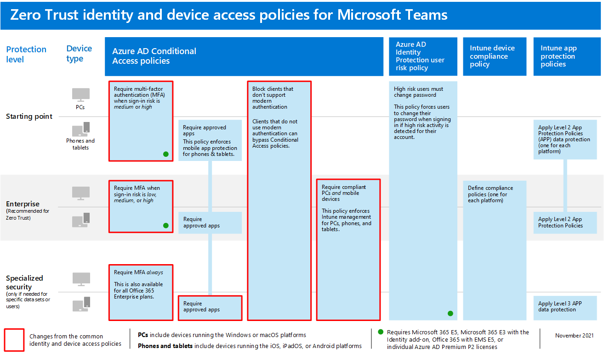

# Policy recommendations for securing Teams chats, groups, and files

This article describes how to implement the recommended identity and device-access policies to protect Microsoft Teams chats, groups, and content such as files and calendars. This guidance builds on the [common identity and device access policies](identity-access-policies.md), with additional information that's Teams-specific. Because Teams integrates with our other products, also see [Policy recommendations for securing SharePoint sites and files](sharepoint-file-access-policies.md) and [Policy recommendations for securing email](secure-email-recommended-policies.md).

These recommendations are based on three different tiers of security and protection for Teams that can be applied based on the granularity of your needs: baseline, sensitive, and highly regulated. You can learn more about these security tiers and the recommended policies referenced by these recommendations in the [Identity and device access configurations](microsoft-365-policies-configurations.md).

More recommendations specific to Teams deployment are included in this article to cover specific authentication circumstances, including for users outside your organization. You will need to follow this guidance for a complete security experience.

## Getting started with Teams before other dependent services

You don't need to enable dependent services to get started with Microsoft Teams. These services will all "just work." However, you do need to be prepared to manage the following service-related elements:

- Microsoft 365 groups
- SharePoint team sites
- OneDrive for Business
- Exchange mailboxes
- Stream videos and Planner plans (if these services are enabled)

## Updating common policies to include Teams

To protect chat, groups and content in Teams, the following diagram illustrates which policies to update from the the common identity and device access policies. For each policy to update, make sure that Teams and dependent services are included in the assignment of cloud apps.

[See a larger version of this image](https://github.com/MicrosoftDocs/microsoft-365-docs/raw/public/microsoft-365/media/microsoft-365-policies-configurations/identity-access-ruleset-teams.png)

These services are the dependent services to include in the assignment of cloud apps for Teams:

- Microsoft Teams
- SharePoint and OneDrive for Business
- Exchange Online
- Skype for Business Online
- Microsoft Stream (meeting recordings)
- Microsoft Planner (Planner tasks and plan data)

This table lists the policies that need to be revisited and links to each policy in the [common identity and device access policies](identity-access-policies.md), which has the wider policy set for all Office applications.

|Protection level|Policies|Further information for Teams implementation|
|---|---|---|
|**Baseline**|[Require MFA when sign-in risk is *medium* or *high*](identity-access-policies.md#require-mfa-based-on-sign-in-risk)|Be sure Teams and dependent services are included in the list of apps. Teams has Guest Access and External Access rules to consider as well, you'll learn more about these rules later in this article.|
||[Block clients that don't support modern authentication](identity-access-policies.md#block-clients-that-dont-support-multi-factor)|Include Teams and dependent services in the assignment of cloud apps.|
||[High risk users must change password](identity-access-policies.md#high-risk-users-must-change-password)|Forces Teams users to change their password when signing in if high-risk activity is detected for their account. Be sure Teams and dependent services are included in the list of apps.|
||[Apply APP data protection policies](identity-access-policies.md#apply-app-data-protection-policies)|Be sure Teams and dependent services are included in the list of apps. Update the policy for each platform (iOS, Android, Windows).|
||[Define device compliance policies](identity-access-policies.md#define-device-compliance-policies)|Include Teams and dependent services in this policy.|
||[Require compliant PCs](identity-access-policies.md#require-compliant-pcs-but-not-compliant-phones-and-tablets)|Include Teams and dependent services in this policy.|
|**Sensitive**|[Require MFA when sign-in risk is *low*, *medium* or *high*](identity-access-policies.md#require-mfa-based-on-sign-in-risk)|Teams has Guest Access and External Access rules to consider as well, you'll learn more about these rules later in this article. Include Teams and dependent services in this policy.|
||[Require compliant PCs *and* mobile devices](identity-access-policies.md#require-compliant-pcs-and-mobile-devices)|Include Teams and dependent services in this policy.|
|**Highly regulated**|[*Always* require MFA](identity-access-policies.md#require-mfa-based-on-sign-in-risk)|Regardless of user identity, MFA will be used by your organization. Include Teams and dependent services in this policy. |
|

## Teams dependent services architecture

For reference, the following diagram illustrates the services Teams relies on. For more information and illustrations, see [Microsoft Teams and related productivity services in Microsoft 365 for IT architects](../../solutions/productivity-illustrations.md).

[See a larger version of this image](https://github.com/MicrosoftDocs/microsoft-365-docs/raw/public/microsoft-365/media/microsoft-365-policies-configurations/identity-access-logical-architecture-teams.png)

## Guest and external access for Teams

Microsoft Teams defines the following access types:

- **Guest access** uses an Azure AD B2B account for a guest or external user that can be added as a member of a team and have all permissioned access to the communication and resources of the team.

- **External access** is for an external user that does not have an Azure AD B2B account. External access can include invitations and participation in calls, chats, and meetings, but does not include team membership and access to the resources of the team.

Conditional Access policies only apply to guest access in Teams because there is a corresponding Azure AD B2B account.

<!--
In Azure AD, guest and external users are the same. The user type for both of these is Guest. Guest users are B2B users. Microsoft Teams differentiates between guest users and external users in the app. While it's important to understand how each of these are treated in Teams, both types of users are B2B users in Azure AD and the recommended policies for B2B users apply to both.

-->

For recommended policies to allow access for guest and external users with an Azure AD B2B account, see [Policies for allowing guest and external B2B account access](identity-access-policies-guest-access.md).

### Guest access in Teams

In addition to the policies for users who are internal to your business or organization, administrators may enable guest access to allow, on a user-by-user basis, people who are external to your business or organization to access Teams resources and interact with internal people for things like group conversations, chat, and meetings.

For more information about guest access and how to implement it, see  [Teams guest access](https://docs.microsoft.com/microsoftteams/guest-access).

### External access in Teams

External access is sometimes confused with guest access, so it's important to be clear that these two non-internal access mechanisms are different types of access.

External access is a way for Teams users from an entire external domain to find, call, chat, and set up meetings with your users in Teams. Teams administrators configure external access at the organization level. For more information, see [Manage external access in Microsoft Teams](https://docs.microsoft.com/microsoftteams/manage-external-access).

External access users have less access and functionality than an individual who's been added via guest access. For example, external access users can chat with your internal users with Teams but cannot access team channels, files, or other resources.

External access does not use Azure AD B2B user accounts and therefore does not use Conditional Access policies.

## Teams policies

Outside of the common policies listed above, there are Teams-specific policies that can and should be configured to manage various Teams functionalities.

### Teams and channels policies

Teams and channels are two commonly used elements in Microsoft Teams, and there are policies you can put in place to control what users can and cannot do when using teams and channels. While you can create a global team, if your organization has 5000 users or less, you are likely to find it helpful to have smaller teams and channels for specific purposes, in-line with your organizational needs.

Changing the default policy or creating custom policies would be recommended, and you can learn more about managing your policies at this link: [Manage teams policies in Microsoft Teams](https://docs.microsoft.com/microsoftteams/teams-policies).

### Messaging policies

Messaging, or chat, can also be managed through the default global policy, or through custom policies, and this can help your users communicate with one another in a way that's appropriate for your organization. This information can be reviewed at [Managing messaging policies in Teams](https://docs.microsoft.com/microsoftteams/messaging-policies-in-teams).

### Meeting policies

No discussion of Teams would be complete without planning and implementing policies around Teams meetings. Meetings are an essential component of Teams, allowing people to formally meet and present to many users at once, and to share content relevant to the meeting. Setting the right policies for your organization around meetings is essential.

For more information, review [Manage meeting policies in Teams](https://docs.microsoft.com/microsoftteams/meeting-policies-in-teams).

### App permission policies

Teams also allows you to use apps in various places, such as channels or personal chats. Having policies around what apps can be added and used, and where, is essential to maintaining a content-rich environment that is also secure.

For more reading about App Permission Policies, check out [Manage app permission policies in Microsoft Teams](https://docs.microsoft.com/microsoftteams/teams-app-permission-policies).

## Next steps

Configure Conditional Access policies for:

- [Exchange Online](secure-email-recommended-policies.md)
- [SharePoint](sharepoint-file-access-policies.md)
