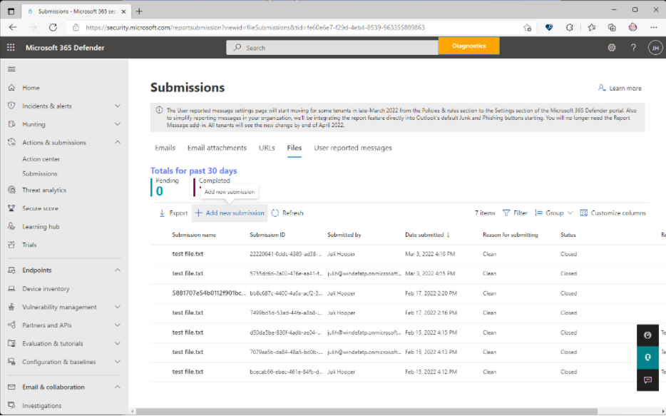
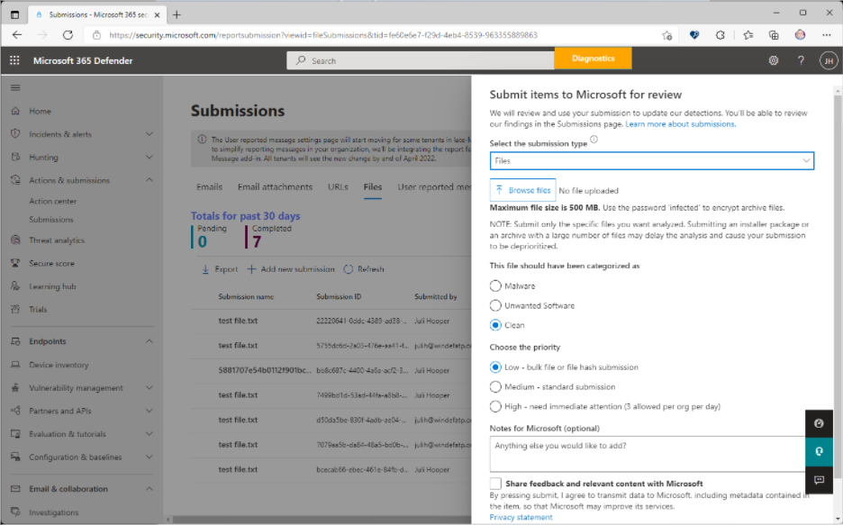
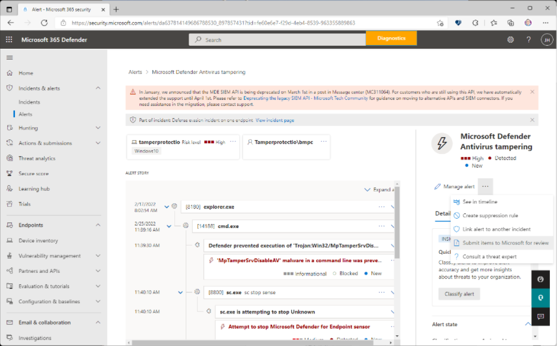
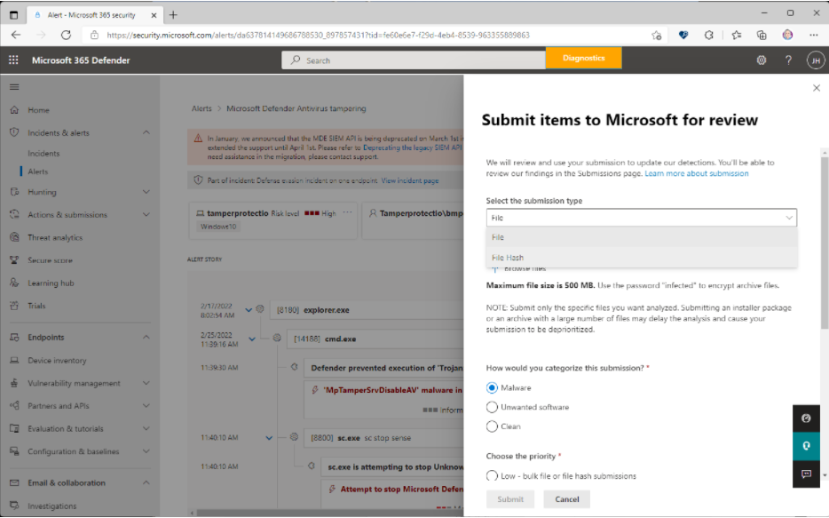

# Submit files in Microsoft Defender for Endpoint

[!INCLUDE [Microsoft 365 Defender rebranding](../../includes/microsoft-defender.md)]

**Applies to**

- [Microsoft Defender for Endpoint](https://go.microsoft.com/fwlink/p/?linkid=2146806)
- [Microsoft 365 Defender](https://go.microsoft.com/fwlink/?linkid=2118804)

> Want to experience Microsoft Defender for Endpoint? [Sign up for a free trial](https://www.microsoft.com/microsoft-365/windows/microsoft-defender-atp?ocid=docs-wdatp-usewdatp-abovefoldlink).

In Microsoft Defender for Endpoint, admins can use the unified submissions feature to submit files and file hashes (SHAs) to Microsoft for review. The unified submissions experience is a one-stop shop for submitting emails, URLs, email attachments, and files in one, easy-to-use submission experience. Admins can use the Microsoft 365 Defender portal or the Microsoft Defender for Endpoint Alert page to submit suspicious files.

## What do you need to know before you begin?

- The new unified submissions experience is available only in subscriptions that include Microsoft 365 Defender, Microsoft Defender for Endpoint Plan 2, or Microsoft Defender for Office Plan 2.

- To submit files to Microsoft, you need to be a member of one of the following role groups:

  - **Organization Management**, **Security Administrator**, or **Security Reader** in the [Microsoft 365 Defender portal](../office-365-security/mdo-portal-permissions.md).

- For more information about how you can submit spam, phish, URLs, and email attachments to Microsoft, see [Report messages and files to Microsoft](../office-365-security/submissions-report-messages-files-to-microsoft.md).

## Report items to Microsoft from the portal

If you have a file that you suspect might be malware or is being incorrectly detected (false positive), you can submit it to Microsoft for analysis using the Microsoft 365 Defender portal at https://security.microsoft.com/.

### Submit a file or file hash

1. Open Microsoft 365 Defender at <https://security.microsoft.com/>, click **Actions & submissions**, click **Submissions**, go to **Files** tab, and then select **Add new submission**.

    > [!div class="mx-imgBorder"]
    > 

2. Use the **Submit items to Microsoft for review** flyout that appears to submit the **File** or **File hash**.

3. In the **Select the submission type** box, select **File** or **File hash** from the drop-down list.

4. When submitting a file, click **Browse files**. In the dialog that opens, find and select the file, and then click **Open**. Note that for **File hash** submissions, you'll either have to copy or type in the file hash.

5. In the **This file should have been categorized as** section, choose either **Malware** (false negative), or **Unwanted software**, or **Clean** (false positive).

6. Next, **Choose the priority**. Note that for **File hash** submissions, **Low - bulk file or file hash submission** is the only choice, and is automatically selected.

    > [!div class="mx-imgBorder"]
    > 

7. Click **Submit**.

   If you want to view the details of your submission, select your submission from the **Submissions name** list to open the **Result details** flyout.

## Report items to Microsoft from the Alerts page

You can also submit a file or file hash directly from the list of alerts on the **Alerts** page.

1. Open the Microsoft 365 Defender at <https://security.microsoft.com/>, click **Incidents & alerts**, and then click **Alerts** to view the list of alerts.

2. Select the alert you want to report. Note that you are submitting a file that is nestled within the alert.

3. Click the ellipses next to **Manage alert** to see additional options. Select **Submit items to Microsoft for review**.

    > [!div class="mx-imgBorder"]
    > 

4. In the next flyout that opens, select the submission type.

    > [!div class="mx-imgBorder"]
    > 

    If you select **File** as the submission type, upload the file, categorize your submission, and choose the priority.

    If you select **File Hash** as the submission type, choose the file hashes that are available from the drop-down. You can select multiple file hashes.

5. Click **Submit**.

## Related information

- [Exclusions for Microsoft Defender for Endpoint and Microsoft Defender Antivirus](defender-endpoint-antivirus-exclusions.md)
- [Microsoft Defender for Endpoint in Microsoft 365 Defender](../defender/microsoft-365-security-center-mde.md)
- [Address false positives/negatives](defender-endpoint-false-positives-negatives.md)
- [View and organize alerts queue in Microsoft Defender for Endpoint](alerts-queue.md)
