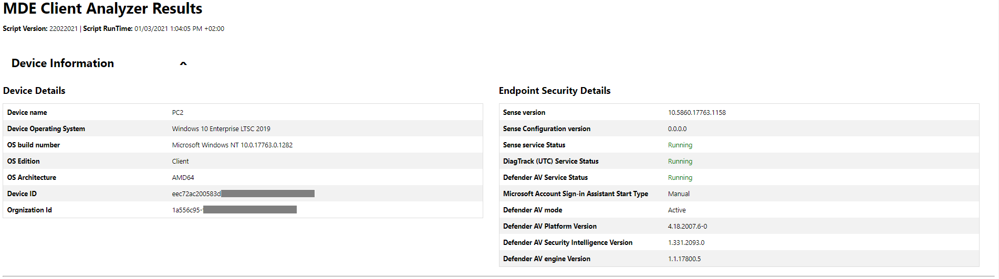
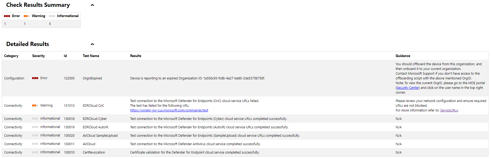
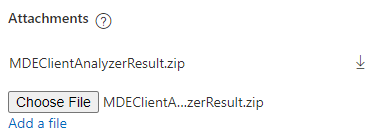

# Understand the client analyzer HTML report

**Applies to:**
- [Microsoft Defender for Endpoint](https://go.microsoft.com/fwlink/p/?linkid=2146631)

The client analyzer produces a report in HTML format. Learn how to review the report to identify potential sensor issues so that you can troubleshoot them.

Use the following example to understand the report.

 Example output from the analyzer on a machine onboarded to expired Org ID and
failing to reach one of the required Microsoft Defender for Endpoint URLs:

-   On the top the script version and script runtime are listed for reference

-   The **Device Information** section provides basic OS and device identifiers
    to uniquely identify the device on which the analyzer has run.

-   The **Endpoint Security Details** provides general information about Microsoft Defender for Endpoint-related processes including Microsoft Defender Antivirus and the sensor
    process. If important processes are not online as expected,  the color will change to red.

-   On **Check Results Summary** you will have an aggregated count for error,
    warning, or informational events detected by the analyzer.

-   On the **Detailed Results** you will see a list (sorted by severity) with
    the results and the guidance based on the observations made by the analyzer.

## Open a support ticket to Microsoft and include the Analyzer results

To include analyzer result files [when opening a support
ticket](contact-support.md#open-a-service-request),
make sure you use the **Attachments** section and include the
`MDEClientAnalyzerResult.zip` file:

> [!NOTE]
> If the file size is larger than 25 MB, the support engineer assigned to your
case will provide a dedicated secure workspace to upload large files for
analysis.
