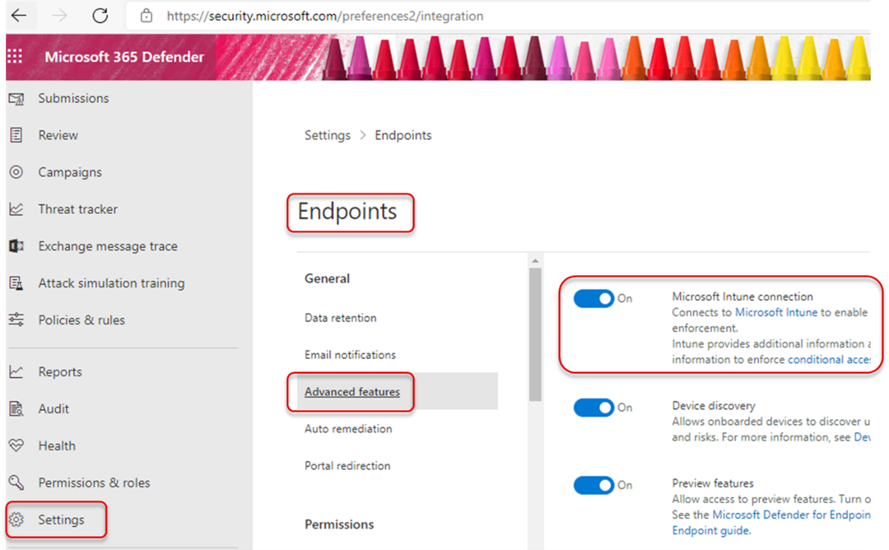
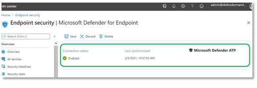
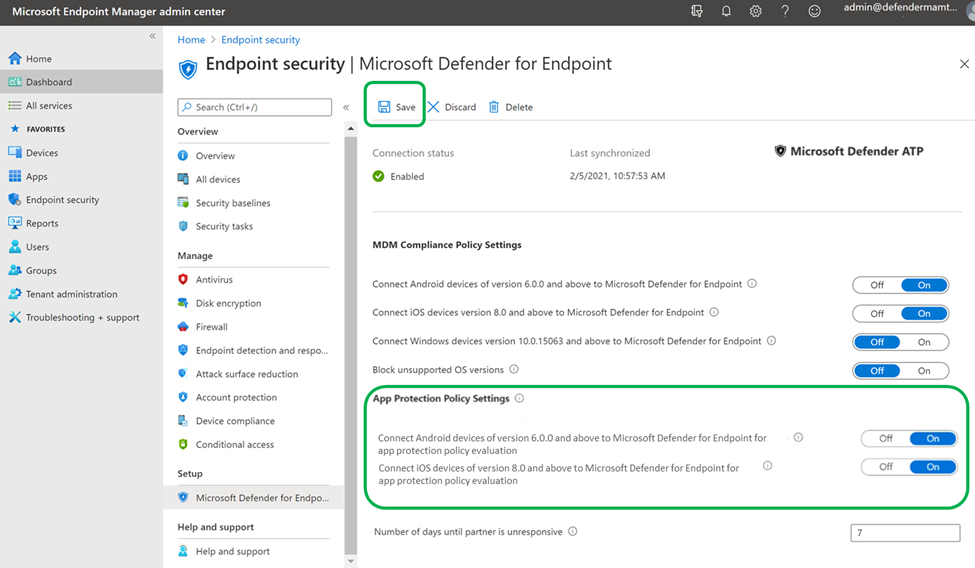
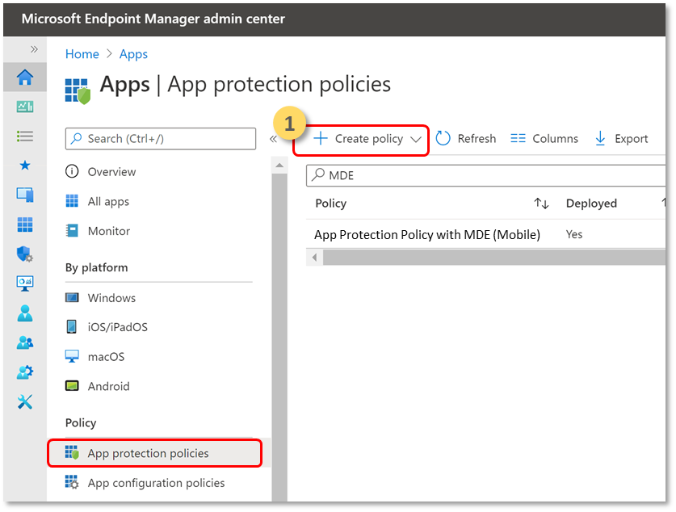
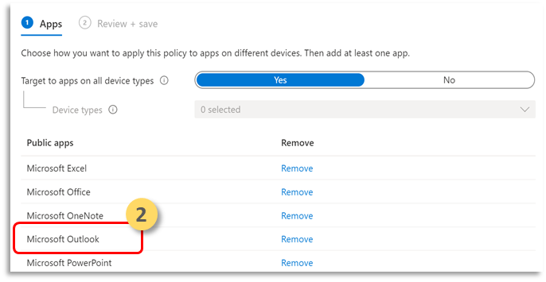
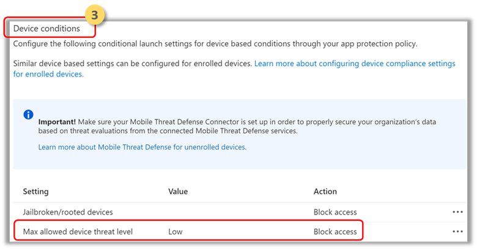
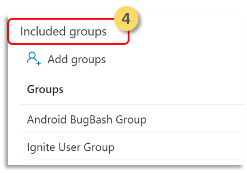
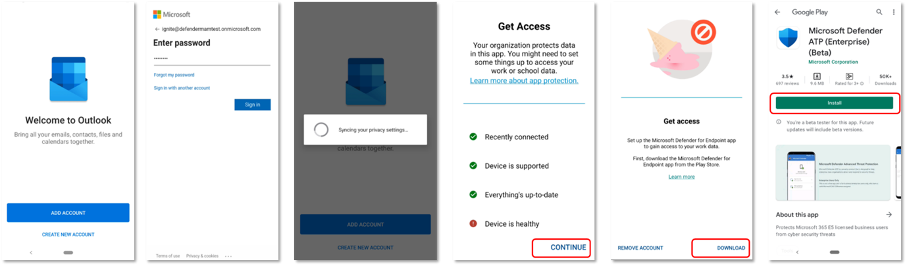

# Configure Microsoft Defender for Endpoint risk signals in app protection policy (MAM)

[!INCLUDE [Microsoft 365 Defender rebranding](../../includes/microsoft-defender.md)]

**Applies to:**
- [Microsoft Defender for Endpoint](https://go.microsoft.com/fwlink/p/?linkid=2154037)
- [Microsoft 365 Defender](https://go.microsoft.com/fwlink/?linkid=2118804)

Microsoft Defender for Endpoint Android, which already protects enterprise users on Mobile Device Management (MDM) scenarios, now extends supports Mobile App Management (MAM). This capability allows you to manage and protect your organization's data within an application.

Microsoft Defender for Endpoint Android threat information is leveraged by Intune App Protection policies to protect these apps. App protection policies (APP) are rules that ensure an organization's data remains safe or contained in a managed app. A managed application has app protection policies applied to it and can be managed by Intune.  

Microsoft Defender for Endpoint (Mobile) supports both the configurations of MAM
- **Intune MDM + MAM**: IT administrators can only manage apps using App Protection Policies on devices that are enrolled with Intune mobile device management (MDM).
- **MAM without device enrollment**: MAM without device enrollment, or MAM-WE, allows IT administrators to manage apps using [App Protection Policies](/mem/intune/app/app-protection-policy) on devices not enrolled with Intune MDM. This means apps can be managed by Intune on devices enrolled with third-party EMM providers. 
To manage apps using in both the above configurations customers should use Intune in the [Microsoft Endpoint Manager admin center](https://go.microsoft.com/fwlink/?linkid=2109431)

## Admin prerequisites

**1. Validate if Microsoft Defender for Endpoint-Intune connector is enabled**
  a. Go to security.microsoft.com. 
  b. Select  **Settings > Endpoints> Advanced   Features > Microsoft Intune Connection** is turned on.
  c. If the connection is not turned on, select the toggle to turn it on and then select **Save Preferences**.

  d. Go to **Microsoft Endpoint Manager (Intune)** and Validate whether Microsoft Defender for Endpoint-Intune connector is enabled.

**2. Enable Microsoft Defender for Endpoint**(Mobile) Connector for App Protection Policy (APP)
  Configure the connector on Intune Microsoft Endpoint Manager for App protection policies:
  - Go to **Tenant Administration > Connectors and Tokens > Microsoft Defender for Endpoint**.
  - Turn on the toggles for the app protection policy for Android and iOS (as seen in the following screenshot).
  - Select **Save**.

  

## Create App Protection Policy to block access or wipe data of a managed app, based on Microsoft Defender for Endpoint risk signals

Microsoft Defender for Endpoint can be configured to send threat signals to be used in app protection policies (APP, also known as MAM). With this capability, you can use Microsoft Defender for Endpoint to protect managed apps.

1. **Create a policy:** App protection policies (APP) are rules that ensure an organization's data remains safe or contained in a managed app. A policy can be a rule that is enforced when the user attempts to access or move "corporate" data, or a set of actions that are prohibited or monitored when the user is inside the app. 
    
        

    **Add Apps:**

    **2.1 Choose how you wnat to apply this policy to apps on different devices.** Then add at least one app.

    Use this option to specify whether this policy applies to Unmanaged devices. In case of Android, you can specify the policy applies to Android Enterprise, Device Admin, or Unmanaged devices. You can choose option to target your policy to apps on devices of any management state also.
    Because mobile app management doesn't require device management, you can protect company data on both managed and unmanaged devices. The management is centered on the user identity, which removes the requirement for device management. Companies can use app protection policies with or without MDM at the same time. For example, consider an employee that uses both a phone issued by the company, and their own personal tablet. The company phone is enrolled in MDM and protected by app protection policies while the personal device is protected by app protection policies only.

    **2.2 Select Apps**

    A managed app is an app that has app protection policies applied to it, and can be managed by Intune. Any app that has been integrated with the [Intune SDK](/mem/intune/developer/app-sdk) or wrapped by the [Intune App Wrapping Tool](/mem/intune/developer/apps-prepare-mobile-application-management) can be managed using Intune app protection Policies. See the official list of [Microsoft Intune protected apps](/mem/intune/apps/apps-supported-intune-apps) that have been built using these tools and are available for public use.

    *Example: Outlook as a managed app*
    
    

    **3. Conditional launch:** Set sign-in security requirements for your protection policy.

    Select **Setting “Max allowed device threat level”** in Device Conditions and enter a Value. Then select  **Action  "Block Access"**. Microsoft Defender for Endpoint (Mobile) shares this Device Threat Level.

**3. Assignments:** Assign user groups for whom the policy needs to be applied.

## End user prerequisites
- The broker app needs to be installed
    - Android: Intune Company Portal
    
- Users have the required licenses for Managed app and has the app installed

**End user onboarding to managed app will initiate Microsoft Defender for Endpoint mobile installation & activation**

1. Sign in to a managed application, for example, Outlook. The device is registered and the application protection policy is synchronized to the device. The application protection policy recognizes the device's health state.  

2. Select **Continue**. A screen is presented which recommends downloading and setting up of Microsoft Defender for Endpoint Android app.

3. Selects **Download**. You will be redirected to the app store (Google play). 

4.  Install the Microsoft Defender for Endpoint (Mobile) app and launch back Managed app onboarding screen.

  

5.  Click **Continue > Launch**. The Microsoft Defender for Endpoint app onboarding/activation flow is initiated. Follow the steps to complete onboarding. You will automatically be redirected back to Managed app onboarding screen, which now indicates that the device is healthy.

6. Select **Continue** to log into the managed application. 

## Related topics

- [Overview of Microsoft Defender for Endpoint on Android](microsoft-defender-endpoint-android.md)
- [Deploy Microsoft Defender for Endpoint on Android with Microsoft Intune](android-intune.md)
